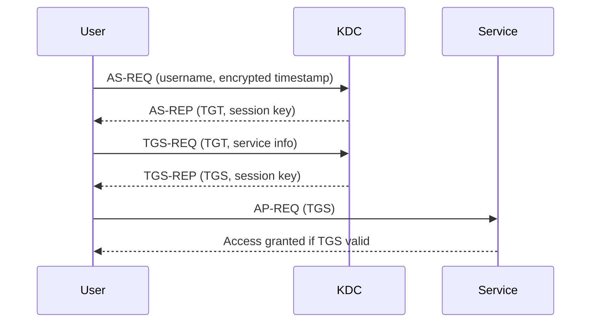
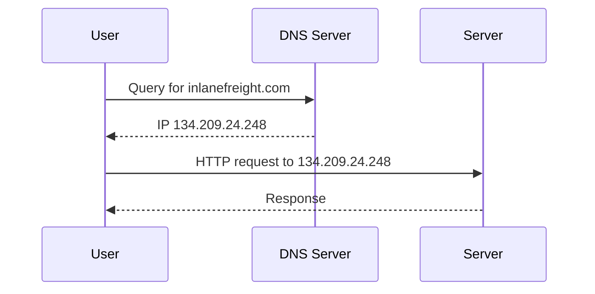
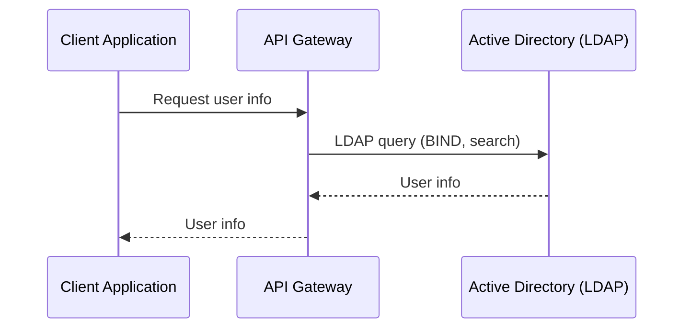

# Protocols

This document covers the protocols used in Active Directory. 

## Overview

Active Directory relies on four main protocols:
- <span style="color:#0074D9"><b>Kerberos</b></span>: Authentication protocol
- <span style="color:#2ECC40"><b>DNS</b></span>: Name resolution and service location
- <span style="color:#FF851B"><b>LDAP</b></span>: Directory access and management
- <span style="color:#B10DC9"><b>MSRPC</b></span>: Remote procedure calls for client-server communication

---

## <span style="color:#0074D9">Kerberos</span>

Kerberos is the default authentication protocol for domain accounts since Windows 2000. It is an open standard, enabling interoperability with other systems. Kerberos uses mutual authentication and is stateless, relying on tickets rather than transmitting user passwords over the network.

**Key Points:**
- Used for authenticating users and services in AD
- Based on tickets (TGT and TGS)
- Domain Controllers run a Key Distribution Center (KDC)
- Port: 88 (TCP/UDP)

### Kerberos Authentication Process
1. **User Login:**
   - User enters credentials; password is used to encrypt a timestamp.
   - The client sends an Authentication Service Request (AS-REQ) to the KDC.
2. **KDC Issues TGT:**
   - KDC verifies the request and issues a Ticket Granting Ticket (TGT), encrypted with the krbtgt account's secret key.
   - TGT is sent to the user (AS-REP).
3. **Requesting Service Ticket:**
   - User presents the TGT to the KDC, requesting a Ticket Granting Service (TGS) ticket for a specific service (TGS-REQ).
4. **KDC Issues TGS:**
   - KDC validates the TGT and issues a TGS, encrypted with the service's NTLM password hash (TGS-REP).
5. **Accessing the Service:**
   - User presents the TGS to the target service (AP-REQ).
   - If valid, access is granted.

### Mermaid Diagram: Kerberos Authentication Flow


Kerberos ensures that user credentials are never sent over the network, and authentication is based on the possession of valid tickets. The KDC does not keep session state, relying on the validity of the TGT and TGS for access control.

---

## <span style="color:#2ECC40">DNS</span>

Active Directory Domain Services (AD DS) relies on DNS to:
- Allow clients (workstations, servers) to locate Domain Controllers (DCs)
- Enable DCs to communicate with each other
- Resolve hostnames to IP addresses within internal networks

**Key Points:**
- AD maintains a DNS database with service records (SRV) for locating services (e.g., file servers, printers, DCs)
- Dynamic DNS updates entries automatically when IP addresses change
- If DNS records are incorrect, clients cannot locate or communicate with resources
- DNS uses UDP port 53 (default) and TCP port 53 (for large messages)

### How DNS Works in AD
1. Client joins the network and queries DNS for a Domain Controller
2. DNS returns an SRV record with the DC's hostname
3. Client queries DNS for the DC's IP address
4. Client communicates with the DC using the resolved IP

### Example: Forward DNS Lookup
```powershell
PS C:\htb> nslookup INLANEFREIGHT.LOCAL

Server:  172.16.6.5
Address:  172.16.6.5

Name:    INLANEFREIGHT.LOCAL
Address:  172.16.6.5
```

### Example: Reverse DNS Lookup
```powershell
PS C:\htb> nslookup 172.16.6.5

Server:  172.16.6.5
Address:  172.16.6.5

Name:    ACADEMY-EA-DC01.INLANEFREIGHT.LOCAL
Address:  172.16.6.5
```

### Example: Finding IP Address of a Host
```powershell
PS C:\htb> nslookup ACADEMY-EA-DC01

Server:   172.16.6.5
Address:  172.16.6.5

Name:    ACADEMY-EA-DC01.INLANEFREIGHT.LOCAL
Address:  172.16.6.5
```

### Mermaid Diagram: DNS Request Process


DNS is critical for AD functionality. Without proper DNS configuration, clients and services cannot reliably locate or communicate with each other in the domain.

---

## <span style="color:#FF851B">LDAP</span>

Lightweight Directory Access Protocol (LDAP) is an open, cross-platform protocol used for directory lookups and authentication in Active Directory (AD) and other directory services. LDAP is essential for querying and managing directory information in AD environments.

**Key Points:**
- LDAP is used for authentication and directory queries in AD
- Latest version: LDAPv3 (RFC 4511)
- Default port: 389 (LDAP), 636 (LDAPS/LDAP over SSL)
- AD Domain Controllers listen for LDAP requests
- LDAP is the "language" applications use to communicate with directory servers

### How LDAP Works in AD
- AD stores user and security information, accessible via LDAP
- Applications and systems use LDAP to query and update directory data
- LDAP sessions start by connecting to a Directory System Agent (usually a Domain Controller)

**Analogy:**
- AD : LDAP :: Apache : HTTP (AD is the server, LDAP is the protocol)

### LDAP Authentication
- **Simple Authentication:** Username/password sent in a BIND request (can be anonymous, unauthenticated, or authenticated)
- **SASL Authentication:** Uses the Simple Authentication and Security Layer framework to support other authentication methods (e.g., Kerberos)
- LDAP messages are cleartext by default—use TLS/SSL for security

### Mermaid Diagram: LDAP Query Process


LDAP is fundamental for both authentication and directory lookups in AD. Secure LDAP (LDAPS) is recommended to protect credentials and sensitive data in transit.

---

## <span style="color:#B10DC9">MSRPC</span>

Microsoft Remote Procedure Call (MSRPC) is Microsoft's implementation of the Remote Procedure Call (RPC) protocol, enabling interprocess communication for client-server applications. MSRPC is fundamental for Windows systems to access and manage resources in Active Directory (AD).

**Key Points:**
- MSRPC enables communication between clients and servers in AD environments
- Used for authentication, management, and replication tasks
- Operates over dynamic ports (TCP 135 for endpoint mapping, then high ports for actual communication)

### Key MSRPC Interfaces in AD

| Interface   | Description |
|-------------|-------------|
| <b>lsarpc</b>  | RPC calls to the Local Security Authority (LSA) for managing local/domain security policy, audit policy, and interactive authentication. Used for domain security management. |
| <b>netlogon</b>| Authenticates users and services in the domain. Runs as a background service to support domain logons. |
| <b>samr</b>    | Remote Security Account Manager (SAM) protocol for managing the domain account database (users, groups, computers). Used for CRUD operations on security principals. Can be abused for domain reconnaissance. |
| <b>drsuapi</b> | Directory Replication Service (DRS) Remote Protocol for replication tasks between Domain Controllers. Can be abused to extract the NTDS.dit database and retrieve password hashes. |

**Security Note:**
- By default, all authenticated users can query some MSRPC interfaces (e.g., samr), which can be abused for reconnaissance. Restricting access via registry settings is recommended.

MSRPC is critical for AD operations, but its interfaces can be leveraged by attackers for enumeration and lateral movement if not properly secured.

---

## <span style="color:#111111;background:#FFD700;padding:2px 8px;border-radius:4px;">NTLM Authentication</span>

NTLM (NT LAN Manager) authentication is a suite of Microsoft security protocols intended to provide authentication, integrity, and confidentiality to users. While Kerberos is preferred, NTLM is still widely used and can be abused if not properly managed.

**Key Points:**
- Includes LM, NTLM, NTLMv1, and NTLMv2
- Used when Kerberos is unavailable or unsupported
- Challenge-response protocol (no mutual authentication)
- Vulnerable to pass-the-hash, relay, and brute-force attacks

### Hash/Protocol Comparison
| Hash/Protocol | Crypto Technique | Mutual Auth | Message Type | Trusted Third Party |
|---------------|-----------------|-------------|--------------|---------------------|
| NTLM          | Symmetric key   | No          | Random num   | Domain Controller   |
| NTLMv1        | Symmetric key   | No          | MD4, random  | Domain Controller   |
| NTLMv2        | Symmetric key   | No          | MD4, random  | Domain Controller   |
| Kerberos      | Symmetric & asymmetric | Yes   | Encrypted ticket | KDC/DC         |

### LM (LAN Manager) Hashes
- Oldest Windows password storage mechanism (pre-Vista/Server 2008)
- Weak: passwords limited to 14 chars, not case sensitive, split into 2 chunks, easy to crack
- Disabled by default on modern systems, but may still be found in legacy environments

### NT Hash (NTLM)
- Used in modern Windows systems
- MD4 hash of the UTF-16-LE password
- Stored in SAM (local) or NTDS.DIT (domain)
- Used in challenge-response authentication (NEGOTIATE, CHALLENGE, AUTHENTICATE messages)
- Vulnerable to pass-the-hash attacks

**Example NTLM Hash:**
```
Rachel:500:aad3c435b514a4eeaad3b935b51304fe:e46b9e548fa0d122de7f59fb6d48eaa2:::
```
- Username: Rachel
- RID: 500 (Administrator)
- LM hash: aad3c435b514a4eeaad3b935b51304fe
- NT hash: e46b9e548fa0d122de7f59fb6d48eaa2

### NTLM Authentication Protocol
1. Client sends NEGOTIATE_MESSAGE to server
2. Server responds with CHALLENGE_MESSAGE
3. Client replies with AUTHENTICATE_MESSAGE
4. Server validates and grants/denies access

### NTLMv1 (Net-NTLMv1)
- Challenge/response using NT and LM hash
- Server sends 8-byte challenge, client returns 24-byte response
- Vulnerable to offline cracking and relay attacks

**Example NTLMv1 Hash:**
```
u4-netntlm::kNS:338d08f8e26de93300000000000000000000000000000000:9526fb8c23a90751cdd619b6cea564742e1e4bf33006ba41:cb8086049ec4736c
```

### NTLMv2 (Net-NTLMv2)
- Default since Windows 2000
- Uses HMAC-MD5, includes client/server challenge, timestamp, and domain name
- More resistant to spoofing and replay attacks

**Example NTLMv2 Hash:**
```
admin::N46iSNekpT:08ca45b7d7ea58ee:88dcbe4446168966a153a0064958dac6:5c7830315c7830310000000000000b45c67103d07d7b95acd12ffa11230e0000000052920b85f78d013c31cdb3b92f5d765c783030
```

### Domain Cached Credentials (MSCache2)
- Used when a domain-joined host cannot contact a Domain Controller
- Stores last 10 hashes for users who logged in
- Hashes stored in Windows registry (HKEY_LOCAL_MACHINE\SECURITY\Cache)
- Slow to crack, not usable for pass-the-hash
- Format: `$DCC2$10240#username#hash`

**Security Note:**
- Neither LM nor NTLM uses a salt
- NTLM is vulnerable to pass-the-hash, relay, and brute-force attacks
- Use Kerberos and disable LM/NTLM where possible

--- 