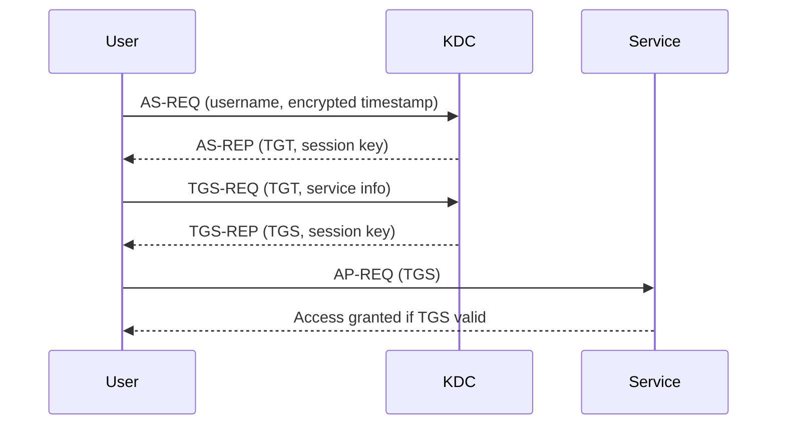
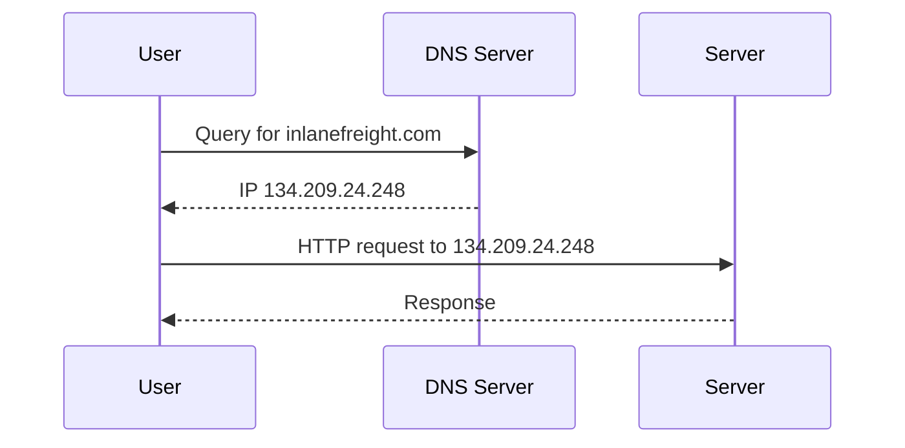
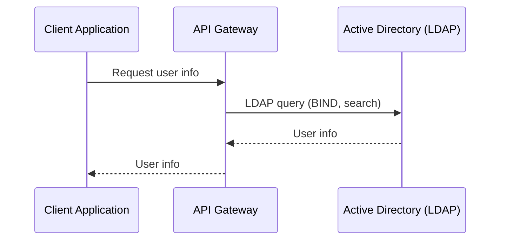

# Protocols

This document covers the protocols used in Active Directory. 

## Overview

Active Directory relies on four main protocols:
- **Kerberos**: Authentication protocol
- **DNS**: Name resolution and service location
- **LDAP**: Directory access and management
- **MSRPC**: Remote procedure calls for client-server communication

---

## Kerberos

Kerberos is the default authentication protocol for domain accounts since Windows 2000. It is an open standard, enabling interoperability with other systems. Kerberos uses mutual authentication and is stateless, relying on tickets rather than transmitting user passwords over the network.

**Key Points:**
- Used for authenticating users and services in AD
- Based on tickets (TGT and TGS)
- Domain Controllers run a Key Distribution Center (KDC)
- Port: 88 (TCP/UDP)

### Kerberos Authentication Process
1. **User Login:**
   - User enters credentials; password is used to encrypt a timestamp.
   - The client sends an Authentication Service Request (AS-REQ) to the KDC.
2. **KDC Issues TGT:**
   - KDC verifies the request and issues a Ticket Granting Ticket (TGT), encrypted with the krbtgt account's secret key.
   - TGT is sent to the user (AS-REP).
3. **Requesting Service Ticket:**
   - User presents the TGT to the KDC, requesting a Ticket Granting Service (TGS) ticket for a specific service (TGS-REQ).
4. **KDC Issues TGS:**
   - KDC validates the TGT and issues a TGS, encrypted with the service's NTLM password hash (TGS-REP).
5. **Accessing the Service:**
   - User presents the TGS to the target service (AP-REQ).
   - If valid, access is granted.

### Mermaid Diagram: Kerberos Authentication Flow


Kerberos ensures that user credentials are never sent over the network, and authentication is based on the possession of valid tickets. The KDC does not keep session state, relying on the validity of the TGT and TGS for access control.

--- 

## DNS

Active Directory Domain Services (AD DS) relies on DNS to:
- Allow clients (workstations, servers) to locate Domain Controllers (DCs)
- Enable DCs to communicate with each other
- Resolve hostnames to IP addresses within internal networks

**Key Points:**
- AD maintains a DNS database with service records (SRV) for locating services (e.g., file servers, printers, DCs)
- Dynamic DNS updates entries automatically when IP addresses change
- If DNS records are incorrect, clients cannot locate or communicate with resources
- DNS uses UDP port 53 (default) and TCP port 53 (for large messages)

### How DNS Works in AD
1. Client joins the network and queries DNS for a Domain Controller
2. DNS returns an SRV record with the DC's hostname
3. Client queries DNS for the DC's IP address
4. Client communicates with the DC using the resolved IP

### Example: Forward DNS Lookup
```powershell
PS C:\htb> nslookup INLANEFREIGHT.LOCAL

Server:  172.16.6.5
Address:  172.16.6.5

Name:    INLANEFREIGHT.LOCAL
Address:  172.16.6.5
```

### Example: Reverse DNS Lookup
```powershell
PS C:\htb> nslookup 172.16.6.5

Server:  172.16.6.5
Address:  172.16.6.5

Name:    ACADEMY-EA-DC01.INLANEFREIGHT.LOCAL
Address:  172.16.6.5
```

### Example: Finding IP Address of a Host
```powershell
PS C:\htb> nslookup ACADEMY-EA-DC01

Server:   172.16.6.5
Address:  172.16.6.5

Name:    ACADEMY-EA-DC01.INLANEFREIGHT.LOCAL
Address:  172.16.6.5
```

### Mermaid Diagram: DNS Request Process


DNS is critical for AD functionality. Without proper DNS configuration, clients and services cannot reliably locate or communicate with each other in the domain.

--- 

## LDAP

Lightweight Directory Access Protocol (LDAP) is an open, cross-platform protocol used for directory lookups and authentication in Active Directory (AD) and other directory services. LDAP is essential for querying and managing directory information in AD environments.

**Key Points:**
- LDAP is used for authentication and directory queries in AD
- Latest version: LDAPv3 (RFC 4511)
- Default port: 389 (LDAP), 636 (LDAPS/LDAP over SSL)
- AD Domain Controllers listen for LDAP requests
- LDAP is the "language" applications use to communicate with directory servers

### How LDAP Works in AD
- AD stores user and security information, accessible via LDAP
- Applications and systems use LDAP to query and update directory data
- LDAP sessions start by connecting to a Directory System Agent (usually a Domain Controller)

**Analogy:**
- AD : LDAP :: Apache : HTTP (AD is the server, LDAP is the protocol)

### LDAP Authentication
- **Simple Authentication:** Username/password sent in a BIND request (can be anonymous, unauthenticated, or authenticated)
- **SASL Authentication:** Uses the Simple Authentication and Security Layer framework to support other authentication methods (e.g., Kerberos)
- LDAP messages are cleartext by default—use TLS/SSL for security

### Mermaid Diagram: LDAP Query Process


LDAP is fundamental for both authentication and directory lookups in AD. Secure LDAP (LDAPS) is recommended to protect credentials and sensitive data in transit.

--- 