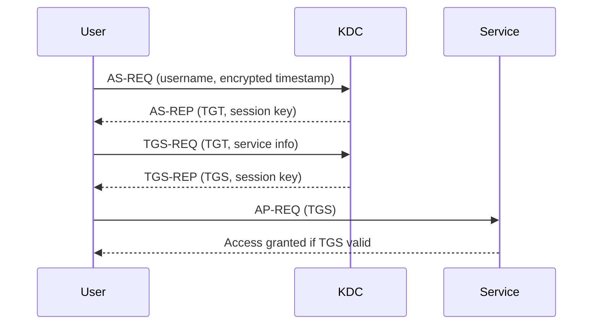

# Protocols

This document covers the protocols used in Active Directory. 

## Overview

Active Directory relies on four main protocols:
- **Kerberos**: Authentication protocol
- **DNS**: Name resolution and service location
- **LDAP**: Directory access and management
- **MSRPC**: Remote procedure calls for client-server communication

---

## Kerberos

Kerberos is the default authentication protocol for domain accounts since Windows 2000. It is an open standard, enabling interoperability with other systems. Kerberos uses mutual authentication and is stateless, relying on tickets rather than transmitting user passwords over the network.

**Key Points:**
- Used for authenticating users and services in AD
- Based on tickets (TGT and TGS)
- Domain Controllers run a Key Distribution Center (KDC)
- Port: 88 (TCP/UDP)

### Kerberos Authentication Process
1. **User Login:**
   - User enters credentials; password is used to encrypt a timestamp.
   - The client sends an Authentication Service Request (AS-REQ) to the KDC.
2. **KDC Issues TGT:**
   - KDC verifies the request and issues a Ticket Granting Ticket (TGT), encrypted with the krbtgt account's secret key.
   - TGT is sent to the user (AS-REP).
3. **Requesting Service Ticket:**
   - User presents the TGT to the KDC, requesting a Ticket Granting Service (TGS) ticket for a specific service (TGS-REQ).
4. **KDC Issues TGS:**
   - KDC validates the TGT and issues a TGS, encrypted with the service's NTLM password hash (TGS-REP).
5. **Accessing the Service:**
   - User presents the TGS to the target service (AP-REQ).
   - If valid, access is granted.

### Mermaid Diagram: Kerberos Authentication Flow

Kerberos ensures that user credentials are never sent over the network, and authentication is based on the possession of valid tickets. The KDC does not keep session state, relying on the validity of the TGT and TGS for access control.

--- 