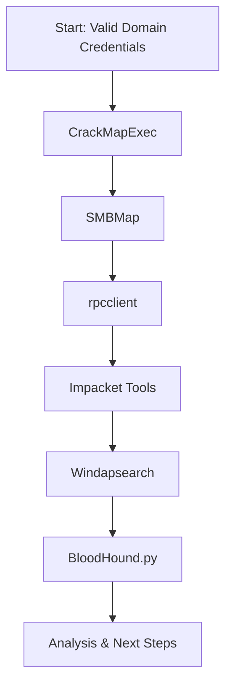

## Table of Contents
- [Credentialed Enumeration – from Linux](#credentialed-enumeration--from-linux)
    - [Enumeration Workflow (Visual)](#enumeration-workflow-visual)
    - [CrackMapExec (CME)](#crackmapexec-cme)
    - [SMBMap](#smbmap)
    - [rpcclient](#rpcclient)
    - [Impacket Toolkit](#impacket-toolkit)
    - [Windapsearch](#windapsearch)
    - [BloodHound.py](#bloodhoundpy)
    - [Summary Table: Key Tools & Use Cases](#summary-table-key-tools--use-cases)

# Credentialed Enumeration – from Linux

## Overview
- After obtaining valid domain credentials, enumerate AD in depth: users, groups, computers, shares, GPOs, ACLs, trusts, and more.
- Most tools require at least a low-privilege domain user, NTLM hash, or SYSTEM access.

---

## Enumeration Workflow (Visual)


---

## CrackMapExec (CME)
- Swiss army knife for AD enumeration and exploitation.
- Supports SMB, WinRM, MSSQL, SSH protocols.
- Key flags: `--users`, `--groups`, `--loggedon-users`, `--shares`, `-M spider_plus`

**Enumerate Users:**
```bash
sudo crackmapexec smb 172.16.5.5 -u forend -p Klmcargo2 --users
```
**Enumerate Groups:**
```bash
sudo crackmapexec smb 172.16.5.5 -u forend -p Klmcargo2 --groups
```
**Logged On Users:**
```bash
sudo crackmapexec smb 172.16.5.130 -u forend -p Klmcargo2 --loggedon-users
```
**Enumerate Shares:**
```bash
sudo crackmapexec smb 172.16.5.5 -u forend -p Klmcargo2 --shares
```
**Spider Shares:**
```bash
sudo crackmapexec smb 172.16.5.5 -u forend -p Klmcargo2 -M spider_plus --share 'Department Shares'
```

---

## SMBMap
- Enumerate SMB shares, permissions, and recursively list directories/files.

**Check Access:**
```bash
smbmap -u forend -p Klmcargo2 -d INLANEFREIGHT.LOCAL -H 172.16.5.5
```
**Recursive Directory Listing:**
```bash
smbmap -u forend -p Klmcargo2 -d INLANEFREIGHT.LOCAL -H 172.16.5.5 -R 'Department Shares' --dir-only
```

---

## rpcclient
- Versatile tool for MS-RPC enumeration (users, groups, RIDs, etc.).

**Connect (NULL session or credentialed):**
```bash
rpcclient -U "" -N 172.16.5.5
rpcclient -U 'forend%Klmcargo2' 172.16.5.5
```
**Enumerate Users by RID:**
```bash
rpcclient $> queryuser 0x457
```
**List All Users:**
```bash
rpcclient $> enumdomusers
```

---

## Impacket Toolkit
- Python toolkit for Windows protocol interaction and exploitation.
- Key tools: `psexec.py`, `wmiexec.py`

**psexec.py (interactive SYSTEM shell):**
```bash
psexec.py inlanefreight.local/wley:'transporter@4'@172.16.5.125
```
**wmiexec.py (semi-interactive shell):**
```bash
wmiexec.py inlanefreight.local/wley:'transporter@4'@172.16.5.5
```

---

## Windapsearch
- Python script for LDAP enumeration (users, groups, computers, privileged users).

**Enumerate Domain Admins:**
```bash
python3 windapsearch.py --dc-ip 172.16.5.5 -u forend@inlanefreight.local -p Klmcargo2 --da
```
**Enumerate Privileged Users:**
```bash
python3 windapsearch.py --dc-ip 172.16.5.5 -u forend@inlanefreight.local -p Klmcargo2 -PU
```

---

## BloodHound.py
- Collects AD data for graphical analysis of attack paths and relationships.

**Collect All Data:**
```bash
sudo bloodhound-python -u 'forend' -p 'Klmcargo2' -ns 172.16.5.5 -d inlanefreight.local -c all
```
- Upload JSON/ZIP output to BloodHound GUI for analysis.

---

## Summary Table: Key Tools & Use Cases
| Tool            | Main Purpose                        | Example Command/Flag           |
|-----------------|-------------------------------------|-------------------------------|
| CrackMapExec    | Users, groups, shares, sessions     | --users, --groups, --shares   |
| SMBMap          | Share/dir listing, permissions      | -R, --dir-only                |
| rpcclient       | User/group/RID enumeration          | enumdomusers, queryuser       |
| Impacket        | Remote shell, command exec          | psexec.py, wmiexec.py         |
| Windapsearch    | LDAP user/group/privilege enum      | --da, -PU                     |
| BloodHound.py   | Graphical AD attack path analysis   | -c all                        |

---

**Tip:** Save all output for later analysis and reporting. Use visuals (BloodHound) to map relationships and plan lateral movement. 