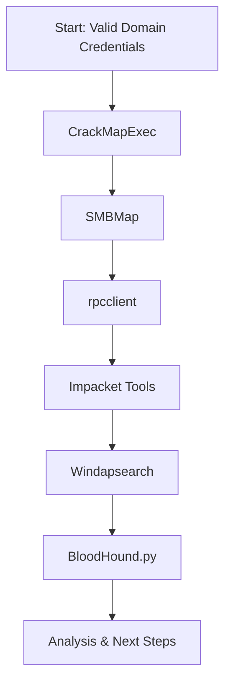

# Credentialed Enumeration in Active Directory

This document covers practical techniques and tools for enumerating Active Directory environments after obtaining valid credentials. It provides step-by-step guidance for both Linux and Windows attack hosts, including built-in and third-party tools, example commands, and workflow visuals to help you map out and analyze AD environments during internal assessments.

## Table of Contents
- [Credentialed Enumeration – from Linux](#credentialed-enumeration--from-linux)
    - [Enumeration Workflow (Visual)](#enumeration-workflow-visual)
    - [CrackMapExec (CME)](#crackmapexec-cme)
    - [SMBMap](#smbmap)
    - [rpcclient](#rpcclient)
    - [Impacket Toolkit](#impacket-toolkit)
    - [Windapsearch](#windapsearch)
    - [BloodHound.py](#bloodhoundpy)
    - [Summary Table: Key Tools & Use Cases](#summary-table-key-tools--use-cases)
- [Credentialed Enumeration – from Windows](#credentialed-enumeration--from-windows)
    - [Overview](#overview-1)
    - [Enumeration Workflow (Visual)](#enumeration-workflow-visual-1)
    - [ActiveDirectory PowerShell Module](#activedirectory-powershell-module)
    - [PowerView / SharpView](#powerview--sharpview)
    - [Snaffler](#snaffler)
    - [BloodHound / SharpHound](#bloodhound--sharphound)
    - [Summary Table: Key Tools & Use Cases (Windows)](#summary-table-key-tools--use-cases-windows)

# Credentialed Enumeration – from Linux

## Overview
- After obtaining valid domain credentials, enumerate AD in depth: users, groups, computers, shares, GPOs, ACLs, trusts, and more.
- Most tools require at least a low-privilege domain user, NTLM hash, or SYSTEM access.

---

## Enumeration Workflow (Visual)


---

## CrackMapExec (CME)
- Swiss army knife for AD enumeration and exploitation.
- Supports SMB, WinRM, MSSQL, SSH protocols.
- Key flags: `--users`, `--groups`, `--loggedon-users`, `--shares`, `-M spider_plus`

**Enumerate Users:**
```bash
sudo crackmapexec smb 172.16.5.5 -u forend -p Klmcargo2 --users
```
**Enumerate Groups:**
```bash
sudo crackmapexec smb 172.16.5.5 -u forend -p Klmcargo2 --groups
```
**Logged On Users:**
```bash
sudo crackmapexec smb 172.16.5.130 -u forend -p Klmcargo2 --loggedon-users
```
**Enumerate Shares:**
```bash
sudo crackmapexec smb 172.16.5.5 -u forend -p Klmcargo2 --shares
```
**Spider Shares:**
```bash
sudo crackmapexec smb 172.16.5.5 -u forend -p Klmcargo2 -M spider_plus --share 'Department Shares'
```

---

## SMBMap
- Enumerate SMB shares, permissions, and recursively list directories/files.

**Check Access:**
```bash
smbmap -u forend -p Klmcargo2 -d INLANEFREIGHT.LOCAL -H 172.16.5.5
```
**Recursive Directory Listing:**
```bash
smbmap -u forend -p Klmcargo2 -d INLANEFREIGHT.LOCAL -H 172.16.5.5 -R 'Department Shares' --dir-only
```

---

## rpcclient
- Versatile tool for MS-RPC enumeration (users, groups, RIDs, etc.).

**Connect (NULL session or credentialed):**
```bash
rpcclient -U "" -N 172.16.5.5
rpcclient -U 'forend%Klmcargo2' 172.16.5.5
```
**Enumerate Users by RID:**
```bash
rpcclient $> queryuser 0x457
```
**List All Users:**
```bash
rpcclient $> enumdomusers
```

---

## Impacket Toolkit
- Python toolkit for Windows protocol interaction and exploitation.
- Key tools: `psexec.py`, `wmiexec.py`

**psexec.py (interactive SYSTEM shell):**
```bash
psexec.py inlanefreight.local/wley:'transporter@4'@172.16.5.125
```
**wmiexec.py (semi-interactive shell):**
```bash
wmiexec.py inlanefreight.local/wley:'transporter@4'@172.16.5.5
```

---

## Windapsearch
- Python script for LDAP enumeration (users, groups, computers, privileged users).

**Enumerate Domain Admins:**
```bash
python3 windapsearch.py --dc-ip 172.16.5.5 -u forend@inlanefreight.local -p Klmcargo2 --da
```
**Enumerate Privileged Users:**
```bash
python3 windapsearch.py --dc-ip 172.16.5.5 -u forend@inlanefreight.local -p Klmcargo2 -PU
```

---

## BloodHound.py
- Collects AD data for graphical analysis of attack paths and relationships.

**Collect All Data:**
```bash
sudo bloodhound-python -u 'forend' -p 'Klmcargo2' -ns 172.16.5.5 -d inlanefreight.local -c all
```
- Upload JSON/ZIP output to BloodHound GUI for analysis.

---

## Summary Table: Key Tools & Use Cases
| Tool            | Main Purpose                        | Example Command/Flag           |
|-----------------|-------------------------------------|-------------------------------|
| CrackMapExec    | Users, groups, shares, sessions     | --users, --groups, --shares   |
| SMBMap          | Share/dir listing, permissions      | -R, --dir-only                |
| rpcclient       | User/group/RID enumeration          | enumdomusers, queryuser       |
| Impacket        | Remote shell, command exec          | psexec.py, wmiexec.py         |
| Windapsearch    | LDAP user/group/privilege enum      | --da, -PU                     |
| BloodHound.py   | Graphical AD attack path analysis   | -c all                        |

---

**Tip:** Save all output for later analysis and reporting. Use visuals (BloodHound) to map relationships and plan lateral movement. 

---

# Credentialed Enumeration – from Windows

## Overview
- Enumerate AD from a Windows attack host using built-in and third-party tools.
- Tools: ActiveDirectory PowerShell module, PowerView/SharpView, Grouper2, Snaffler, BloodHound/SharpHound, and more.
- Useful for both attack path discovery and reporting informational findings.

---

## Enumeration Workflow (Visual)
```mermaid
flowchart TD
    A[Start: Valid Domain Credentials on Windows] --> B[ActiveDirectory PowerShell Module]
    B --> C[PowerView / SharpView]
    C --> D[Snaffler]
    D --> E[SharpHound (BloodHound)]
    E --> F[Analysis & Next Steps]
```

---

## ActiveDirectory PowerShell Module
- 147+ cmdlets for AD administration and enumeration.
- Import and use for stealthy, built-in enumeration.

**Import Module & List Modules:**
```powershell
Get-Module
Import-Module ActiveDirectory
Get-Module
```
**Get Domain Info:**
```powershell
Get-ADDomain
```
**Find Kerberoastable Accounts:**
```powershell
Get-ADUser -Filter {ServicePrincipalName -ne "$null"} -Properties ServicePrincipalName
```
**Check Trust Relationships:**
```powershell
Get-ADTrust -Filter *
```
**List Groups & Members:**
```powershell
Get-ADGroup -Filter * | select name
Get-ADGroup -Identity "Backup Operators"
Get-ADGroupMember -Identity "Backup Operators"
```

---

## PowerView / SharpView
- PowerView: PowerShell tool for deep AD recon (users, groups, ACLs, trusts, shares, sessions, etc.).
- SharpView: .NET port of PowerView for use when PowerShell is restricted.

**PowerView Example – User Info:**
```powershell
Get-DomainUser -Identity mmorgan -Domain inlanefreight.local | Select-Object -Property name,samaccountname,description,memberof,whencreated,pwdlastset,lastlogontimestamp,accountexpires,admincount,userprincipalname,serviceprincipalname,useraccountcontrol
```
**Recursive Group Membership:**
```powershell
Get-DomainGroupMember -Identity "Domain Admins" -Recurse
```
**Trust Mapping:**
```powershell
Get-DomainTrustMapping
```
**Test Local Admin Access:**
```powershell
Test-AdminAccess -ComputerName ACADEMY-EA-MS01
```
**Find Users with SPN Set:**
```powershell
Get-DomainUser -SPN -Properties samaccountname,ServicePrincipalName
```
**SharpView Example:**
```powershell
.\SharpView.exe Get-DomainUser -Identity forend
```

---

## Snaffler
- Finds sensitive files and credentials in domain shares.
- Color-coded output, logs to file, and helps identify high-value data.

**Run Snaffler:**
```powershell
.\Snaffler.exe -d INLANEFREIGHT.LOCAL -s -v data -o snaffler.log
```

---

## BloodHound / SharpHound
- Visualizes AD relationships and attack paths.
- Collect data with SharpHound, analyze in BloodHound GUI.

**Collect Data:**
```powershell
.\SharpHound.exe -c All --zipfilename ILFREIGHT
```
- Upload the resulting ZIP to BloodHound GUI for analysis.

---

## Summary Table: Key Tools & Use Cases (Windows)
| Tool/Script         | Main Purpose                        | Example Command/Flag           |
|---------------------|-------------------------------------|-------------------------------|
| AD PowerShell Module| Built-in AD enumeration             | Get-ADUser, Get-ADGroup       |
| PowerView           | Deep AD recon, ACLs, trusts, shares | Get-DomainUser, Get-DomainTrust|
| SharpView           | PowerView in .NET (no PowerShell)   | Get-DomainUser, -Help         |
| Snaffler            | Find sensitive files in shares      | -d, -s, -v data, -o           |
| SharpHound          | BloodHound data collection          | -c All, --zipfilename         |
| BloodHound GUI      | Visual AD attack path analysis      | Upload ZIP, run queries       |

---

**Tip:** Use built-in tools for stealth, third-party tools for depth. Document all findings and output for reporting and further analysis. 