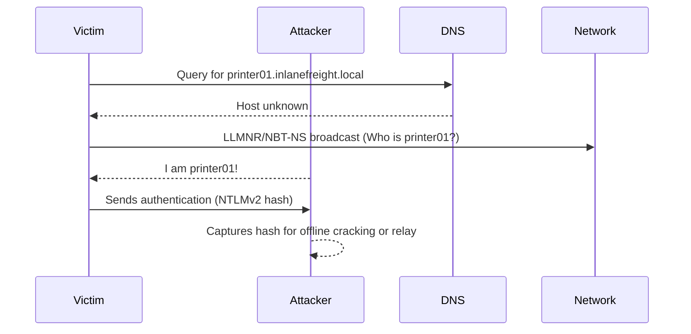

# LLMNR/NBT-NS Poisoning (from Linux)

This section covers a common technique for gaining an initial foothold in an AD environment: Man-in-the-Middle attacks on Link-Local Multicast Name Resolution (LLMNR) and NetBIOS Name Service (NBT-NS) broadcasts. The goal is to capture password hashes or cleartext credentials for domain user accounts.

---

## LLMNR & NBT-NS Primer
- **LLMNR (UDP 5355):** DNS-like protocol for local name resolution when DNS fails.
- **NBT-NS (UDP 137):** NetBIOS-based name resolution for local networks.
- If DNS fails, Windows will broadcast LLMNR/NBT-NS requests to the local network. Any host can reply, making poisoning possible.

### Attack Flow (Visual)


---

## Tools for LLMNR/NBT-NS Poisoning
| Tool       | Description                                                                 |
|------------|-----------------------------------------------------------------------------|
| Responder  | Python tool for LLMNR, NBT-NS, MDNS poisoning and credential capture.       |
| Inveigh    | Cross-platform MITM tool for spoofing/poisoning (C#/PowerShell).            |
| Metasploit | Has modules for LLMNR/NBT-NS poisoning and credential capture.              |

---

## Using Responder
Responder is the most common tool for this attack. It can run in passive (analyze) or active (poison) mode.

### Common Responder Options
- `-A` : Analyze mode (listen only, no poisoning)
- `-I <iface>` : Network interface to use
- `-w` : Start WPAD rogue proxy server
- `-f` : Fingerprint hosts
- `-v` : Verbose output

### Example: Start Responder in Poisoning Mode
```bash
sudo responder -I ens224
```

### Example: Start Responder in Analyze Mode
```bash
sudo responder -I ens224 -A
```

Responder will print captured hashes to the console and save them in `/usr/share/responder/logs/`.

---

## Ports to Monitor/Poison
- UDP 137, 138, 53, 5355, 5353
- TCP 80, 135, 139, 445, 1433, 21, 25, 110, 587, 3128, 3141, 389

---

## Example: Captured Hashes
Responder saves hashes in files like `SMB-NTLMv2-SSP-<IP>.txt`.

---

## Cracking Captured Hashes
Captured NTLMv2 hashes can be cracked offline with Hashcat or John.

### Example: Crack NTLMv2 Hash with Hashcat
```bash
hashcat -m 5600 captured_hash.txt /usr/share/wordlists/rockyou.txt
```

**Sample Output:**
```
FOREND::INLANEFREIGHT:4af70a79938ddf8a:...:Klmcargo2
Status...........: Cracked
Hash.Name........: NetNTLMv2
Recovered........: 1/1 (100.00%) Digests
```

---

## Key Points
- LLMNR/NBT-NS poisoning is a powerful way to capture credentials in AD environments.
- Use Responder or Inveigh to listen and poison requests.
- Captured hashes can be cracked offline for cleartext passwords.
- Always run with proper scope and permissions.

---

This technique is often the first step in gaining a foothold for further enumeration and attacks in an AD environment. 