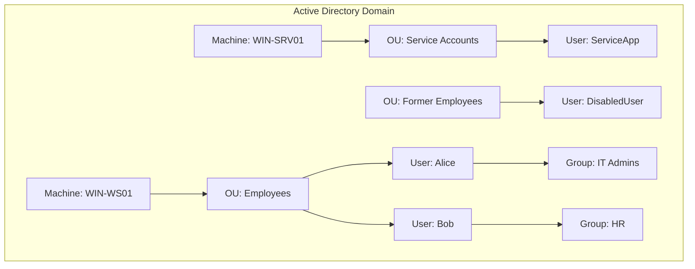
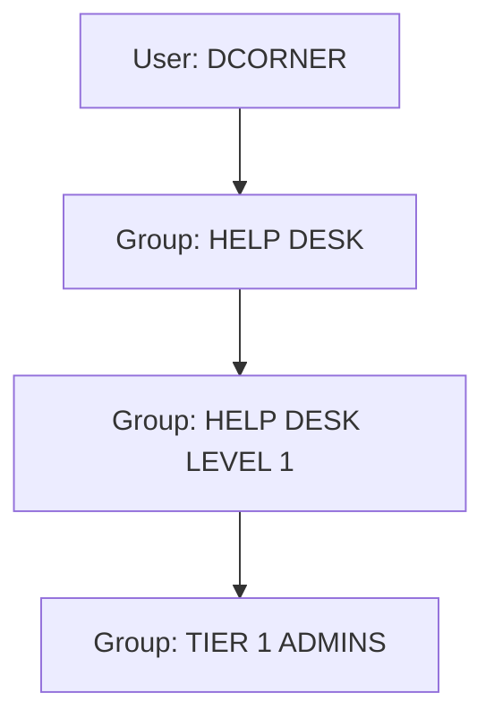

# AD Users

This document covers Active Directory users.

## User and Machine Accounts

User accounts are created both locally and in Active Directory (AD) to allow people or services to log on and access resources. When a user logs in, the system verifies their password and creates an access token, which includes the user's identity and group memberships. Groups simplify administration by allowing privileges to be assigned collectively.

### Account Types in Windows Environments
| Account Type      | Description                                                                                 |
|------------------|---------------------------------------------------------------------------------------------|
| Local User       | Exists only on a specific host; rights apply only to that host.                              |
| Domain User      | Managed by AD; can log in to any domain-joined host and access domain resources.             |
| Service Account  | Used to run applications/services with specific privileges.                                  |
| Machine Account  | Represents computers in AD; has similar rights to a standard domain user.                    |
| Disabled Account | Deactivated but not deleted; often kept for audit purposes (e.g., FORMER EMPLOYEES OU).      |

### Default Local Accounts
| Account Name   | Description                                                                                   |
|---------------|-----------------------------------------------------------------------------------------------|
| Administrator | First account created; full control; cannot be deleted or locked, but can be disabled/renamed. |
| Guest         | Disabled by default; allows temporary login with limited rights.                               |
| SYSTEM        | Used by OS for internal functions; highest permission level; not visible in User Manager.      |
| Network Service | Runs Windows services; presents credentials to remote services.                              |
| Local Service | Runs Windows services with minimal privileges; presents anonymous credentials to network.      |

---

## Domain Users

Domain users are granted rights from the domain to access resources (file servers, printers, intranet, etc.) based on their account or group memberships. They can log in to any domain-joined host. Special accounts include:
- **KRBTGT**: Built-in service account for Kerberos Key Distribution; critical for domain authentication and a common attack target.

### User Naming Attributes
| Attribute         | Description                                                                                 |
|-------------------|--------------------------------------------------------------------------------------------|
| UserPrincipalName | Primary logon name (usually email address).                                                |
| ObjectGUID        | Unique identifier for the user; never changes.                                             |
| SAMAccountName    | Logon name for legacy Windows clients/servers.                                             |
| objectSID         | Security Identifier; identifies user and group memberships.                                |
| sIDHistory        | Previous SIDs for migrated users; used in domain migrations.                               |

### Example: Common User Attributes
```powershell
PS C:\htb> Get-ADUser -Identity htb-student

DistinguishedName : CN=htb student,CN=Users,DC=INLANEFREIGHT,DC=LOCAL
Enabled           : True
GivenName         : htb
Name              : htb student
ObjectClass       : user
ObjectGUID        : aa799587-c641-4c23-a2f7-75850b4dd7e3
SamAccountName    : htb-student
SID               : S-1-5-21-3842939050-3880317879-2865463114-1111
Surname           : student
UserPrincipalName : htb-student@INLANEFREIGHT.LOCAL
```

---

## Domain-Joined vs. Non-Domain-Joined Machines

| Machine Type         | Description                                                                                   |
|---------------------|-----------------------------------------------------------------------------------------------|
| Domain-Joined       | Managed centrally; receives policies/updates from DC; users can log in from any domain host.   |
| Non-Domain-Joined   | Standalone/workgroup; managed locally; user accounts exist only on that host.                  |

- **Domain-joined**: Centralized management, easier resource sharing, and policy enforcement.
- **Non-domain-joined**: Local management, suitable for home/small business, no central policy.

---

## Visual: User and Machine Account Relationships in AD


---

## Active Directory Groups

Groups are a fundamental object in Active Directory (AD) used to organize users, computers, and other objects for easier management and permission assignment. Groups can simplify administration, but if not managed carefully, can lead to excessive or unintended privileges.

### Groups vs. Organizational Units (OUs)
- **Groups:** Used to assign permissions to access resources. Membership determines access rights.
- **OUs:** Used to organize objects for management and apply Group Policy. Can delegate admin tasks without granting extra rights via group membership.

---

### Types of Groups
| Group Type      | Purpose                                                                                   |
|-----------------|------------------------------------------------------------------------------------------|
| Security        | Assign permissions/rights to users and computers for resources (files, printers, etc.).   |
| Distribution    | Used by email applications (e.g., Exchange) to distribute messages; not for permissions.  |

---

### Group Scopes
| Scope         | Description                                                                                 |
|---------------|--------------------------------------------------------------------------------------------|
| Domain Local  | Manage permissions to resources in the same domain; can include users from other domains.   |
| Global        | Can be used in any domain, but only contains users from its own domain.                     |
| Universal     | Used across multiple domains in a forest; can contain users/groups from any domain.         |

---

### Example: Group Scopes in AD
```powershell
PS C:\htb> Get-ADGroup  -Filter * |select samaccountname,groupscope

samaccountname                           groupscope
--------------                           ----------
Administrators                          DomainLocal
Users                                   DomainLocal
Guests                                  DomainLocal
Domain Computers                             Global
Domain Controllers                           Global
Schema Admins                             Universal
Enterprise Admins                         Universal
Domain Admins                                Global
Domain Users                                 Global
Domain Guests                                Global
```

---

### Built-in vs. Custom Groups
- **Built-in Groups:** Created by default for administrative purposes (e.g., Administrators, Users, Guests). Usually Domain Local scope.
- **Custom Groups:** Created by organizations for specific needs. Can be security or distribution, and any scope.

---

### Nested Group Membership
Groups can be members of other groups (nesting), which can lead to inherited privileges. This can make it difficult to audit effective permissions. Tools like BloodHound help visualize and analyze nested group relationships.

#### Visual: Nested Group Membership


---

### Important Group Attributes
| Attribute   | Description                                                      |
|-------------|------------------------------------------------------------------|
| cn          | Common-Name of the group                                         |
| member      | Users, groups, or contacts that are members of the group         |
| groupType   | Integer specifying group type and scope                          |
| memberOf    | Groups that contain this group as a member (nested membership)   |
| objectSid   | Security Identifier (SID) unique to the group                    |

---

Groups are essential for managing access and permissions in AD. Understanding group types, scopes, and nesting is critical for both administration and security assessment.

User and machine accounts are the foundation of AD security and administration. Proper management, naming, and group assignment are critical for both security and operational efficiency. 

## Active Directory Rights and Privileges

Rights and privileges are the foundation of AD management. Mismanagement can lead to privilege escalation and domain compromise. Understanding the difference is critical:
- **Rights:** Permissions to access objects (e.g., files, folders)
- **Privileges:** Permissions to perform actions (e.g., reset passwords, shut down systems)

Privileges can be assigned directly or via group membership. Windows User Rights Assignment (via Group Policy) controls many of these privileges.

---

### Built-in AD Groups and Their Privileges
| Group Name                | Description                                                                                       |
|--------------------------|---------------------------------------------------------------------------------------------------|
| Account Operators         | Create/modify most accounts; cannot manage admin accounts or key groups.                          |
| Administrators            | Full, unrestricted access to a computer or domain.                                                |
| Backup Operators          | Backup/restore all files; can log on to DCs locally; can extract sensitive databases.             |
| DnsAdmins                 | Manage DNS if DNS server role is/was installed.                                                   |
| Domain Admins             | Full domain admin rights; members of local admin group on all domain-joined machines.             |
| Domain Computers          | All computers (except DCs) in the domain.                                                         |
| Domain Controllers        | All DCs in the domain.                                                                            |
| Domain Guests             | Built-in Guest account; limited access.                                                           |
| Domain Users              | All user accounts in the domain.                                                                  |
| Enterprise Admins         | Forest-wide configuration rights; only in root domain.                                            |
| Event Log Readers         | Read event logs on local computers.                                                               |
| Group Policy Creator Owners| Create/edit/delete Group Policy Objects.                                                         |
| Hyper-V Administrators    | Full access to Hyper-V features.                                                                  |
| IIS_IUSRS                 | Used by Internet Information Services (IIS).                                                     |
| Print Operators           | Manage printers on DCs; can log on locally to DCs.                                                |
| Protected Users           | Additional protections against credential theft.                                                  |
| Read-only Domain Controllers| All RODCs in the domain.                                                                       |
| Remote Desktop Users      | Permission to connect via RDP.                                                                    |
| Remote Management Users   | Remote access via WinRM.                                                                          |
| Schema Admins             | Modify the AD schema; only in root domain.                                                        |
| Server Operators          | Modify services, access shares, backup files on DCs.                                              |

---

### Example: Viewing Group Details
```powershell
PS C:\htb> Get-ADGroup -Identity "Server Operators" -Properties *
# ...output shows group details, scope, and members

PS C:\htb> Get-ADGroup -Identity "Domain Admins" -Properties * | select DistinguishedName,GroupCategory,GroupScope,Name,Members
# ...output shows group details and members
```

---

### User Rights Assignment (Privileges)
Privileges can be assigned via group membership or directly to users. Some key privileges include:

| Privilege                        | Description                                                                                 |
|----------------------------------|--------------------------------------------------------------------------------------------|
| SeRemoteInteractiveLogonRight    | Log on via Remote Desktop (RDP).                                                            |
| SeBackupPrivilege                | Create system backups; can be used to extract sensitive files (SAM, NTDS.dit, etc.).        |
| SeDebugPrivilege                 | Debug/adjust memory of processes (e.g., dump LSASS for credentials).                        |
| SeImpersonatePrivilege           | Impersonate tokens of privileged accounts (used in privilege escalation attacks).           |
| SeLoadDriverPrivilege            | Load/unload device drivers (potential for privilege escalation).                            |
| SeTakeOwnershipPrivilege         | Take ownership of objects (files, shares, etc.).                                            |

---

### Example: Viewing User Privileges
```powershell
PS C:\htb> whoami /priv

PRIVILEGES INFORMATION
----------------------
Privilege Name                Description                    State
============================= ============================== ========
SeChangeNotifyPrivilege       Bypass traverse checking       Enabled
SeIncreaseWorkingSetPrivilege Increase a process working set Disabled
# ...
```

- Standard users have limited rights.
- Domain Admins have more rights, especially in an elevated session (due to User Account Control/UAC).

---

User rights and privileges increase based on group membership and assigned privileges. Misconfiguration or excessive rights can lead to privilege escalation and domain compromise. Regular audits and least privilege principles are essential for AD security. 