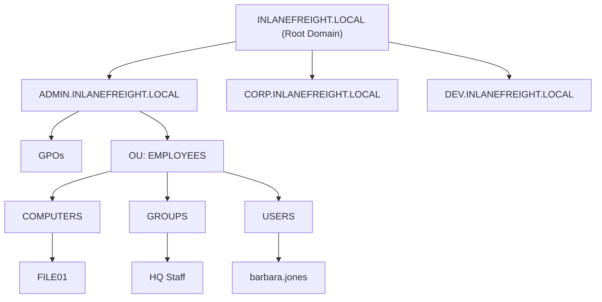

# Fundamentals

## What is Active Directory?

Active Directory (AD) is a directory service developed by Microsoft for Windows network environments. It provides a distributed, hierarchical structure for centralized management of resources such as users, computers, groups, network devices, file shares, group policies, servers, workstations, and trusts. AD is a core component in most enterprise Windows environments, offering authentication and authorization services within a Windows domain.

## Why Active Directory?

- Centralizes management of users, computers, and resources.
- Provides authentication and authorization within a Windows domain.
- Enables enforcement of security policies and access controls.
- Widely used in enterprise environments, but can be complex and prone to misconfiguration.
- Security weaknesses and misconfigurations can be exploited for lateral movement and privilege escalation.
- Any domain user can enumerate most AD objects, making proper security and hardening essential.

## Active Directory Structure

AD is arranged in a hierarchical tree structure:
- **Forest:** Top-level security boundary, contains one or more domains.
- **Domain:** Logical group of objects (users, computers, groups), may have child/sub-domains.
- **Organizational Units (OUs):** Containers within domains for organizing objects and applying group policies. OUs can be nested.

### Example Structure
```
INLANEFREIGHT.LOCAL/
├── ADMIN.INLANEFREIGHT.LOCAL
│   ├── GPOs
│   └── OU
│       └── EMPLOYEES
│           ├── COMPUTERS
│           │   └── FILE01
│           ├── GROUPS
│           │   └── HQ Staff
│           └── USERS
│               └── barbara.jones
├── CORP.INLANEFREIGHT.LOCAL
└── DEV.INLANEFREIGHT.LOCAL
```

#### Visual Representation


### Security Implications
- AD flaws and misconfigurations can allow attackers to gain internal access, move laterally/vertically, and access protected resources (databases, file shares, source code, etc.).
- Even basic user accounts can enumerate most AD objects, including:
  - Domain Computers
  - Domain Users
  - Domain Group Information
  - Organizational Units (OUs)
  - Group Policy Objects (GPOs)
  - Domain Trusts
  - Access Control Lists (ACLs)
- Trust relationships between domains/forests can simplify integration but may introduce security risks if not managed properly.

## Active Directory Terminology

Before diving deeper, here are key terms you’ll encounter when working with Active Directory (AD):

- **Object:** Any resource in AD (users, computers, OUs, printers, etc.).
- **Attribute:** Properties that define an object (e.g., hostname, displayName). Each has an LDAP name.
- **Schema:** The blueprint of AD, defining object types and their attributes. Objects are instances of classes (e.g., a computer object is an instance of the "computer" class).
- **Domain:** Logical group of objects (users, computers, OUs, groups). Domains can be independent or connected via trusts.
- **Forest:** Top-level container holding one or more domains. Forests can have trust relationships with other forests.
- **Tree:** Collection of domains starting at a root domain. Trees in a forest cannot share a namespace.
- **Container:** Object that holds other objects in the directory hierarchy.
- **Leaf:** Object that does not contain other objects (end of the hierarchy).
- **GUID (Global Unique Identifier):** Unique 128-bit value assigned to every AD object (ObjectGUID attribute). Never changes for the object's lifetime.
- **Security Principal:** Any entity that can be authenticated (users, computers, service accounts).
- **SID (Security Identifier):** Unique identifier for security principals and groups. Used for access control.
- **Distinguished Name (DN):** Full path to an object in AD (e.g., cn=bjones,ou=IT,dc=inlanefreight,dc=local).
- **Relative Distinguished Name (RDN):** Unique name for an object at its level in the hierarchy (e.g., bjones in the above DN).
- **sAMAccountName:** User logon name (max 20 characters, e.g., bjones).
- **userPrincipalName:** Alternative user identifier in the format user@domain (e.g., bjones@inlanefreight.local).
- **FSMO Roles:** Five Flexible Single Master Operation roles for domain controllers: Schema Master, Domain Naming Master (forest-wide); RID Master, PDC Emulator, Infrastructure Master (domain-wide).
- **Global Catalog (GC):** Domain controller that stores all objects in the forest (full for its domain, partial for others). Enables forest-wide searches and authentication.
- **RODC (Read-Only Domain Controller):** Domain controller with a read-only AD database. No password caching except for its own account.
- **Replication:** Synchronization of AD objects and changes between domain controllers.
- **SPN (Service Principal Name):** Unique identifier for a service instance, used in Kerberos authentication.
- **GPO (Group Policy Object):** Collection of policy settings applied to users/computers, identified by a GUID.
- **ACL (Access Control List):** Ordered list of Access Control Entries (ACEs) defining permissions on an object.
- **ACE (Access Control Entry):** Entry in an ACL specifying allowed/denied rights for a trustee.
- **DACL (Discretionary ACL):** Defines which security principals are granted/denied access to an object.
- **SACL (System ACL):** Specifies which access attempts are logged for auditing.
- **FQDN (Fully Qualified Domain Name):** Complete name for a host (e.g., DC01.INLANEFREIGHT.LOCAL).
- **Tombstone:** Container for deleted AD objects, retained for a set period (Tombstone Lifetime).
- **AD Recycle Bin:** Feature for restoring deleted AD objects with most attributes preserved.
- **SYSVOL:** Shared folder on DCs storing public files, GPOs, and scripts, replicated across DCs.
- **AdminSDHolder:** Object managing ACLs for privileged groups; SDProp process enforces correct ACLs.
- **dsHeuristics:** Attribute for forest-wide configuration settings, including protected groups.
- **adminCount:** Attribute indicating if an account is protected by SDProp (1 = protected).
- **ADUC (Active Directory Users and Computers):** GUI tool for managing AD objects.
- **ADSI Edit:** Advanced GUI tool for editing AD objects and attributes.
- **sIDHistory:** Attribute holding previous SIDs for migrated objects (used in domain migrations).
- **NTDS.DIT:** Main AD database file on DCs, storing all AD data and password hashes.
- **MSBROWSE:** Legacy protocol for network resource browsing (now obsolete).

## Active Directory Objects

In AD, an **object** is any resource present in the environment (users, computers, OUs, printers, etc.). Objects are the core building blocks of Active Directory. Here are the main types:

- **User**
  - Represents an individual user account (leaf object, cannot contain other objects)
  - Security principal: has a SID and GUID
  - Attributes: display name, login info, email, last login, password change date, manager, etc.
  - Key target for attackers; even low-privileged users can enumerate much of AD

- **Contact**
  - Represents external users (e.g., vendors, customers)
  - Leaf object, not a security principal (no SID, only GUID)
  - Attributes: name, email, phone, etc.

- **Printer**
  - Points to a network-accessible printer
  - Leaf object, not a security principal (no SID, only GUID)
  - Attributes: printer name, driver, port, etc.

- **Computer**
  - Represents a computer joined to AD (workstation or server)
  - Leaf object, security principal (has SID and GUID)
  - Attributes: hostname, OS, etc.
  - Full admin access to a computer = similar rights to a domain user

- **Shared Folder**
  - Points to a shared folder on a computer
  - Not a security principal (only GUID)
  - Attributes: name, location, access rights
  - Access can be open, authenticated, or restricted

- **Group**
  - Container object: can contain users, computers, and other groups (nested groups)
  - Security principal (has SID and GUID)
  - Used to manage permissions and access
  - Attributes: name, description, membership
  - Nested groups can lead to unintended rights; tools like BloodHound help audit group membership

- **Organizational Unit (OU)**
  - Container for organizing objects (users, groups, computers)
  - Used for administrative delegation and Group Policy management
  - Attributes: name, members, security settings
  - OUs can be nested for granular delegation

- **Domain**
  - The main structure of an AD network
  - Contains users, computers, groups, OUs
  - Has its own database and policies

- **Domain Controller (DC)**
  - The server that authenticates users and enforces security policies
  - Stores information about all objects in the domain

- **Site**
  - Logical grouping of computers/subnets for efficient replication

- **Built-in**
  - Container for default groups created when a domain is set up

- **Foreign Security Principal (FSP)**
  - Placeholder object for a security principal from a trusted external forest
  - Created automatically when an external user/group/computer is added to a group in the current domain
  - Stored in the ForeignSecurityPrincipals container

--- 