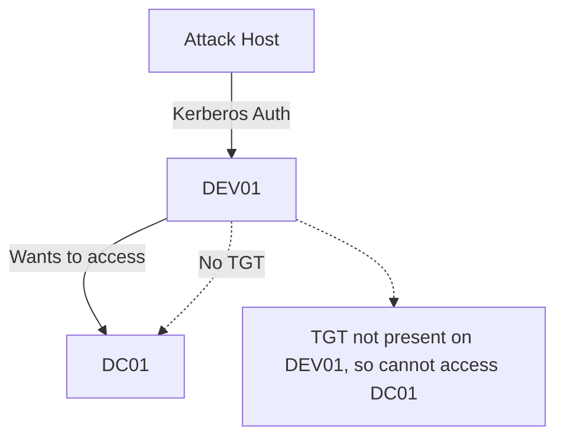

# Kerberos "Double Hop" Problem in Lateral Movement

## Overview
The Kerberos "Double Hop" problem is a common issue encountered during lateral movement in Active Directory environments, especially when using WinRM/PowerShell Remoting. It arises because Kerberos tickets are granted for specific resources and are not equivalent to passwords or NTLM hashes, which can be reused across multiple hops.

---

## What is the Double Hop Problem?
- **Kerberos tickets** are signed data from the KDC, granting access to specific resources (e.g., a single machine).
- When authenticating with a password (NTLM), the hash is stored in memory and can be reused for further authentication.
- With Kerberos, the ticket is only valid for the initial resource; it is not cached for use on subsequent hops.
- **Result:** When you authenticate to Host A via WinRM and try to access Host B from there, your credentials are not forwarded, and access is denied.

---

## Technical Background
- **Occurs most often with WinRM/PowerShell Remoting** (default Kerberos authentication).
- **Symptoms:**
  - You can access the first host, but cannot access other resources (e.g., file shares, DC) from that session.
  - Mimikatz run on the remote host shows no credentials for your user in memory.
- **Contrast:**
  - With PSExec or SMB/LDAP authentication, the NTLM hash is stored in memory and can be reused for further hops.

---

## Example: The Double Hop in Action

### 1. Attacker connects to DEV01 via WinRM as `backupadm`:
```powershell
Enter-PSSession -ComputerName DEV01 -Credential INLANEFREIGHT\backupadm
```

### 2. On DEV01, run Mimikatz to check credentials:
```powershell
.\mimikatz "privilege::debug" "sekurlsa::logonpasswords" exit
```
*Output: No credentials for backupadm in memory.*

### 3. Try to enumerate AD from DEV01 (fails):
```powershell
import-module .\PowerView.ps1
get-domainuser -spn
```
*Error: "An operations error occurred."*

### 4. Check Kerberos tickets:
```powershell
klist
```
*Output: Only a ticket for DEV01, not for the DC or other resources.*

---

## Why Does This Happen?
- When authenticating via WinRM, only a TGS (service ticket) for the target host is sent, not the TGT (Ticket Granting Ticket).
- The remote host cannot request new tickets on your behalf for other resources.
- **No password or NTLM hash is cached in memory** (unlike with PSExec or SMB).

---

## Visualizing the Double Hop



---

## When is the Double Hop NOT a Problem?
- **Unconstrained Delegation:**
  - If the target server has unconstrained delegation enabled, your TGT is sent to the server, which can then request tickets on your behalf for other resources.
  - *Warning: Unconstrained delegation is a major security risk!*

---

## Workarounds for the Double Hop Problem

### 1. Use a PSCredential Object for Each Command
- Pass credentials explicitly with each command to the next resource.
- **Example:**
```powershell
$SecPassword = ConvertTo-SecureString '!qazXSW@' -AsPlainText -Force
$Cred = New-Object System.Management.Automation.PSCredential('INLANEFREIGHT\backupadm', $SecPassword)
get-domainuser -spn -credential $Cred | select samaccountname
```
- *This works because credentials are sent with the command, allowing access to the DC.*

### 2. Register a PSSession Configuration (Requires GUI/Interactive Session)
- Register a new session configuration that runs as the target user.
- **Steps:**
    1. Register the session configuration:
    ```powershell
    Register-PSSessionConfiguration -Name backupadmsess -RunAsCredential inlanefreight\backupadm
    Restart-Service WinRM
    ```
    2. Start a new session using the configuration:
    ```powershell
    Enter-PSSession -ComputerName DEV01 -Credential INLANEFREIGHT\backupadm -ConfigurationName backupadmsess
    ```
    3. Now, `klist` will show a TGT for the DC, and you can run AD queries without specifying credentials each time.
- **Limitations:**
    - Cannot be used from evil-winrm or non-GUI shells.
    - Requires elevated PowerShell and GUI access (e.g., RDP).

### 3. Use RDP Instead of WinRM
- When you RDP to a host, your password is cached, and you can access other resources without the double hop issue.
- **Check with:**
```cmd
klist
```
- *You will see TGTs for the DC and other resources.*

---

## Other Workarounds (Not Covered in Depth)
- **CredSSP**: Enables credential delegation, but has security risks.
- **Port Forwarding**: Use SSH tunnels or similar to proxy requests.
- **Sacrificial Process Injection**: Inject into a process running as the target user.

---

## Defender Notes
- **Monitor for unconstrained delegation** and restrict it wherever possible.
- **Audit WinRM and RDP usage** to detect lateral movement attempts.
- **Monitor for suspicious use of Register-PSSessionConfiguration and credential delegation.**

---

## Summary Table
| Method                | Double Hop Problem? | Credentials Cached? | Can Access DC/Other Hosts? |
|-----------------------|--------------------|---------------------|----------------------------|
| WinRM (Kerberos)      | Yes                | No                  | No                         |
| WinRM + PSCredential  | No                 | No                  | Yes (per command)          |
| WinRM + PSSessionCfg  | No                 | Yes (TGT)           | Yes                        |
| RDP                   | No                 | Yes (TGT)           | Yes                        |
| PSExec/SMB/LDAP       | No                 | Yes (NTLM hash)     | Yes                        |

---

## Key Commands Reference
- **Check Kerberos tickets:**
    ```powershell
    klist
    ```
- **Run Mimikatz to check credentials:**
    ```powershell
    .\mimikatz "privilege::debug" "sekurlsa::logonpasswords" exit
    ```
- **Register a PSSession configuration:**
    ```powershell
    Register-PSSessionConfiguration -Name <name> -RunAsCredential <user>
    Restart-Service WinRM
    ```
- **Start a session with a custom configuration:**
    ```powershell
    Enter-PSSession -ComputerName <host> -Credential <user> -ConfigurationName <name>
    ```

---

## Further Reading
- [Microsoft Docs: Understanding the Kerberos Double Hop Problem](https://docs.microsoft.com/en-us/archive/blogs/askds/understanding-the-double-hop-problem)
- [Harmj0y: Kerberos Double Hop and PowerShell Remoting](https://www.harmj0y.net/blog/powershell/kerberos-double-hop-and-powershell-remoting/) 