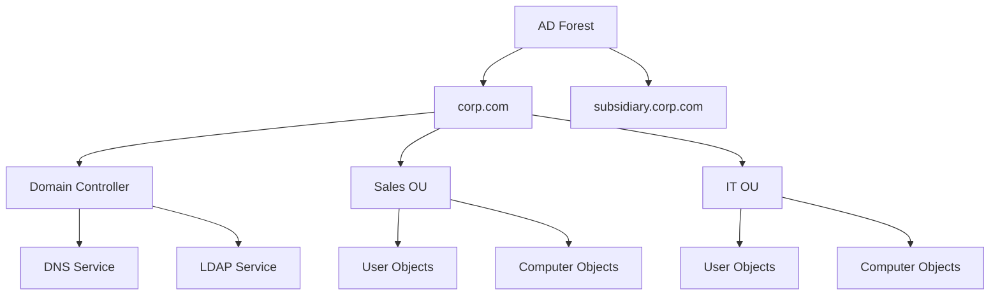
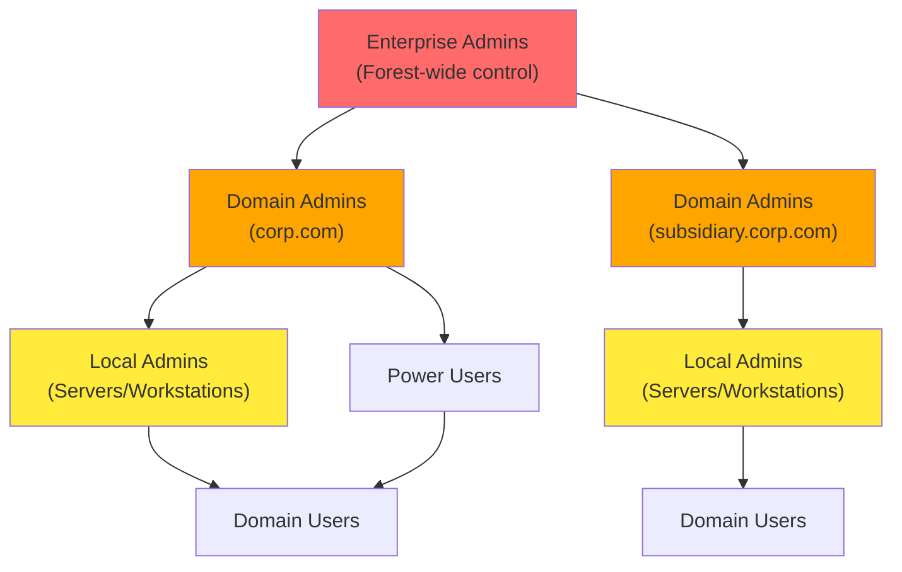
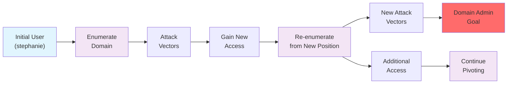
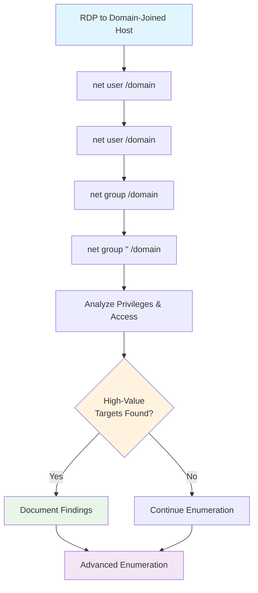

# Active Directory Introduction and Enumeration

Active Directory Domain Services, often referred to as Active Directory (AD), is a service that allows system administrators to update and manage operating systems, applications, users, and data access on a large scale. Active Directory is installed with a standard configuration; however, system administrators often customize it to fit the needs of the organization.

From a penetration tester's perspective, Active Directory is very interesting as it typically contains a wealth of information. If we successfully compromise certain objects within the domain, we may be able to take full control over the organization's infrastructure.

In this Learning Module, we will focus on the enumeration aspect of Active Directory. The information we will gather throughout the Module will have a direct impact on the various attacks we will do in the upcoming Attacking Active Directory Authentication and Lateral Movement in Active Directory Modules.

## Table of Contents

- [Introduction to Active Directory](#introduction-to-active-directory)
- [Active Directory Enumeration Using Manual Tools](#active-directory-enumeration-using-manual-tools)
- [Enumerating Active Directory Using Automated Tools](#enumerating-active-directory-using-automated-tools)

---

## Introduction to Active Directory

Active Directory (AD) is both a service and a management layer that stores critical information about an organization's environment—users, groups, computers, and their associated permissions. Each entity is an **object** with specific **attributes** that define its properties and capabilities within the domain.

### Core Components

**Domain Structure:**
- **Domain**: Fundamental AD unit (e.g., `corp.com`) containing all objects
- **Domain Controller (DC)**: Central hub storing all objects, OUs, and attributes
- **DNS Integration**: Critical dependency—DCs typically host authoritative DNS servers

**Object Organization:**
- **Organizational Units (OUs)**: Containers for organizing objects (similar to file system folders)
- **Computer Objects**: Domain-joined servers and workstations
- **User Objects**: Accounts for domain authentication
- **Group Objects**: Collections of users/computers for unified management

### AD Forest and Domain Structure



### Privilege Hierarchy



### Communication Protocols
- **LDAP**: Primary protocol for AD queries and enumeration
- **Kerberos**: Authentication protocol
- **DNS**: Name resolution and service location
- **SMB/CIFS**: File sharing and remote access

---

## Enumeration Goals and Methodology

### Scenario: corp.com Domain Assessment
- **Initial Access**: User `stephanie` with RDP permissions
- **Privilege Level**: Standard domain user (non-admin)
- **Target**: Full domain enumeration leading to domain administrator privileges
- **Scope**: corp.com domain within PWK labs

### Key Enumeration Targets
1. **High-Value Groups**: Domain Admins, Enterprise Admins, privileged service accounts
2. **Attack Paths**: User permissions, group memberships, ACLs, trusts
3. **Vulnerable Services**: Kerberoastable accounts, ASREPRoast targets
4. **Lateral Movement**: RDP/WinRM access, local admin rights

### Enumeration Strategy: Iterative Pivoting



### Critical Success Factors
- **Perspective Shifts**: Each compromised account provides unique permissions and access
- **Persistent Re-enumeration**: Repeat enumeration with every new account/computer access
- **Individual User Privileges**: Never dismiss seemingly identical accounts—each may have unique permissions
- **Large Organization Complexity**: More users/computers = more opportunities for privilege escalation

This methodology ensures comprehensive coverage and maximizes the chance of finding privilege escalation paths in complex AD environments.

---

## Active Directory Enumeration Using Manual Tools

Manual enumeration forms the foundation of AD reconnaissance, leveraging built-in Windows tools and PowerShell/.NET capabilities. This approach provides deep understanding of the domain structure and builds expertise for more advanced techniques.

### Learning Objectives
- Enumerate Active Directory using legacy Windows applications
- Use PowerShell and .NET to perform additional AD enumeration

---

## Enumeration Using Legacy Windows Tools

### Initial Access Setup
**RDP Connection (Recommended):**
```bash
xfreerdp /u:<username> /d:<domain> /v:<target_ip>
# Example: xfreerdp /u:stephanie /d:corp.com /v:192.168.50.75
```

> **Warning**: Use RDP over PowerShell Remoting to avoid Kerberos Double Hop issues that can break domain enumeration tools.

### User Enumeration with net.exe

**List All Domain Users:**
```cmd
net user /domain
```
*Sample Output:*
```
User accounts for \\DC1.corp.com
-------------------------------------------------------------------------------
Administrator    dave         Guest
iis_service      jeff         jeffadmin  
jen              krbtgt       pete
stephanie
```

**Enumerate Specific User:**
```cmd
net user <username> /domain
# Example: net user jeffadmin /domain
```

**Key Information to Extract:**
- **Account Status**: Active/Inactive, expiration dates
- **Password Policy**: Last set, expiration, change requirements  
- **Group Memberships**: Local and Global groups
- **Login Information**: Last logon, allowed workstations
- **Administrative Indicators**: Look for prefixes/suffixes like "admin", "svc_", etc.

*Critical Finding Example:*
```
User name                    jeffadmin
Local Group Memberships      *Administrators
Global Group memberships     *Domain Users    *Domain Admins
```
→ **High-Value Target**: Domain Admin account identified

### Group Enumeration with net.exe

**List All Domain Groups:**
```cmd
net group /domain
```
*Sample Output:*
```
Group Accounts for \\DC1.corp.com
-------------------------------------------------------------------------------
*Domain Admins           *Enterprise Admins
*Management Department   *Sales Department
*Development Department  *Domain Users
```

**Enumerate Group Members:**
```cmd
net group "<group_name>" /domain
# Example: net group "Domain Admins" /domain
# Example: net group "Sales Department" /domain
```

### Strategic Enumeration Priorities

**1. High-Privilege Groups (Priority 1):**
```cmd
net group "Domain Admins" /domain
net group "Enterprise Admins" /domain  
net group "Schema Admins" /domain
net group "Administrators" /domain
```

**2. Custom Groups (Priority 2):**
```cmd
net group "Management Department" /domain
net group "Development Department" /domain
net group "Sales Department" /domain
```

**3. Service Groups (Priority 3):**
```cmd
net group "Backup Operators" /domain
net group "Server Operators" /domain
net group "Account Operators" /domain
```

### Enumeration Workflow



### Key Takeaways from Legacy Tool Enumeration

**Advantages:**
- **Stealth**: Built-in tools, minimal detection risk
- **Universal**: Available on all Windows systems
- **No Dependencies**: Works without additional tools

**Limitations:**
- **Limited Output**: Basic information only
- **Manual Process**: Requires individual queries
- **No Advanced Filtering**: Cannot perform complex searches

**Information Gained:**
- User account inventory
- Administrative account identification  
- Group structure and memberships
- Custom organizational groups
- Baseline for advanced enumeration

This foundational enumeration provides the groundwork for more sophisticated PowerShell and automated techniques covered in subsequent sections.

---
