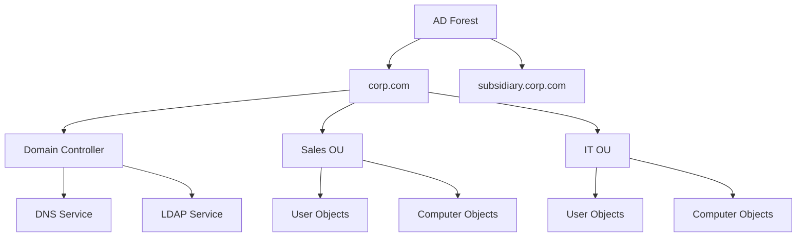
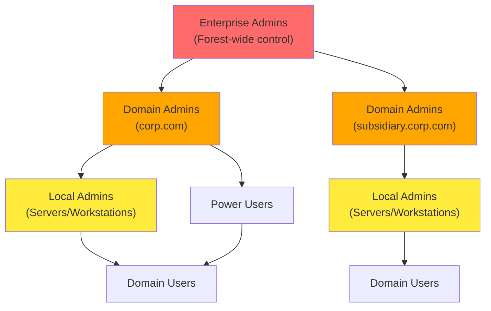
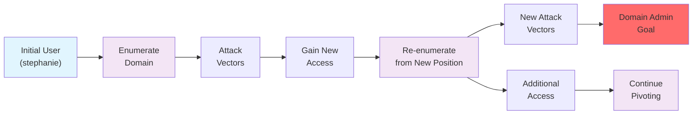

# Active Directory Introduction and Enumeration

Active Directory Domain Services, often referred to as Active Directory (AD), is a service that allows system administrators to update and manage operating systems, applications, users, and data access on a large scale. Active Directory is installed with a standard configuration; however, system administrators often customize it to fit the needs of the organization.

From a penetration tester's perspective, Active Directory is very interesting as it typically contains a wealth of information. If we successfully compromise certain objects within the domain, we may be able to take full control over the organization's infrastructure.

In this Learning Module, we will focus on the enumeration aspect of Active Directory. The information we will gather throughout the Module will have a direct impact on the various attacks we will do in the upcoming Attacking Active Directory Authentication and Lateral Movement in Active Directory Modules.

## Table of Contents

- [Introduction to Active Directory](#introduction-to-active-directory)
- [Active Directory Enumeration Using Manual Tools](#active-directory-enumeration-using-manual-tools)
- [Enumerating Active Directory Using Automated Tools](#enumerating-active-directory-using-automated-tools)

---

## Introduction to Active Directory

Active Directory (AD) is both a service and a management layer that stores critical information about an organization's environment—users, groups, computers, and their associated permissions. Each entity is an **object** with specific **attributes** that define its properties and capabilities within the domain.

### Core Components

**Domain Structure:**
- **Domain**: Fundamental AD unit (e.g., `corp.com`) containing all objects
- **Domain Controller (DC)**: Central hub storing all objects, OUs, and attributes
- **DNS Integration**: Critical dependency—DCs typically host authoritative DNS servers

**Object Organization:**
- **Organizational Units (OUs)**: Containers for organizing objects (similar to file system folders)
- **Computer Objects**: Domain-joined servers and workstations
- **User Objects**: Accounts for domain authentication
- **Group Objects**: Collections of users/computers for unified management

### AD Forest and Domain Structure

### Privilege Hierarchy

### Communication Protocols
- **LDAP**: Primary protocol for AD queries and enumeration
- **Kerberos**: Authentication protocol
- **DNS**: Name resolution and service location
- **SMB/CIFS**: File sharing and remote access

---

## Enumeration Goals and Methodology

### Scenario: corp.com Domain Assessment
- **Initial Access**: User `stephanie` with RDP permissions
- **Privilege Level**: Standard domain user (non-admin)
- **Target**: Full domain enumeration leading to domain administrator privileges
- **Scope**: corp.com domain within PWK labs

### Key Enumeration Targets
1. **High-Value Groups**: Domain Admins, Enterprise Admins, privileged service accounts
2. **Attack Paths**: User permissions, group memberships, ACLs, trusts
3. **Vulnerable Services**: Kerberoastable accounts, ASREPRoast targets
4. **Lateral Movement**: RDP/WinRM access, local admin rights

### Enumeration Strategy: Iterative Pivoting

### Critical Success Factors
- **Perspective Shifts**: Each compromised account provides unique permissions and access
- **Persistent Re-enumeration**: Repeat enumeration with every new account/computer access
- **Individual User Privileges**: Never dismiss seemingly identical accounts—each may have unique permissions
- **Large Organization Complexity**: More users/computers = more opportunities for privilege escalation

This methodology ensures comprehensive coverage and maximizes the chance of finding privilege escalation paths in complex AD environments.

---
