# Active Directory Introduction and Enumeration

Active Directory Domain Services, often referred to as Active Directory (AD), is a service that allows system administrators to update and manage operating systems, applications, users, and data access on a large scale. Active Directory is installed with a standard configuration; however, system administrators often customize it to fit the needs of the organization.

From a penetration tester's perspective, Active Directory is very interesting as it typically contains a wealth of information. If we successfully compromise certain objects within the domain, we may be able to take full control over the organization's infrastructure.

In this Learning Module, we will focus on the enumeration aspect of Active Directory. The information we will gather throughout the Module will have a direct impact on the various attacks we will do in the upcoming Attacking Active Directory Authentication and Lateral Movement in Active Directory Modules.

## Table of Contents

- [Introduction to Active Directory](#introduction-to-active-directory)
- [Active Directory Enumeration Using Manual Tools](#active-directory-enumeration-using-manual-tools)
- [Enumerating Active Directory Using Automated Tools](#enumerating-active-directory-using-automated-tools)

---

## Introduction to Active Directory

Active Directory (AD) is both a service and a management layer that stores critical information about an organization's environment—users, groups, computers, and their associated permissions. Each entity is an **object** with specific **attributes** that define its properties and capabilities within the domain.

### Core Components

**Domain Structure:**
- **Domain**: Fundamental AD unit (e.g., `corp.com`) containing all objects
- **Domain Controller (DC)**: Central hub storing all objects, OUs, and attributes
- **DNS Integration**: Critical dependency—DCs typically host authoritative DNS servers

**Object Organization:**
- **Organizational Units (OUs)**: Containers for organizing objects (similar to file system folders)
- **Computer Objects**: Domain-joined servers and workstations
- **User Objects**: Accounts for domain authentication
- **Group Objects**: Collections of users/computers for unified management

### AD Forest and Domain Structure

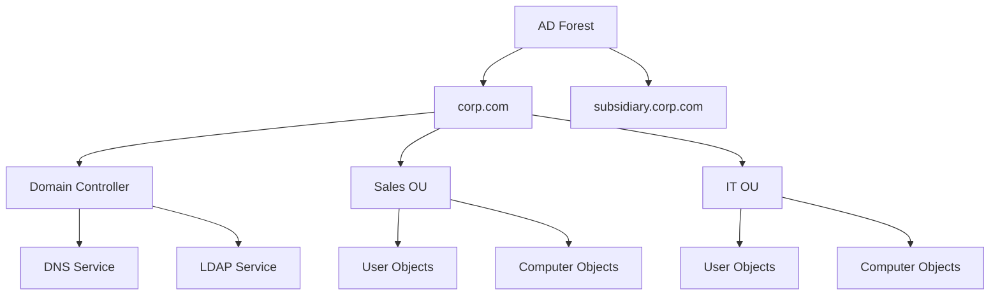

### Privilege Hierarchy

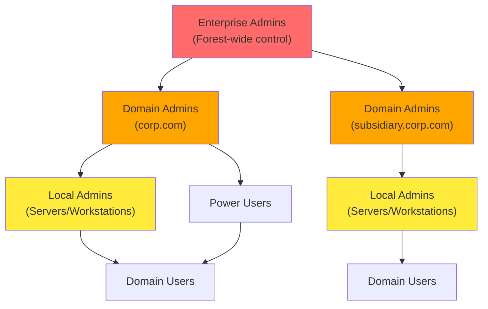

### Communication Protocols
- **LDAP**: Primary protocol for AD queries and enumeration
- **Kerberos**: Authentication protocol
- **DNS**: Name resolution and service location
- **SMB/CIFS**: File sharing and remote access

---

## Enumeration Goals and Methodology

### Scenario: corp.com Domain Assessment
- **Initial Access**: User `stephanie` with RDP permissions
- **Privilege Level**: Standard domain user (non-admin)
- **Target**: Full domain enumeration leading to domain administrator privileges
- **Scope**: corp.com domain within PWK labs

### Key Enumeration Targets
1. **High-Value Groups**: Domain Admins, Enterprise Admins, privileged service accounts
2. **Attack Paths**: User permissions, group memberships, ACLs, trusts
3. **Vulnerable Services**: Kerberoastable accounts, ASREPRoast targets
4. **Lateral Movement**: RDP/WinRM access, local admin rights

### Enumeration Strategy: Iterative Pivoting

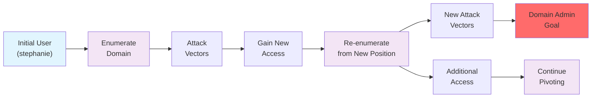

### Critical Success Factors
- **Perspective Shifts**: Each compromised account provides unique permissions and access
- **Persistent Re-enumeration**: Repeat enumeration with every new account/computer access
- **Individual User Privileges**: Never dismiss seemingly identical accounts—each may have unique permissions
- **Large Organization Complexity**: More users/computers = more opportunities for privilege escalation

This methodology ensures comprehensive coverage and maximizes the chance of finding privilege escalation paths in complex AD environments.

---

## Active Directory Enumeration Using Manual Tools

Manual enumeration forms the foundation of AD reconnaissance, leveraging built-in Windows tools and PowerShell/.NET capabilities. This approach provides deep understanding of the domain structure and builds expertise for more advanced techniques.

### Learning Objectives
- Enumerate Active Directory using legacy Windows applications
- Use PowerShell and .NET to perform additional AD enumeration

---

## Enumeration Using Legacy Windows Tools

### Initial Access Setup
**RDP Connection (Recommended):**
```bash
xfreerdp /u:<username> /d:<domain> /v:<target_ip>
# Example: xfreerdp /u:stephanie /d:corp.com /v:192.168.50.75
```

> **Warning**: Use RDP over PowerShell Remoting to avoid Kerberos Double Hop issues that can break domain enumeration tools.

### User Enumeration with net.exe

**List All Domain Users:**
```cmd
net user /domain
```
*Sample Output:*
```
User accounts for \\DC1.corp.com
-------------------------------------------------------------------------------
Administrator    dave         Guest
iis_service      jeff         jeffadmin  
jen              krbtgt       pete
stephanie
```

**Enumerate Specific User:**
```cmd
net user <username> /domain
# Example: net user jeffadmin /domain
```

**Key Information to Extract:**
- **Account Status**: Active/Inactive, expiration dates
- **Password Policy**: Last set, expiration, change requirements  
- **Group Memberships**: Local and Global groups
- **Login Information**: Last logon, allowed workstations
- **Administrative Indicators**: Look for prefixes/suffixes like "admin", "svc_", etc.

*Critical Finding Example:*
```
User name                    jeffadmin
Local Group Memberships      *Administrators
Global Group memberships     *Domain Users    *Domain Admins
```
→ **High-Value Target**: Domain Admin account identified

### Group Enumeration with net.exe

**List All Domain Groups:**
```cmd
net group /domain
```
*Sample Output:*
```
Group Accounts for \\DC1.corp.com
-------------------------------------------------------------------------------
*Domain Admins           *Enterprise Admins
*Management Department   *Sales Department
*Development Department  *Domain Users
```

**Enumerate Group Members:**
```cmd
net group "<group_name>" /domain
# Example: net group "Domain Admins" /domain
# Example: net group "Sales Department" /domain
```

### Strategic Enumeration Priorities

**1. High-Privilege Groups (Priority 1):**
```cmd
net group "Domain Admins" /domain
net group "Enterprise Admins" /domain  
net group "Schema Admins" /domain
net group "Administrators" /domain
```

**2. Custom Groups (Priority 2):**
```cmd
net group "Management Department" /domain
net group "Development Department" /domain
net group "Sales Department" /domain
```

**3. Service Groups (Priority 3):**
```cmd
net group "Backup Operators" /domain
net group "Server Operators" /domain
net group "Account Operators" /domain
```

### Enumeration Workflow

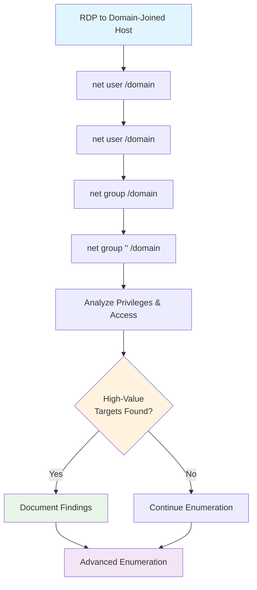

### Key Takeaways from Legacy Tool Enumeration

**Advantages:**
- **Stealth**: Built-in tools, minimal detection risk
- **Universal**: Available on all Windows systems
- **No Dependencies**: Works without additional tools

**Limitations:**
- **Limited Output**: Basic information only
- **Manual Process**: Requires individual queries
- **No Advanced Filtering**: Cannot perform complex searches

**Information Gained:**
- User account inventory
- Administrative account identification  
- Group structure and memberships
- Custom organizational groups
- Baseline for advanced enumeration

This foundational enumeration provides the groundwork for more sophisticated PowerShell and automated techniques covered in subsequent sections.

---

## Enumeration Using PowerShell and .NET Classes

### Why PowerShell/.NET Over Built-in Cmdlets?
- **Get-ADUser** and similar cmdlets require RSAT (Remote Server Administration Tools)
- RSAT is rarely installed on client machines and requires admin privileges
- PowerShell/.NET approach works with basic user privileges and mimics normal AD operations

### LDAP and Active Directory Communication

**LDAP Protocol Fundamentals:**
- Primary communication protocol for AD queries
- Uses Active Directory Services Interface (ADSI) as LDAP provider
- Requires specific LDAP ADsPath format

**LDAP Path Structure:**
```
LDAP://HostName[:PortNumber][/DistinguishedName]
```

**Components:**
- **HostName**: Computer name, IP, or domain name (we want PDC for most current info)
- **PortNumber**: Optional (auto-selected based on SSL usage)
- **DistinguishedName**: Unique object identifier in LDAP format

### Distinguished Names (DN) Structure

**Format Example:**
```
CN=Stephanie,CN=Users,DC=corp,DC=com
```

**Reading Order (Right to Left):**
- **DC=corp,DC=com**: Domain Components (domain itself)
- **CN=Users**: Common Name of parent container
- **CN=Stephanie**: Common Name of the object

**Key Terms:**
- **CN**: Common Name (object identifier)
- **DC**: Domain Component (domain hierarchy)
- **OU**: Organizational Unit (container for objects)

### Building the LDAP Path Dynamically

#### Step 1: Find the Primary Domain Controller (PDC)
```powershell
[System.DirectoryServices.ActiveDirectory.Domain]::GetCurrentDomain()
```
*Output:*
```
Forest                  : corp.com
PdcRoleOwner           : DC1.corp.com
Name                   : corp.com
```

#### Step 2: Extract PDC Hostname
```powershell
$PDC = [System.DirectoryServices.ActiveDirectory.Domain]::GetCurrentDomain().PdcRoleOwner.Name
Write-Host $PDC
# Output: DC1.corp.com
```

#### Step 3: Get Domain Distinguished Name
```powershell
$DN = ([adsi]'').distinguishedName
Write-Host $DN
# Output: DC=corp,DC=com
```

#### Step 4: Construct Full LDAP Path
```powershell
$LDAP = "LDAP://$PDC/$DN"
Write-Host $LDAP
# Output: LDAP://DC1.corp.com/DC=corp,DC=com
```

### Complete LDAP Path Script

**Full Script (enumeration.ps1):**
```powershell
# Get Primary Domain Controller
$PDC = [System.DirectoryServices.ActiveDirectory.Domain]::GetCurrentDomain().PdcRoleOwner.Name

# Get Domain Distinguished Name
$DN = ([adsi]'').distinguishedName 

# Construct LDAP Path
$LDAP = "LDAP://$PDC/$DN"

# Display Result
$LDAP
```

**Execution:**
```powershell
# Bypass execution policy
powershell -ep bypass

# Run script
.\enumeration.ps1
# Output: LDAP://DC1.corp.com/DC=corp,DC=com
```

### LDAP Path Construction Flow

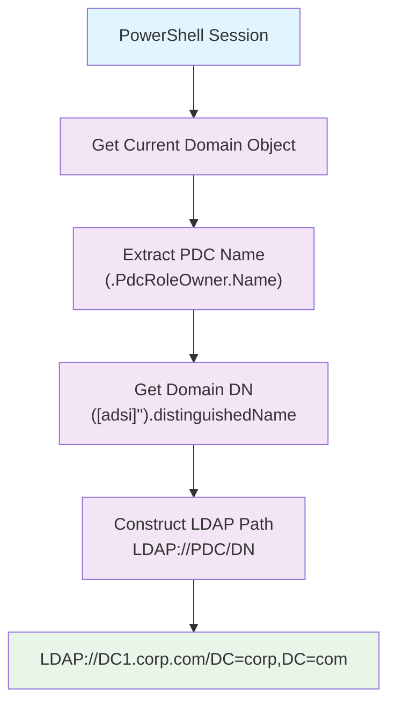

### Key Advantages of This Approach

**Dynamic Discovery:**
- Automatically finds PDC (most current information)
- Works across different domains without hardcoding
- Proper DN format regardless of domain structure

**Stealth and Compatibility:**
- Uses standard .NET classes (available on all Windows systems)
- No additional tools or admin privileges required
- Mimics normal AD operations

**Reusability:**
- Script works in any AD environment
- Foundation for advanced enumeration techniques
- Easily adaptable for different query types

This LDAP path foundation enables sophisticated AD enumeration using DirectorySearcher and other .NET classes in subsequent techniques.

---

## Adding Search Functionality to PowerShell Script

### .NET Classes for AD Searching

**Core Classes:**
- **DirectoryEntry**: Encapsulates AD service hierarchy objects
- **DirectorySearcher**: Performs LDAP queries against AD
- **Location**: System.DirectoryServices namespace

**DirectoryEntry Properties:**
- Encapsulates LDAP path pointing to hierarchy top
- Can accept credentials (not needed when already authenticated)
- Acts as SearchRoot for DirectorySearcher

**DirectorySearcher Methods:**
- **FindAll()**: Returns collection of all matching entries
- **SearchRoot**: Defines where search begins in AD hierarchy

### Basic Search Implementation

**Initial Search Script:**
```powershell
$PDC = [System.DirectoryServices.ActiveDirectory.Domain]::GetCurrentDomain().PdcRoleOwner.Name
$DN = ([adsi]'').distinguishedName 
$LDAP = "LDAP://$PDC/$DN"

$direntry = New-Object System.DirectoryServices.DirectoryEntry($LDAP)
$dirsearcher = New-Object System.DirectoryServices.DirectorySearcher($direntry)
$dirsearcher.FindAll()
```

*Output (truncated):*
```
Path
----
LDAP://DC1.corp.com/DC=corp,DC=com
LDAP://DC1.corp.com/CN=Users,DC=corp,DC=com
LDAP://DC1.corp.com/CN=Computers,DC=corp,DC=com
LDAP://DC1.corp.com/OU=Domain Controllers,DC=corp,DC=com
...
```

### Filtering Results with samAccountType

**samAccountType Values:**
- **805306368** (0x30000000): Normal user accounts
- **805306369** (0x30000001): Computer accounts  
- **268435456** (0x10000000): Group accounts

**User Enumeration Script:**
```powershell
$PDC = [System.DirectoryServices.ActiveDirectory.Domain]::GetCurrentDomain().PdcRoleOwner.Name
$DN = ([adsi]'').distinguishedName 
$LDAP = "LDAP://$PDC/$DN"

$direntry = New-Object System.DirectoryServices.DirectoryEntry($LDAP)
$dirsearcher = New-Object System.DirectoryServices.DirectorySearcher($direntry)
$dirsearcher.filter="samAccountType=805306368"
$dirsearcher.FindAll()
```

*Sample Output:*
```
Path                                                         Properties
----                                                         ----------
LDAP://DC1.corp.com/CN=Administrator,CN=Users,DC=corp,DC=com {logoncount, codepage, objectcategory...}
LDAP://DC1.corp.com/CN=jeffadmin,CN=Users,DC=corp,DC=com     {logoncount, codepage, objectcategory...}
```

### Extracting Object Properties

**Property Enumeration Script:**
```powershell
$PDC = [System.DirectoryServices.ActiveDirectory.Domain]::GetCurrentDomain().PdcRoleOwner.Name
$DN = ([adsi]'').distinguishedName 
$LDAP = "LDAP://$PDC/$DN"

$direntry = New-Object System.DirectoryServices.DirectoryEntry($LDAP)
$dirsearcher = New-Object System.DirectoryServices.DirectorySearcher($direntry)
$dirsearcher.filter="samAccountType=805306368"
$result = $dirsearcher.FindAll()

Foreach($obj in $result)
{
    Foreach($prop in $obj.Properties)
    {
        $prop
    }
    Write-Host "-------------------------------"
}
```

**Key User Attributes:**
- **memberof**: Group memberships (critical for privilege analysis)
- **samaccountname**: Username
- **distinguishedname**: Full LDAP path
- **useraccountcontrol**: Account status and properties
- **admincount**: Indicates administrative privilege history

### Targeted Filtering Examples

**Search Specific User:**
```powershell
$dirsearcher.filter="name=jeffadmin"
$result = $dirsearcher.FindAll()

Foreach($obj in $result)
{
    Foreach($prop in $obj.Properties)
    {
        $prop.memberof
    }
}
```

*Output:*
```
CN=Domain Admins,CN=Users,DC=corp,DC=com
CN=Administrators,CN=Builtin,DC=corp,DC=com
```

### Flexible LDAP Search Function

**Reusable Function (function.ps1):**
```powershell
function LDAPSearch {
    param (
        [string]$LDAPQuery
    )

    $PDC = [System.DirectoryServices.ActiveDirectory.Domain]::GetCurrentDomain().PdcRoleOwner.Name
    $DistinguishedName = ([adsi]'').distinguishedName

    $DirectoryEntry = New-Object System.DirectoryServices.DirectoryEntry("LDAP://$PDC/$DistinguishedName")
    $DirectorySearcher = New-Object System.DirectoryServices.DirectorySearcher($DirectoryEntry, $LDAPQuery)

    return $DirectorySearcher.FindAll()
}
```

**Usage:**
```powershell
# Import function
Import-Module .\function.ps1

# Search users
LDAPSearch -LDAPQuery "(samAccountType=805306368)"

# Search groups
LDAPSearch -LDAPQuery "(objectclass=group)"

# Complex filter
LDAPSearch -LDAPQuery "(&(objectCategory=group)(cn=Sales Department))"
```

### Advanced Group Enumeration

**Group Member Analysis:**
```powershell
# Get all groups and their members
foreach ($group in $(LDAPSearch -LDAPQuery "(objectCategory=group)")) {
    $group.properties | select {$_.cn}, {$_.member}
}

# Target specific group
$sales = LDAPSearch -LDAPQuery "(&(objectCategory=group)(cn=Sales Department))"
$sales.properties.member
```

*Sample Output:*
```
CN=Development Department,DC=corp,DC=com
CN=pete,CN=Users,DC=corp,DC=com
CN=stephanie,CN=Users,DC=corp,DC=com
```

### Nested Group Discovery

**Why Nested Groups Matter:**
- Groups can be members of other groups
- Users inherit permissions from all parent groups
- `net.exe` only shows direct user memberships
- PowerShell/.NET reveals complete hierarchy

**Nested Group Analysis:**
```powershell
# Sales Department members
$sales = LDAPSearch -LDAPQuery "(&(objectCategory=group)(cn=Sales Department))"
$sales.properties.member

# Development Department members
$dev = LDAPSearch -LDAPQuery "(&(objectCategory=group)(cn=Development Department*))"
$dev.properties.member

# Management Department members  
$mgmt = LDAPSearch -LDAPQuery "(&(objectCategory=group)(cn=Management Department*))"
$mgmt.properties.member
```

### PowerShell vs net.exe Comparison

| Feature | net.exe | PowerShell/.NET |
|---------|---------|-----------------|
| **User Enumeration** | Basic info only | Full attribute access |
| **Group Discovery** | Direct members only | Nested groups revealed |
| **Filtering** | Limited | LDAP filter syntax |
| **Attributes** | Fixed output | All object properties |
| **Automation** | Manual queries | Scriptable functions |
| **Detection** | Very low | Low (native .NET) |

### Search Workflow

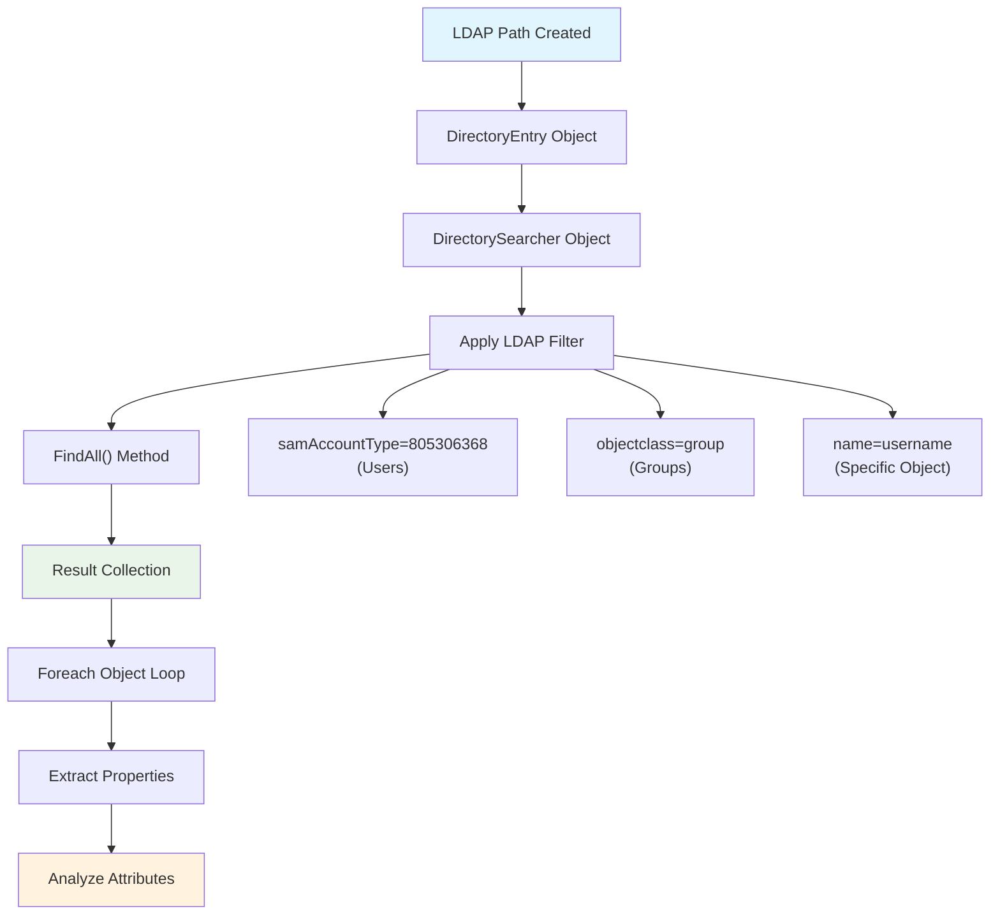

### Key Advantages of PowerShell/.NET Approach

**Enhanced Visibility:**
- Complete object attribute access
- Nested group membership discovery
- Administrative privilege indicators
- Service account identification

**Flexibility:**
- Custom LDAP filter syntax
- Scriptable and reusable functions
- Dynamic property selection
- Complex search criteria

**Stealth:**
- Uses built-in .NET classes
- Normal LDAP traffic patterns
- No additional tool requirements
- Minimal detection footprint

This approach provides comprehensive AD enumeration capabilities that far exceed basic Windows tools while maintaining operational security and compatibility across environments.

---

## Enumerating Active Directory Using Automated Tools

Automated tools streamline AD enumeration by providing pre-built functions that leverage the same .NET classes and LDAP techniques we've explored. These tools significantly speed up reconnaissance while providing advanced filtering and analysis capabilities.

---

## AD Enumeration with PowerView

### PowerView Overview
PowerView is a comprehensive PowerShell script containing numerous functions for AD enumeration. It builds upon the same .NET classes (DirectoryEntry, DirectorySearcher) we used in custom scripts, but provides streamlined commands with advanced filtering capabilities.

### Initial Setup

**Import PowerView:**
```powershell
Import-Module .\PowerView.ps1
```

### Core Domain Information

**Get Basic Domain Info:**
```powershell
Get-NetDomain
```

*Sample Output:*
```
Forest                  : corp.com
DomainControllers       : {DC1.corp.com}
PdcRoleOwner           : DC1.corp.com
RidRoleOwner           : DC1.corp.com
InfrastructureRoleOwner : DC1.corp.com
Name                   : corp.com
```

### User Enumeration with PowerView

**All Users (Full Details):**
```powershell
Get-NetUser
```

*Key Attributes Returned:*
- **distinguishedname**: Full LDAP path
- **samaccountname**: Username
- **memberof**: Group memberships
- **admincount**: Administrative privilege indicator
- **lastlogon**: Last authentication time
- **pwdlastset**: Password last changed

**Filtered User Information:**
```powershell
# Basic user list
Get-NetUser | select cn

# User activity analysis
Get-NetUser | select cn,pwdlastset,lastlogon

# Administrative users
Get-NetUser | where {$_.admincount -eq 1} | select cn,memberof
```

*Sample Output:*
```
cn            pwdlastset            lastlogon
--            ----------            ---------
Administrator 8/16/2022 5:27:22 PM  9/14/2022 2:37:15 AM
jeffadmin     9/2/2022 4:26:48 PM   9/14/2022 2:26:37 AM
iis_service   9/7/2022 5:38:43 AM   9/14/2022 2:35:55 AM
```

### Group Enumeration with PowerView

**All Groups:**
```powershell
# Basic group list
Get-NetGroup | select cn

# Specific group details
Get-NetGroup "Sales Department" | select member

# High-privilege groups
Get-NetGroup "Domain Admins","Enterprise Admins","Schema Admins" | select cn,member
```

*Sample Output:*
```
member
------
{CN=Development Department,DC=corp,DC=com, CN=pete,CN=Users,DC=corp,DC=com, CN=stephanie,CN=Users,DC=corp,DC=com}
```

### Advanced PowerView Techniques

**User Attribute Analysis:**
```powershell
# Dormant accounts (old passwords)
Get-NetUser | where {$_.pwdlastset -lt (Get-Date).AddDays(-90)} | select cn,pwdlastset

# Never logged in users
Get-NetUser | where {$_.lastlogon -eq $null -or $_.lastlogon -eq 0} | select cn

# Service accounts
Get-NetUser | where {$_.cn -like "*service*" -or $_.cn -like "*svc*"} | select cn,memberof

# Accounts with passwords that don't expire
Get-NetUser | where {$_.useraccountcontrol -band 65536} | select cn,pwdlastset
```

**Administrative Privilege Discovery:**
```powershell
# Users with adminCount=1 (historical admin access)
Get-NetUser | where {$_.admincount -eq 1} | select cn,memberof,lastlogon

# Domain Admins group members
Get-NetGroupMember "Domain Admins" | select MemberName,MemberSID

# Local administrators on specific computers
Get-NetLocalGroup -ComputerName <target> -GroupName "Administrators"
```

### PowerView vs Custom Scripts Comparison

| Feature | Custom Script | PowerView |
|---------|---------------|-----------|
| **Setup Time** | Build from scratch | Import and use |
| **Functionality** | Basic LDAP queries | 100+ specialized functions |
| **Filtering** | Manual loops | Built-in pipeline support |
| **Error Handling** | Custom implementation | Pre-built robustness |
| **Learning Curve** | High (LDAP/NET knowledge) | Medium (PowerShell cmdlets) |
| **Customization** | Full control | Parameter-based |
| **Detection Risk** | Very Low | Low (common tool) |

### PowerView Enumeration Workflow

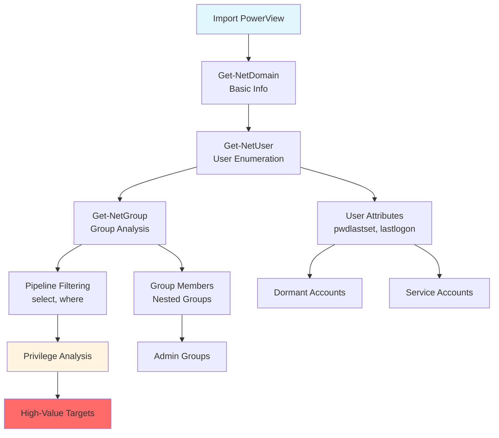

### Strategic User Analysis

**Identifying High-Value Targets:**

1. **Administrative Accounts:**
   ```powershell
   Get-NetUser | where {$_.memberof -match "Admin"} | select cn,memberof
   ```

2. **Dormant Accounts (Stale Passwords):**
   ```powershell
   Get-NetUser | where {$_.pwdlastset -lt (Get-Date).AddDays(-90)} | select cn,pwdlastset,lastlogon
   ```

3. **Service Accounts:**
   ```powershell
   Get-NetUser -ServicePrincipalName *
   ```

4. **Accounts with Pre-Authentication Disabled (ASREPRoast):**
   ```powershell
   Get-NetUser -PreauthNotRequired | select cn,serviceprincipalname
   ```

### Key PowerView Commands Reference

**Domain Information:**
- `Get-NetDomain`: Domain details
- `Get-NetDomainController`: Domain controller info
- `Get-NetForest`: Forest information

**User/Group Enumeration:**
- `Get-NetUser`: User objects
- `Get-NetGroup`: Group objects  
- `Get-NetGroupMember`: Group membership
- `Get-NetLocalGroup`: Local group enumeration

**Computer Enumeration:**
- `Get-NetComputer`: Computer objects
- `Get-NetLoggedon`: Logged-on users
- `Get-NetSession`: Active sessions

**Advanced Functions:**
- `Find-LocalAdminAccess`: Find computers where current user has admin
- `Find-DomainShare`: Discover network shares
- `Get-NetGPO`: Group Policy Objects

### Advantages of PowerView

**Efficiency:**
- Pre-built functions eliminate script development time
- Pipeline support for complex filtering
- Comprehensive error handling

**Functionality:**
- Advanced enumeration techniques beyond basic LDAP
- Specialized functions for privilege escalation paths
- Built-in analysis for common attack vectors

**Flexibility:**
- Parameter-based filtering
- Pipeline integration with PowerShell
- Easy output formatting and analysis

PowerView demonstrates how researchers build upon fundamental LDAP/.NET techniques to create powerful, user-friendly enumeration tools while maintaining the stealth benefits of native Windows functionality.

---

## Manual Enumeration - Expanding our Repertoire

Now that we understand LDAP fundamentals and have enumeration tools available, let's expand our reconnaissance to build a comprehensive domain map. Understanding object relationships and system configurations is crucial for identifying attack vectors and privilege escalation paths.

### Learning Objectives
- Enumerate Operating Systems and computer objects
- Enumerate permissions and logged-on users
- Enumerate through Service Principal Names (SPNs)
- Enumerate Object Permissions and ACLs
- Explore Domain Shares and network resources

---

## Enumerating Operating Systems

Computer objects in AD contain valuable information about the network infrastructure, including operating systems, roles, and potential vulnerabilities.

### Computer Object Enumeration

**Basic Computer Information:**
```powershell
Get-NetComputer
```

*Key Computer Attributes:*
- **operatingsystem**: OS version and edition
- **operatingsystemversion**: Build numbers and patch levels
- **dnshostname**: Fully qualified domain names
- **serviceprincipalname**: Services running on the host
- **lastlogon**: Recent activity indicators
- **useraccountcontrol**: Computer account properties

**Filtered Computer Enumeration:**
```powershell
# Operating systems and hostnames
Get-NetComputer | select operatingsystem,dnshostname

# Detailed system information
Get-NetComputer | select dnshostname,operatingsystem,operatingsystemversion,lastlogon

# Server systems only
Get-NetComputer | where {$_.operatingsystem -like "*Server*"} | select dnshostname,operatingsystem

# Workstation systems
Get-NetComputer | where {$_.operatingsystem -notlike "*Server*"} | select dnshostname,operatingsystem
```

*Sample Output:*
```
operatingsystem              dnshostname
---------------              -----------
Windows Server 2022 Standard DC1.corp.com
Windows Server 2022 Standard web04.corp.com
Windows Server 2022 Standard FILES04.corp.com
Windows 11 Pro               client74.corp.com
Windows 11 Pro               client75.corp.com
Windows 10 Pro               CLIENT76.corp.com
```

### Strategic Analysis of Computer Objects

**1. Operating System Targeting:**
```powershell
# Identify older/vulnerable systems
Get-NetComputer | where {$_.operatingsystem -like "*Windows 10*" -or $_.operatingsystem -like "*Windows 7*"} | select dnshostname,operatingsystem

# Server roles identification
Get-NetComputer | where {$_.dnshostname -like "*web*" -or $_.dnshostname -like "*file*" -or $_.dnshostname -like "*sql*"} | select dnshostname,operatingsystem
```

**2. System Activity Analysis:**
```powershell
# Recently active computers
Get-NetComputer | where {$_.lastlogon -gt (Get-Date).AddDays(-30)} | select dnshostname,lastlogon

# Potentially inactive/vulnerable systems
Get-NetComputer | where {$_.lastlogon -lt (Get-Date).AddDays(-90)} | select dnshostname,lastlogon,operatingsystem
```

**3. Service Principal Name Analysis:**
```powershell
# Computer with multiple services
Get-NetComputer | where {$_.serviceprincipalname.count -gt 5} | select dnshostname,serviceprincipalname

# Web servers (HTTP SPNs)
Get-NetComputer | where {$_.serviceprincipalname -like "*HTTP*"} | select dnshostname,serviceprincipalname
```

### Computer Enumeration Workflow

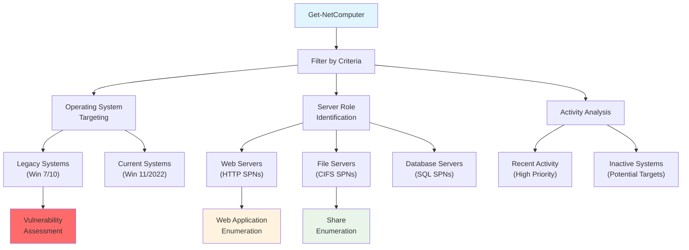

### Key Insights from Computer Enumeration

**Attack Surface Identification:**
- **Legacy Systems**: Windows 10/7 may have unpatched vulnerabilities
- **Server Roles**: Web, file, and database servers offer different attack vectors
- **Service Density**: Computers with many SPNs may have larger attack surfaces

**Targeting Prioritization:**
1. **High-Value Servers**: Domain controllers, database servers
2. **Vulnerable Systems**: Older OS versions, inactive systems
3. **Lateral Movement Targets**: Workstations with administrative users
4. **Service Exploitation**: Web applications, database services

**Environmental Mapping:**
- **Network Topology**: Server roles and client distribution
- **Technology Stack**: OS versions, application services
- **Activity Patterns**: User behavior and system utilization

### Computer Object Attributes Reference

**Critical Attributes:**
- **dnshostname**: Target identification
- **operatingsystem/operatingsystemversion**: Vulnerability research
- **serviceprincipalname**: Service enumeration and Kerberoasting
- **lastlogon**: Activity analysis
- **useraccountcontrol**: Account properties and delegation settings

**Advanced Attributes:**
- **msds-supportedencryptiontypes**: Kerberos encryption capabilities
- **serverreferencebl**: Active Directory site information
- **primarygroupid**: Computer group membership

This computer enumeration provides the foundation for understanding the network infrastructure and identifying initial attack targets based on system vulnerabilities, service exposure, and activity patterns.

---

## Enumerating Permissions and Logged-on Users

Understanding user-computer relationships and active sessions is crucial for mapping attack paths and maintaining persistent access. This enumeration reveals credential exposure opportunities and lateral movement targets.

### Strategic Goals of Permission/Session Enumeration

**Attack Path Mapping:**
- Identify where privileged users have active sessions
- Locate computers where current user has administrative rights
- Map credential exposure opportunities for privilege escalation

**Persistence Planning:**
- Discover additional user accounts for maintained access
- Identify service accounts with elevated privileges
- Find alternative paths to sensitive data (not always Domain Admin required)

**Chained Compromise Strategy:**
- Progress through multiple privilege levels toward objectives
- Establish multiple footholds for redundancy
- Target "crown jewels" through various privilege paths

### Local Administrative Access Discovery

**Find-LocalAdminAccess Command:**
```powershell
Find-LocalAdminAccess
```

**How It Works:**
- Uses `OpenServiceW` function to connect to Service Control Manager (SCM)
- Attempts to open SCM database with `SC_MANAGER_ALL_ACCESS` rights
- Success indicates administrative privileges on target machine

*Sample Output:*
```
client74.corp.com
```

**Strategic Follow-up:**
```powershell
# Verify discovered admin access
Get-NetLocalGroup -ComputerName client74 -GroupName "Administrators"

# Check for additional privileged groups
Get-NetLocalGroup -ComputerName client74 -GroupName "Remote Desktop Users"
```

### Active Session Enumeration Challenges

**NetSessionEnum API Limitations:**

**PowerView Get-NetSession Command:**
```powershell
# Basic session enumeration
Get-NetSession -ComputerName <target>

# Verbose output for troubleshooting
Get-NetSession -ComputerName <target> -Verbose
```

*Common Issues:*
```
VERBOSE: [Get-NetSession] Error: Access is denied
```

**Registry Permissions Analysis:**
```powershell
Get-Acl -Path HKLM:SYSTEM\CurrentControlSet\Services\LanmanServer\DefaultSecurity\ | fl
```

*Key Findings:*
- **SrvsvcSessionInfo** registry key controls NetSessionEnum permissions
- Modern Windows (Win 10 build 1709+, Server 2019+) restricts access
- Only administrative privileges allow session enumeration
- "Authenticated Users" access removed in recent versions

### Alternative Session Enumeration: PsLoggedOn

**Tool Location and Usage:**
```cmd
# Navigate to PSTools directory
cd C:\Tools\PSTools

# Enumerate sessions on target
.\PsLoggedon.exe \\<target>
```

**How PsLoggedOn Works:**
- Enumerates `HKEY_USERS` registry keys for Security Identifiers (SIDs)
- Converts SIDs to usernames
- Uses NetSessionEnum for resource share sessions
- Requires **Remote Registry service** (default on Server 2012 R2+)

**Remote Registry Service Details:**
- **Workstations**: Disabled by default since Windows 8
- **Servers**: Enabled by default (2012 R2, 2016, 2019, 2022)
- **Auto-stop**: After 10 minutes of inactivity
- **Auto-start**: Triggered by connection attempts

### Practical Session Enumeration Examples

**File Server Enumeration:**
```cmd
.\PsLoggedon.exe \\files04
```
*Output:*
```
Users logged on locally:
     <unknown time>             CORP\jeff
Unable to query resource logons
```

**Web Server Enumeration:**
```cmd
.\PsLoggedon.exe \\web04
```
*Output:*
```
No one is logged on locally.
Unable to query resource logons
```

**Administrative Target Enumeration:**
```cmd
.\PsLoggedon.exe \\client74
```
*Output:*
```
Users logged on locally:
     <unknown time>             CORP\jeffadmin

Users logged on via resource shares:
     10/5/2022 1:33:32 AM       CORP\stephanie
```

### Session Enumeration Analysis

**High-Value Findings:**
- **jeffadmin** logged on CLIENT74 (Domain Admin candidate)
- **stephanie** has admin rights on CLIENT74
- **jeff** active session on FILES04 (credential theft opportunity)

**Attack Vector Identification:**
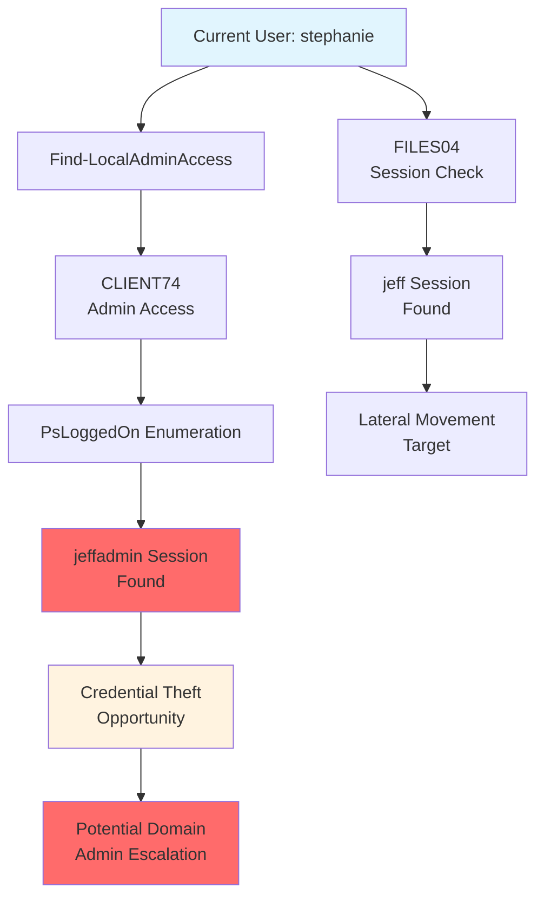

### Operating System Version Impact

**Modern Windows Restrictions:**
```powershell
Get-NetComputer | select dnshostname,operatingsystem,operatingsystemversion
```

*Sample Output:*
```
dnshostname       operatingsystem              operatingsystemversion
-----------       ---------------              ----------------------
DC1.corp.com      Windows Server 2022 Standard 10.0 (20348)
CLIENT76.corp.com Windows 10 Pro               10.0 (16299)
```

**Key Version Impacts:**
- **Windows 10 Build 1709+**: NetSessionEnum restrictions implemented
- **Windows Server 2019+**: Similar restrictions applied
- **Legacy Systems**: May still allow NetSessionEnum without admin rights

### Session Enumeration Methodology

**1. Administrative Access Discovery:**
```powershell
# Find systems with admin access
Find-LocalAdminAccess

# Validate admin access
Get-NetLocalGroup -ComputerName <target> -GroupName "Administrators"
```

**2. Session Enumeration Attempts:**
```powershell
# Try PowerView first (fast)
Get-NetSession -ComputerName <target> -Verbose

# Fall back to PsLoggedOn (reliable on servers)
.\PsLoggedon.exe \\<target>
```

**3. Strategic Prioritization:**
- **High-Value Users**: Domain/Enterprise Admins, service accounts
- **Administrative Access**: Systems where current user has admin rights
- **Active Sessions**: Recently active vs stale sessions

### Key Takeaways

**Credential Exposure Opportunities:**
- Administrative access + logged-on privileged users = credential theft potential
- Service accounts often have elevated but not maximum privileges
- Multiple compromise paths may lead to same objectives

**Enumeration Challenges:**
- Modern Windows restricts session enumeration APIs
- Different tools work on different OS versions/configurations
- Remote Registry service availability varies by system type

**Attack Planning:**
- Map user-computer relationships for lateral movement
- Identify privilege escalation through credential theft
- Plan persistent access through multiple user accounts

This enumeration provides the foundation for credential theft attacks and lateral movement planning by revealing where valuable user sessions exist and which systems offer administrative access.

---

## Enumeration Through Service Principal Names

Service Principal Names (SPNs) are unique identifiers for services running on servers in Active Directory. They enable Kerberos authentication to specific services and reveal valuable information about the network infrastructure, service accounts, and potential attack vectors.

### SPN Structure and Purpose

**SPN Format:**
```
service_class/host:port/service_name
```

**Common Service Classes:**
- **HTTP**: Web applications, SharePoint
- **MSSQL**: SQL Server instances
- **CIFS**: File sharing services
- **LDAP**: Directory services
- **HOST**: Generic host services
- **TERMSRV**: Terminal Services/RDP

**Why SPNs Matter for Attackers:**
- Reveal running services and their locations
- Identify service accounts (often privileged)
- Enable Kerberoasting attacks
- Map network infrastructure and service topology

### SPN Enumeration with PowerView

**Basic SPN Discovery:**
```powershell
# All SPNs in the domain
Get-NetUser -SPN | select samaccountname,serviceprincipalname

# Computer object SPNs
Get-NetComputer | select dnshostname,serviceprincipalname
```

**Service-Specific Enumeration:**
```powershell
# SQL Server instances
Get-NetUser -SPN | where {$_.serviceprincipalname -like "*MSSQL*"}

# Web applications
Get-NetUser -SPN | where {$_.serviceprincipalname -like "*HTTP*"}

# File shares
Get-NetComputer | where {$_.serviceprincipalname -like "*CIFS*"}
```

**High-Value Service Account Discovery:**
```powershell
# Service accounts (users with SPNs)
Get-NetUser -SPN | select samaccountname,serviceprincipalname,memberof

# Privileged service accounts
Get-NetUser -SPN | where {$_.memberof -like "*admin*"}
```

### SPN Analysis Examples

**SQL Server Discovery:**
```powershell
Get-NetUser -SPN | where {$_.serviceprincipalname -like "*MSSQL*"} | select samaccountname,serviceprincipalname
```
*Sample Output:*
```
samaccountname serviceprincipalname
-------------- --------------------
sqlservice     {MSSQLSVC/db01.corp.com:1433, MSSQLSVC/db01.corp.com}
```

**Web Application Enumeration:**
```powershell
Get-NetUser -SPN | where {$_.serviceprincipalname -like "*HTTP*"} | select samaccountname,serviceprincipalname
```
*Sample Output:*
```
samaccountname serviceprincipalname
-------------- --------------------
iis_service    {HTTP/web04.corp.com, HTTP/web04}
```

**Service Account Privilege Analysis:**
```powershell
Get-NetUser -SPN | select samaccountname,memberof,serviceprincipalname | fl
```

### SPN-Based Infrastructure Mapping

**Network Service Discovery:**
```powershell
# Map all services by host
Get-NetComputer | select dnshostname,@{Name="Services";Expression={($_.serviceprincipalname -split " ") -join ", "}}

# Database infrastructure
Get-NetUser -SPN | where {$_.serviceprincipalname -match "MSSQL|MYSQL|ORACLE"} | select samaccountname,serviceprincipalname

# Web infrastructure  
Get-NetUser -SPN | where {$_.serviceprincipalname -match "HTTP|HTTPS"} | select samaccountname,serviceprincipalname
```

### Kerberoasting Target Identification

**Identify Kerberoastable Accounts:**
```powershell
# Service accounts with SPNs (Kerberoasting targets)
Get-NetUser -SPN | where {$_.samaccounttype -eq "USER_OBJECT"} | select samaccountname,serviceprincipalname

# Exclude computer accounts (focus on user service accounts)
Get-NetUser -SPN | where {$_.samaccountname -notlike "*$"} | select samaccountname,serviceprincipalname

# High-privilege Kerberoasting targets
Get-NetUser -SPN | where {$_.admincount -eq 1} | select samaccountname,serviceprincipalname,memberof
```

### SPN Enumeration Workflow

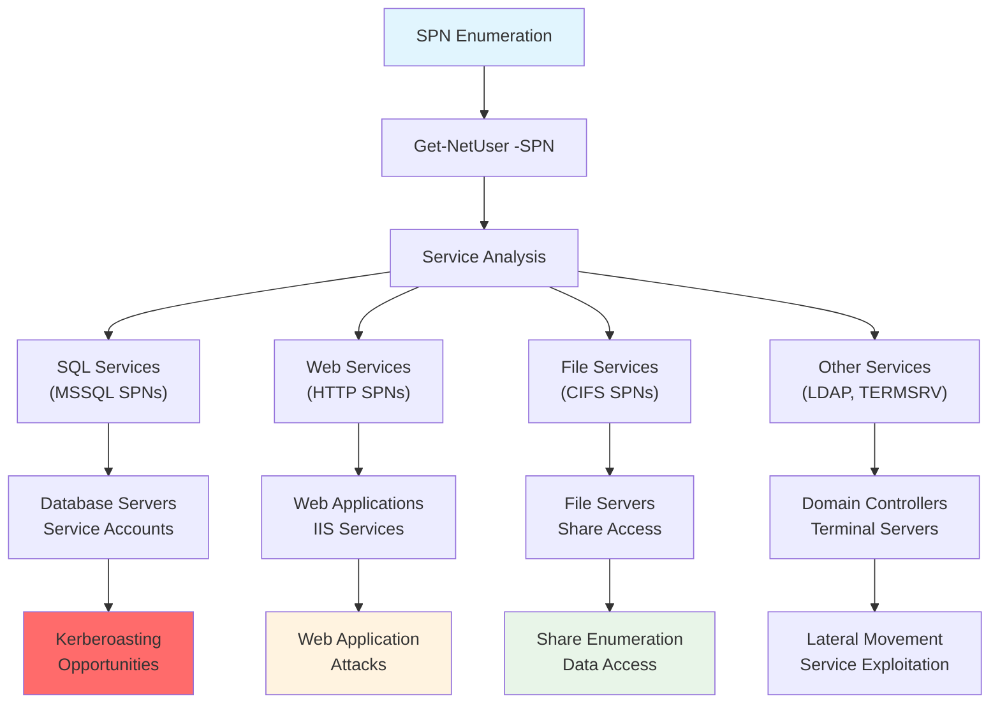

### Service Account Strategic Analysis

**Service Account Characteristics:**
- Often have elevated privileges for service functionality
- May have "Log on as a service" rights
- Frequently exempt from password policies
- Can have local admin rights on multiple servers

**Attack Vectors:**
1. **Kerberoasting**: Extract service account password hashes
2. **Service Exploitation**: Target vulnerable services directly
3. **Privilege Escalation**: Leverage service account permissions
4. **Lateral Movement**: Use service context for network access

### SPN Enumeration Commands Reference

**Discovery Commands:**
```powershell
# All service accounts
Get-NetUser -SPN

# Service accounts with details
Get-NetUser -SPN | select samaccountname,serviceprincipalname,memberof,lastlogon

# Computer SPNs
Get-NetComputer | select dnshostname,serviceprincipalname

# SPN by service type
Get-NetUser -SPN | where {$_.serviceprincipalname -like "*<SERVICE>*"}
```

**Analysis Commands:**
```powershell
# Administrative service accounts
Get-NetUser -SPN | where {$_.admincount -eq 1}

# Recently active service accounts
Get-NetUser -SPN | where {$_.lastlogon -gt (Get-Date).AddDays(-30)}

# Service accounts by group membership
Get-NetUser -SPN | where {$_.memberof -match "admin|operator|backup"}
```

### Common SPN Patterns and Targets

**High-Value SPNs:**
- **MSSQLSVC**: Database servers (often privileged access)
- **HTTP**: Web applications (potential for web shells)
- **CIFS**: File servers (data access opportunities)
- **LDAP**: Domain controllers (authentication services)

**Service Account Naming Patterns:**
- **svc_**: Service account prefix
- **sql**: Database service accounts
- **iis**: Web service accounts
- **backup**: Backup service accounts (often highly privileged)

### Key Insights from SPN Enumeration

**Infrastructure Mapping:**
- Service distribution across hosts
- Technology stack identification
- Network service dependencies
- Administrative service locations

**Attack Surface Analysis:**
- Kerberoasting target prioritization
- Service exploitation opportunities
- Privilege escalation paths through service accounts
- Lateral movement via service context

SPN enumeration provides critical intelligence for understanding service infrastructure, identifying privileged service accounts, and planning targeted attacks against specific services and their associated credentials.

---

## Enumerating Object Permissions

Active Directory object permissions control access through Access Control Lists (ACLs) containing Access Control Entries (ACEs). Understanding and enumerating these permissions reveals privilege escalation opportunities and misconfigurations that attackers can exploit.

### ACL/ACE Structure and Validation

**Access Control Components:**
- **ACL (Access Control List)**: Collection of permissions for an object
- **ACE (Access Control Entry)**: Individual permission rule (allow/deny)
- **Access Token**: User identity and permissions sent during access attempts
- **Validation Process**: Target object checks token against ACL

**Access Validation Flow:**
1. User sends access token to target object
2. Object validates token against its ACL
3. ACL allows or denies access based on ACE rules

### Critical Permission Types for Attackers

**High-Impact Permissions:**
- **GenericAll**: Full permissions on object (complete control)
- **GenericWrite**: Edit certain attributes on the object
- **WriteOwner**: Change ownership of the object
- **WriteDACL**: Edit ACEs applied to object (modify permissions)
- **AllExtendedRights**: Change password, reset password, etc.
- **ForceChangePassword**: Password change for object
- **Self (Self-Membership)**: Add ourselves to groups

### Object ACL Enumeration with PowerView

**Basic ACL Enumeration:**
```powershell
# Enumerate ACEs for specific object
Get-ObjectAcl -Identity <object_name>

# Focus on specific permissions
Get-ObjectAcl -Identity <object_name> | where {$_.ActiveDirectoryRights -eq "GenericAll"}

# Clean output format
Get-ObjectAcl -Identity <object_name> | select SecurityIdentifier,ActiveDirectoryRights
```

**Key Properties for Analysis:**
- **ObjectSID**: Target object's Security Identifier
- **SecurityIdentifier**: Principal with the permission (who has access)
- **ActiveDirectoryRights**: Type of permission granted

### SID to Name Conversion

**Converting SIDs to Readable Names:**
```powershell
# Single SID conversion
Convert-SidToName <SID>

# Multiple SID conversion
"<SID1>","<SID2>","<SID3>" | Convert-SidToName
```

*Example:*
```powershell
Convert-SidToName S-1-5-21-1987370270-658905905-1781884369-1104
# Output: CORP\stephanie
```

### Practical Permission Enumeration Examples

**Personal User ACL Analysis:**
```powershell
Get-ObjectAcl -Identity stephanie | select SecurityIdentifier,ActiveDirectoryRights
```

**Group Permission Discovery:**
```powershell
# Check GenericAll permissions on Management Department
Get-ObjectAcl -Identity "Management Department" | ? {$_.ActiveDirectoryRights -eq "GenericAll"} | select SecurityIdentifier,ActiveDirectoryRights
```

*Sample Output:*
```
SecurityIdentifier                            ActiveDirectoryRights
------------------                            ---------------------
S-1-5-21-1987370270-658905905-1781884369-512             GenericAll
S-1-5-21-1987370270-658905905-1781884369-1104            GenericAll
S-1-5-32-548                                             GenericAll
```

**SID Resolution:**
```powershell
"S-1-5-21-1987370270-658905905-1781884369-512","S-1-5-21-1987370270-658905905-1781884369-1104","S-1-5-32-548" | Convert-SidToName
```
*Output:*
```
CORP\Domain Admins
CORP\stephanie
BUILTIN\Account Operators
```

### Exploiting Misconfigured Permissions

**GenericAll Abuse Example:**
```powershell
# Add user to group (requires GenericAll on group)
net group "Management Department" stephanie /add /domain

# Verify membership
Get-NetGroup "Management Department" | select member

# Cleanup (remove from group)
net group "Management Department" stephanie /del /domain
```

### Systematic Permission Enumeration

**Domain-Wide Permission Discovery:**
```powershell
# All objects with GenericAll permissions
Get-ObjectAcl | ? {$_.ActiveDirectoryRights -eq "GenericAll"} | select ObjectDN,SecurityIdentifier

# WriteDACL permissions (can modify ACLs)
Get-ObjectAcl | ? {$_.ActiveDirectoryRights -eq "WriteDACL"} | select ObjectDN,SecurityIdentifier

# AllExtendedRights (password changes)
Get-ObjectAcl | ? {$_.ActiveDirectoryRights -eq "AllExtendedRights"} | select ObjectDN,SecurityIdentifier
```

**Group-Focused Enumeration:**
```powershell
# Check permissions on high-value groups
$groups = @("Domain Admins","Enterprise Admins","Schema Admins")
foreach($group in $groups) {
    Get-ObjectAcl -Identity $group | ? {$_.ActiveDirectoryRights -eq "GenericAll"}
}
```

### Permission Enumeration Workflow

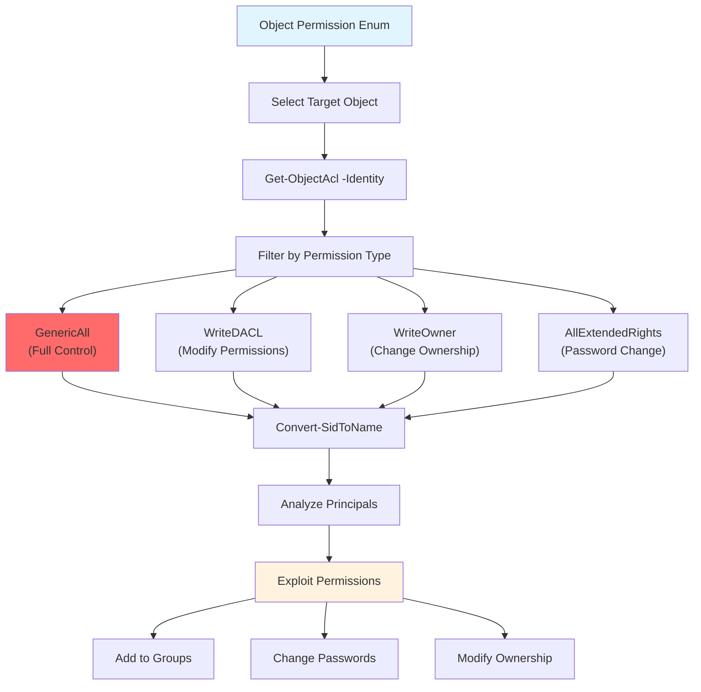

### Strategic Permission Analysis

**Identifying Misconfigurations:**
- Regular users with GenericAll on groups/OUs
- Service accounts with excessive permissions
- Cross-domain permission inheritance issues
- Orphaned permissions from deleted objects

**Attack Vectors by Permission:**
1. **GenericAll**: Complete object control, group membership manipulation
2. **WriteDACL**: Permission modification, backdoor creation
3. **WriteOwner**: Ownership takeover, permission inheritance
4. **AllExtendedRights**: Password changes, account manipulation
5. **ForceChangePassword**: Direct credential compromise

### Permission Enumeration Commands Reference

**Basic Enumeration:**
```powershell
# Target-specific ACL enumeration
Get-ObjectAcl -Identity "<target>"

# Permission-filtered enumeration
Get-ObjectAcl -Identity "<target>" | ? {$_.ActiveDirectoryRights -eq "<permission>"}

# Clean output format
Get-ObjectAcl -Identity "<target>" | select SecurityIdentifier,ActiveDirectoryRights,ObjectDN
```

**Advanced Analysis:**
```powershell
# Multiple permission types
Get-ObjectAcl -Identity "<target>" | ? {$_.ActiveDirectoryRights -match "GenericAll|WriteDACL|WriteOwner"}

# Non-standard permissions (potential misconfigurations)
Get-ObjectAcl -Identity "<target>" | ? {$_.SecurityIdentifier -notmatch "S-1-5-32|S-1-5-18|S-1-5-19"}
```

### Well-Known SIDs Reference

**Common System SIDs:**
- **S-1-5-18**: Local System
- **S-1-5-19**: Local Service
- **S-1-5-20**: Network Service
- **S-1-5-32-544**: BUILTIN\Administrators
- **S-1-5-32-548**: BUILTIN\Account Operators

**Domain-Specific SIDs (pattern):**
- **-512**: Domain Admins
- **-513**: Domain Users
- **-515**: Domain Computers
- **-519**: Enterprise Admins

### Key Insights from Permission Enumeration

**Security Implications:**
- Misconfigured permissions often provide privilege escalation paths
- Regular users with administrative permissions indicate policy violations
- Permission inheritance can create unintended access

**Attack Planning:**
- GenericAll permissions enable group membership manipulation
- WriteDACL allows permission backdoor creation
- AllExtendedRights enables credential attacks

Object permission enumeration reveals critical security misconfigurations and provides direct paths for privilege escalation through ACL abuse and permission manipulation.

---

## Enumerating Domain Shares

Domain shares often contain critical organizational intelligence, including sensitive documents, configuration files, legacy policies, and credentials. Thorough share enumeration reveals data repositories that may contain privilege escalation paths and operational intelligence.

### Domain Share Discovery with PowerView

**Basic Share Enumeration:**
```powershell
# Discover all domain shares
Find-DomainShare

# Filter for accessible shares only
Find-DomainShare -CheckShareAccess

# Target specific computer
Find-DomainShare -ComputerName <hostname>
```

**Share Type Analysis:**
- **Type 0**: Standard file shares (user-created)
- **Type 2147483648**: Administrative shares (C$, ADMIN$)
- **Type 2147483651**: IPC shares (Inter-Process Communication)

### Critical Default Domain Shares

**Domain Controller Shares:**
- **SYSVOL**: Group Policy templates, logon scripts, domain policies
- **NETLOGON**: Domain logon scripts and authentication files
- **ADMIN$**: Administrative access to system root
- **C$**: Administrative access to C: drive
- **IPC$**: Inter-Process Communication endpoint

**SYSVOL Share Significance:**
- Contains Group Policy Preferences (GPP) files
- Stores domain-wide script repositories
- Houses policy configuration archives
- Accessible to all domain users by default
- Located at `%SystemRoot%\SYSVOL\Sysvol\domain-name`

### Systematic Share Investigation

**SYSVOL Enumeration Example:**
```powershell
# List SYSVOL contents
ls \\<domain_controller>\sysvol\<domain_name>\

# Common SYSVOL structure:
# ├── Policies\
# ├── scripts\
# └── Archives (if present)
```

**Sample SYSVOL Contents:**
```
Directory: \\DC1.corp.com\sysvol\corp.com

Mode                 LastWriteTime         Length Name
----                 -------------         ------ ----
d-----         9/21/2022   1:11 AM                Policies
d-----          9/2/2022   4:08 PM                scripts
```

**Policies Directory Investigation:**
```powershell
# Enumerate policy folders
ls \\<domain_controller>\sysvol\<domain_name>\Policies\

# Common findings:
# - GUIDs representing Group Policy Objects
# - Legacy policy backups
# - Administrative configuration files
```

### Group Policy Preferences (GPP) Password Extraction

**GPP Vulnerability Background:**
- Legacy method for managing local account passwords
- AES-256 encrypted passwords stored in policy files
- Microsoft published decryption key on MSDN
- Affects cpassword attributes in policy XML files

**GPP Password Discovery:**
```powershell
# Search for policy files with encrypted passwords
findstr /S /I cpassword \\<domain_controller>\sysvol\<domain_name>\Policies\*.xml

# Manual file inspection
cat \\<domain_controller>\sysvol\<domain_name>\Policies\<policy_folder>\*.xml
```

**Sample GPP Password File:**
```xml
<?xml version="1.0" encoding="utf-8"?>
<Groups clsid="{3125E937-EB16-4b4c-9934-544FC6D24D26}">
  <User clsid="{DF5F1855-51E5-4d24-8B1A-D9BDE98BA1D1}"
        name="Administrator (built-in)"
        cpassword="+bsY0V3d4/KgX3VJdO/vyepPfAN1zMFTiQDApgR92JE"
        userName="Administrator (built-in)" />
</Groups>
```

**GPP Password Decryption:**
```bash
# Using gpp-decrypt (Kali Linux)
gpp-decrypt "<encrypted_password>"

# Example:
gpp-decrypt "+bsY0V3d4/KgX3VJdO/vyepPfAN1zMFTiQDApgR92JE"
# Output: P@$$w0rd
```

**Alternative Decryption Tools:**
- **Get-GPPPassword** (PowerShell)
- **gpp-decrypt** (Ruby script)
- **GPP-Decrypt** (Python implementations)
- **Metasploit GPP modules**

### Custom Share Enumeration and Analysis

**Non-Default Share Investigation:**
```powershell
# Target interesting custom shares
ls \\<target_server>\<custom_share>

# Common naming patterns to investigate:
# - backup, backups
# - docs, documentation, docshare
# - share, sharing, shared
# - files, data
# - temp, temporary
# - archive, old
```

**Deep Directory Traversal:**
```powershell
# Recursive directory listing
Get-ChildItem \\<server>\<share> -Recurse

# Search for specific file types
Get-ChildItem \\<server>\<share> -Recurse -Include *.txt,*.doc,*.xlsx,*.pdf
```

### Credential and Intelligence Discovery

**Common Sensitive File Locations:**
- **Configuration Files**: web.config, app.config, settings files
- **Documentation**: README files, installation guides, admin notes
- **Scripts**: PowerShell scripts, batch files, deployment scripts
- **Backups**: Database dumps, configuration backups, user exports

**Password Pattern Analysis:**
From discovered credentials, analyze organizational password policies:
- **Complexity Requirements**: Character types, length patterns
- **Naming Conventions**: Seasonal patterns, company references
- **Account Types**: Service accounts, administrative accounts
- **Age Indicators**: Password change frequency, legacy credentials

**Sample Credential Discovery:**
```
Email content revealing:
Username: jeff
Password: HenchmanPutridBonbon11
Context: New hire temporary password
```

### Share Enumeration Workflow

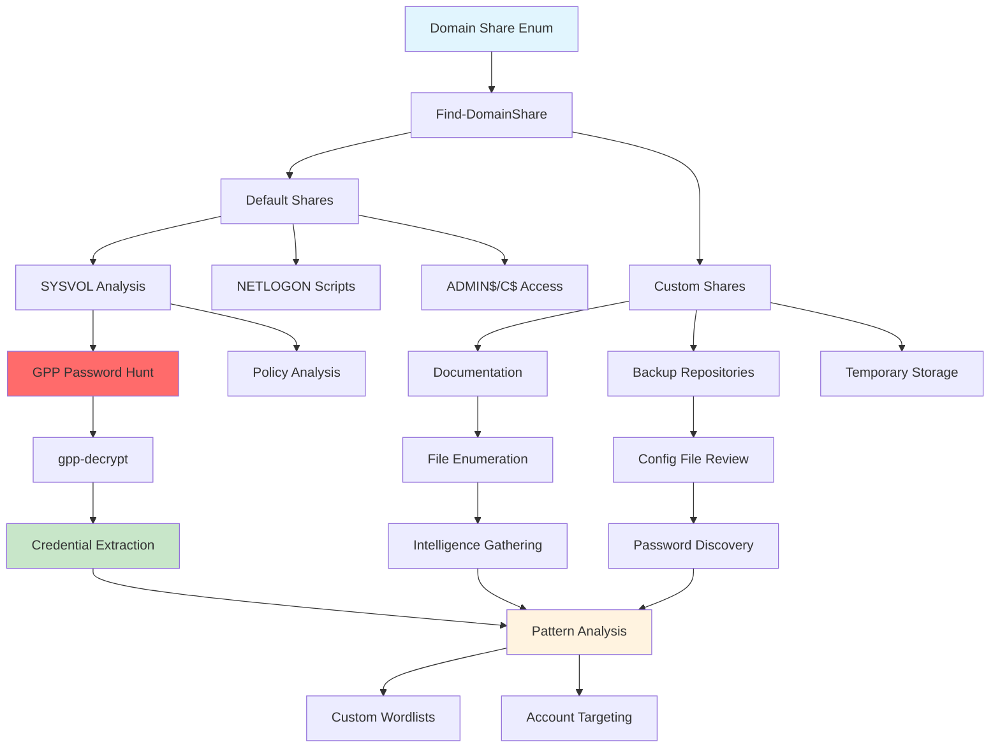

### Strategic Share Analysis

**High-Value Target Identification:**
1. **SYSVOL**: Always investigate for GPP passwords and policies
2. **Custom Documentation Shares**: Often contain organizational intelligence
3. **Backup Shares**: May contain configuration files and credential exports
4. **Administrative Tool Shares**: Script repositories and deployment tools

**Intelligence Extraction Priorities:**
- **Credentials**: Plaintext or encrypted passwords
- **Network Architecture**: Server names, IP ranges, service configurations
- **Organizational Structure**: User roles, department mappings, contact information
- **Security Policies**: Password requirements, account policies, access controls

### Share Access Verification

**Testing Share Permissions:**
```powershell
# Test read access
Test-Path \\<server>\<share>

# List accessible shares for current user
Find-DomainShare -CheckShareAccess

# Test specific file access
Get-Content \\<server>\<share>\<file>
```

**Permission Escalation via Shares:**
- **Write Access**: Upload malicious files, modify scripts
- **Administrative Shares**: C$, ADMIN$ access indicates local admin rights
- **Script Directories**: NETLOGON write access enables logon script modification

### Documentation and Intelligence Management

**Systematic Documentation:**
- **Share Inventory**: Complete list with access levels
- **Credential Repository**: Discovered passwords with context
- **File Catalog**: Important documents and their locations
- **Pattern Analysis**: Password policies and naming conventions

**Operational Intelligence:**
- **Network Mapping**: Server roles and relationships
- **User Behavior**: Access patterns and file usage
- **Security Posture**: Policy enforcement and monitoring gaps
- **Attack Vectors**: Identified privilege escalation paths

### Share Enumeration Commands Reference

**PowerView Share Commands:**
```powershell
# Basic share discovery
Find-DomainShare

# Accessible shares only
Find-DomainShare -CheckShareAccess

# Target specific hosts
Find-DomainShare -ComputerName <hostname>

# Domain controller focus
Find-DomainShare -ComputerName <domain_controller>
```

**Manual Share Analysis:**
```powershell
# Directory listing
ls \\<server>\<share>

# Recursive enumeration
Get-ChildItem \\<server>\<share> -Recurse

# File content inspection
cat \\<server>\<share>\<file>

# File type filtering
Get-ChildItem \\<server>\<share> -Include *.xml,*.txt,*.config -Recurse
```

**GPP Password Hunting:**
```bash
# Search for GPP passwords in SYSVOL
findstr /S /I cpassword \\<domain_controller>\sysvol\<domain>\Policies\*.xml

# Decrypt discovered passwords
gpp-decrypt "<encrypted_password>"
```

Domain share enumeration provides critical intelligence gathering opportunities, revealing organizational credentials, configuration details, and sensitive documentation that enables both immediate exploitation and strategic attack planning.

---

## Active Directory - Automated Enumeration

While manual enumeration provides deep technical understanding and precise control, automated tools significantly accelerate the discovery process and reveal complex attack paths through visual relationship mapping. Professional assessments leverage both approaches strategically.

### SharpHound: Automated Data Collection

SharpHound is the data collection component of the BloodHound suite, written in C# and utilizing Windows API functions and LDAP namespace functions for comprehensive domain enumeration. It automates the same techniques used in manual enumeration but at scale and speed.

### SharpHound Technical Foundation

**Core Enumeration Methods:**
- **NetWkstaUserEnum**: Logged-on session enumeration
- **NetSessionEnum**: Active session discovery
- **Remote Registry Service**: Registry-based user identification
- **LDAP Queries**: Object relationship mapping
- **Windows API Calls**: Native system enumeration

**SharpHound Deployment Options:**
1. **Compiled Executable**: Pre-built C# binary
2. **PowerShell Script**: In-memory execution via Sharphound.ps1
3. **Source Compilation**: Custom builds from GitHub repository

### SharpHound PowerShell Implementation

**Script Import and Execution:**
```powershell
# Bypass execution policy
powershell -ep bypass

# Import SharpHound PowerShell script
Import-Module .\Sharphound.ps1

# Verify available commands
Get-Help Invoke-BloodHound
```

**Invoke-BloodHound Command Structure:**
The PowerShell wrapper uses reflection to load the compiled C# ingestor into memory without touching disk, converting PowerShell parameters to equivalent CLI arguments.

### Collection Methods and Parameters

**Primary Collection Methods:**
- **All**: Comprehensive collection (excludes only local group policies)
- **Default**: Standard collection (recommended starting point)
- **DCOnly**: Domain Controller focused enumeration
- **Group**: Group membership enumeration
- **LocalAdmin**: Local administrator privilege mapping
- **Session**: Active session enumeration
- **LoggedOn**: Currently logged-on user discovery
- **Trusts**: Domain trust relationships
- **ACL**: Access Control List enumeration
- **ObjectProps**: Object property collection

**Advanced Collection Options:**
- **GPOLocalGroup**: Group Policy local group enumeration
- **RDP**: Remote Desktop access rights
- **DCOM**: DCOM object permissions
- **SPNTargets**: Service Principal Name mapping
- **PSRemote**: PowerShell remoting capabilities
- **UserRights**: User rights assignment
- **CertServices**: Certificate Services enumeration

### Comprehensive Data Collection Example

**Standard SharpHound Execution:**
```powershell
# Complete domain enumeration
Invoke-BloodHound -CollectionMethod All -OutputDirectory C:\Users\<username>\Desktop\ -OutputPrefix "<prefix>"

# Example with specific parameters
Invoke-BloodHound -CollectionMethod All -OutputDirectory C:\Users\stephanie\Desktop\ -OutputPrefix "corp audit"
```

**Output Analysis:**
```
2024-08-10T20:16:00.7960323-07:00|INFORMATION|Resolved Collection Methods: Group, LocalAdmin, GPOLocalGroup, Session, LoggedOn, Trusts, ACL, Container, RDP, ObjectProps, DCOM, SPNTargets, PSRemote, UserRights, CARegistry, DCRegistry, CertServices
2024-08-10T20:16:01.8272851-07:00|INFORMATION|Status: 309 objects finished (+309 Infinity)/s -- Using 118 MB RAM
2024-08-10T20:16:01.8272851-07:00|INFORMATION|Enumeration finished in 00:00:00.7702863
```

### Advanced SharpHound Configuration

**Stealth and Performance Options:**
```powershell
# Stealth collection (reduced noise)
Invoke-BloodHound -CollectionMethod All -Stealth

# Throttled collection (slower, less detectable)
Invoke-BloodHound -CollectionMethod All -Throttle 1000 -Jitter 50

# Multi-threaded collection
Invoke-BloodHound -CollectionMethod All -Threads 10
```

**Domain-Specific Targeting:**
```powershell
# Specific domain controller
Invoke-BloodHound -CollectionMethod All -DomainController <DC_FQDN>

# Cross-domain enumeration
Invoke-BloodHound -CollectionMethod All -Domain <target_domain>

# Forest-wide collection
Invoke-BloodHound -CollectionMethod All -SearchForest
```

**Output Format Control:**
```powershell
# Custom output location and naming
Invoke-BloodHound -CollectionMethod All -OutputDirectory <path> -OutputPrefix <name>

# Disable compression (separate JSON files)
Invoke-BloodHound -CollectionMethod All -NoZip

# Password-protected archive
Invoke-BloodHound -CollectionMethod All -ZipPassword <password>
```

### Collection Method Strategic Selection

**Targeted Collection Examples:**
```powershell
# Session-focused enumeration
Invoke-BloodHound -CollectionMethod Session,LoggedOn

# Permission-focused collection
Invoke-BloodHound -CollectionMethod ACL,LocalAdmin,ObjectProps

# Group and trust mapping
Invoke-BloodHound -CollectionMethod Group,Trusts,Container

# Service and privilege enumeration
Invoke-BloodHound -CollectionMethod SPNTargets,UserRights,PSRemote
```

### Looped Collection for Dynamic Environments

**Continuous Monitoring Setup:**
```powershell
# Loop collection over time period
Invoke-BloodHound -CollectionMethod Session,LoggedOn -Loop -LoopDuration 01:00:00 -LoopInterval 00:10:00

# Parameters explanation:
# -Loop: Enable continuous collection
# -LoopDuration: Total collection time (1 hour)
# -LoopInterval: Collection frequency (every 10 minutes)
```

**Loop Collection Benefits:**
- **Dynamic Session Capture**: Identifies users logging in/out during collection
- **Privilege Changes**: Captures permission modifications
- **Service Account Activity**: Monitors service authentication patterns
- **Temporal Attack Paths**: Reveals time-dependent access opportunities

### SharpHound Output Analysis

**Generated Files:**
```
├── <prefix>_<timestamp>_BloodHound.zip    # Main data archive
├── <cache_file>.bin                       # Cache for subsequent runs
└── SharpHound logs (if enabled)          # Detailed execution logs
```

**Data File Contents:**
- **JSON Files**: Structured relationship data
- **Computer Objects**: Host information and permissions
- **User Objects**: Account details and group memberships
- **Group Objects**: Membership hierarchies and nesting
- **Domain Objects**: Trust relationships and policies
- **Session Data**: Active authentication mappings

### Cache Management and Performance

**Cache File Purpose:**
- **Speed Optimization**: Accelerates subsequent collections
- **Delta Collections**: Identifies changes since last run
- **Bandwidth Reduction**: Minimizes redundant network queries
- **Incremental Updates**: Supports looped collection efficiency

**Cache Commands:**
```powershell
# Use existing cache
Invoke-BloodHound -CollectionMethod All -MemCache

# Rebuild cache from scratch
Invoke-BloodHound -CollectionMethod All -RebuildCache

# Custom cache file location
Invoke-BloodHound -CollectionMethod All -CacheName <custom_name>
```

### OpSec Considerations for SharpHound

**Network Traffic Characteristics:**
- **High LDAP Query Volume**: Extensive directory service requests
- **Registry Access Patterns**: Remote registry enumeration signatures
- **Session Enumeration**: NetSessionEnum API calls across hosts
- **Group Membership Queries**: Bulk user and group relationship requests

**Detection Reduction Strategies:**
```powershell
# Reduced noise collection
Invoke-BloodHound -CollectionMethod Default -Stealth -Throttle 2000

# Skip noisy collection methods
Invoke-BloodHound -CollectionMethod Group,ACL,ObjectProps -SkipRegistryLoggedOn

# Distributed collection timing
Invoke-BloodHound -CollectionMethod Session -Jitter 25 -Threads 5
```

### SharpHound Error Handling and Troubleshooting

**Common Collection Issues:**
- **Insufficient Privileges**: Limited data collection scope
- **Network Connectivity**: Unreachable domain controllers or hosts
- **Firewall Restrictions**: Blocked enumeration ports (445, 135, 139)
- **Authentication Failures**: Invalid credentials or expired tokens

**Debugging and Verbosity:**
```powershell
# Increased logging detail
Invoke-BloodHound -CollectionMethod All -Verbosity 3

# Status interval reporting
Invoke-BloodHound -CollectionMethod All -StatusInterval 30000

# Track specific operations
Invoke-BloodHound -CollectionMethod All -TrackComputerCalls
```

### SharpHound Collection Workflow

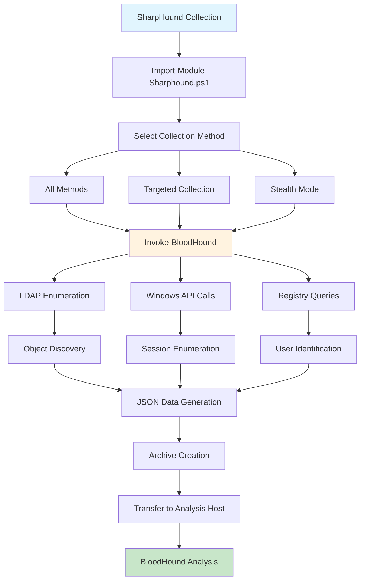

### Collection Method Reference

**Comprehensive Method List:**
- **Group**: Group membership and nesting relationships
- **LocalAdmin**: Local administrator privilege mapping
- **GPOLocalGroup**: Group Policy-defined local group memberships
- **Session**: Active user sessions on computers
- **LoggedOn**: Currently logged-on users via registry
- **Trusts**: Domain and forest trust relationships
- **ACL**: Access Control Lists and permissions
- **Container**: Organizational Unit and container structures
- **RDP**: Remote Desktop Protocol access rights
- **ObjectProps**: Extended object properties and attributes
- **DCOM**: Distributed COM object permissions
- **SPNTargets**: Service Principal Name mappings
- **PSRemote**: PowerShell remoting capabilities
- **UserRights**: User rights assignments and privileges
- **CARegistry**: Certificate Authority registry information
- **DCRegistry**: Domain Controller registry enumeration
- **CertServices**: Active Directory Certificate Services

### SharpHound Best Practices

**Collection Strategy:**
1. **Initial Reconnaissance**: Start with Default or Group methods
2. **Privilege Mapping**: Add LocalAdmin and ACL collection
3. **Session Intelligence**: Include Session and LoggedOn methods
4. **Complete Assessment**: Use All method for comprehensive coverage
5. **Continuous Monitoring**: Implement Loop collection for dynamic environments

**Performance Optimization:**
- **Use Caching**: Leverage cache files for repeated collections
- **Throttle Appropriately**: Balance speed with stealth requirements
- **Target Specific Methods**: Avoid unnecessary collection overhead
- **Monitor Resource Usage**: Track memory and network utilization

SharpHound automates comprehensive Active Directory enumeration through systematic LDAP queries, Windows API calls, and registry analysis, providing structured data optimized for BloodHound's graph-based attack path analysis.

---

## Analyzing Data using BloodHound

BloodHound transforms raw Active Directory enumeration data into visual graph representations that reveal complex attack paths through node and edge relationships. This graph-based analysis enables rapid identification of privilege escalation routes and lateral movement opportunities that manual analysis might miss.

### BloodHound Technical Architecture

**Core Components:**
- **Neo4j Database**: Open-source graph database (NoSQL) backend
- **BloodHound GUI**: Graph visualization and analysis interface
- **Node-Edge Model**: Objects (nodes) connected by relationships (edges)
- **Graph Algorithms**: Automated shortest path calculations

**Data Structure:**
- **Nodes**: Active Directory objects (users, computers, groups, domains)
- **Edges**: Relationships between objects (AdminTo, MemberOf, HasSession)
- **Properties**: Object attributes and metadata
- **Constraints**: Security boundaries and access limitations

### Neo4j Database Setup and Configuration

**Service Initialization:**
```bash
# Start Neo4j service
sudo neo4j start

# Verify service status
sudo neo4j status

# Access web interface
# URL: http://localhost:7474
# Default credentials: neo4j/neo4j
```

**Initial Configuration:**
```
Directories in use:
home:         /usr/share/neo4j
config:       /usr/share/neo4j/conf
logs:         /usr/share/neo4j/logs
plugins:      /usr/share/neo4j/plugins
import:       /usr/share/neo4j/import
data:         /usr/share/neo4j/data
```

**Database Authentication:**
1. **Initial Login**: Default credentials (neo4j/neo4j)
2. **Password Change**: Mandatory on first access
3. **BloodHound Connection**: Uses Neo4j credentials
4. **Database Selection**: Default database for BloodHound

### BloodHound Application Launch and Setup

**Application Startup:**
```bash
# Launch BloodHound
bloodhound

# Alternative GUI launch methods
bloodhound --no-sandbox
```

**Authentication Process:**
- **Database Connection**: Auto-detection of Neo4j service
- **Credential Entry**: Neo4j username and password
- **Connection Verification**: Green checkmark indicates success
- **Initial Interface**: Empty database until data import

### Data Import and Processing

**Data Transfer Methods:**
1. **File Transfer**: Move SharpHound ZIP from Windows to Kali
2. **Upload Function**: Right-side GUI upload button
3. **Drag-and-Drop**: Direct file import to main window
4. **Progress Monitoring**: Upload progress bar indication

**Import Process:**
```
File Structure:
├── <prefix>_<timestamp>_BloodHound.zip
├── computers.json
├── users.json
├── groups.json
├── domains.json
└── gpos.json (if applicable)
```

**Post-Import Verification:**
- **Database Info**: Hamburger menu → Database statistics
- **Object Counts**: Users, groups, computers, sessions
- **Refresh Function**: Update database statistics if needed

### Database Information Analysis

**Statistical Overview:**
```
Database Statistics Example:
- Users: 10
- Groups: 57  
- Computers: 6
- Sessions: 5
- ACLs: Multiple entries
- Relationships: Varies by domain size
```

**Key Metrics Understanding:**
- **Sessions**: Active user authentication mappings
- **ACLs**: Access Control List relationships
- **Groups**: Nested group memberships and hierarchies
- **Computers**: Host objects and their properties

### BloodHound Interface Navigation

**Main Interface Components:**
- **Search Bar**: Object lookup and targeting
- **Graph Canvas**: Visual relationship display
- **Node Info Panel**: Detailed object information
- **Analysis Tab**: Pre-built queries and analytics
- **Settings**: Display configuration and preferences

**Display Configuration:**
```
Settings → Node Label Display → Always Display
- Shows object names permanently
- Improves graph readability
- Reduces hover requirements
```

### Pre-Built Analysis Queries

**Domain Information Queries:**
- **Find all Domain Admins**: Identifies privileged users
- **Find Shortest Paths to Domain Admins**: Attack path discovery
- **Find Principals with DCSync Rights**: Dangerous permissions
- **Find Computers where Domain Users are Local Admin**: Widespread access

**Pathfinding Queries:**
- **Shortest Paths to Domain Admins from Owned Principals**: Targeted attack paths
- **Shortest Paths to High Value Targets**: Multiple privilege escalation routes
- **Find Shortest Paths to Domain Admins from Kerberoastable Users**: Service account exploitation

**Session Analysis:**
- **Find Computers with Unsupported Operating Systems**: Legacy system identification
- **Find Shortest Paths to Unconstrained Delegation Systems**: Dangerous configurations
- **List all Kerberoastable Accounts**: Service account enumeration

### Graph Analysis and Interpretation

**Node Types and Representations:**
- **Users**: Circular nodes (blue)
- **Computers**: Computer-shaped nodes (red)
- **Groups**: Pentagon-shaped nodes (green)
- **Domains**: Domain-shaped nodes (yellow)

**Edge Types and Meanings:**
- **AdminTo**: Administrative privileges on computer
- **MemberOf**: Group membership relationship
- **HasSession**: Active authentication session
- **CanRDP**: Remote Desktop access rights
- **CanPSRemote**: PowerShell remoting capabilities
- **GenericAll**: Complete control over object

### Attack Path Analysis Methodology

**Shortest Path to Domain Admins Analysis:**


**Path Interpretation:**
1. **stephanie** has administrative privileges on **CLIENT74**
2. **jeffadmin** has an active session on **CLIENT74**
3. **jeffadmin** is a member of **Domain Admins**
4. **Attack Vector**: Credential theft from CLIENT74 → Domain Admin access

### Owned Principals Management

**Marking Objects as Owned:**
```
Process:
1. Search for target object
2. Right-click on node
3. Select "Mark User/Computer as Owned"
4. Skull icon indicates owned status
```

**Strategic Owned Principal Selection:**
- **Current User Account**: Known compromised credentials
- **Current Computer**: Host with established access
- **Compromised Service Accounts**: Obtained through attacks
- **Privilege Escalation Targets**: Systems with local admin access

**Owned Principal Benefits:**
- **Targeted Analysis**: Focus on realistic attack paths
- **Risk Assessment**: Evaluate actual compromise impact
- **Attack Planning**: Identify next-step opportunities
- **Scenario Testing**: "What if" compromise analysis

### Advanced Graph Analysis Techniques

**Multi-Hop Attack Paths:**
```
Example Path:
stephanie → CLIENT75 → jeffadmin → CLIENT74 → Domain Admins

Analysis:
1. stephanie controls CLIENT75
2. jeffadmin has session on CLIENT75
3. Credential theft opportunity
4. jeffadmin access leads to CLIENT74
5. CLIENT74 compromise → Domain Admin rights
```

**Help and Documentation Access:**
- **Right-click Edge**: Access relationship help
- **Abuse Tab**: Attack methodology information
- **OpSec Tab**: Detection considerations
- **References**: Supporting documentation links

### BloodHound Query Customization

**Custom Cypher Queries:**
```cypher
# Find users with AdminTo rights
MATCH (u:User)-[:AdminTo]->(c:Computer) RETURN u,c

# Find computers where domain users can RDP
MATCH (g:Group {name:'DOMAIN USERS@DOMAIN.COM'})-[:CanRDP]->(c:Computer) RETURN g,c

# Find shortest path from specific user
MATCH p=shortestPath((u:User {name:'STEPHANIE@CORP.COM'})-[*1..]->(g:Group {name:'DOMAIN ADMINS@CORP.COM'})) RETURN p
```

**Query Development Process:**
1. **Identify Objective**: Define analysis goal
2. **Node Selection**: Choose starting and ending objects
3. **Relationship Filtering**: Specify edge types
4. **Path Constraints**: Set hop limits and conditions
5. **Result Visualization**: Format output for analysis

### Attack Path Validation and Exploitation

**Path Verification Steps:**
1. **Technical Feasibility**: Confirm attack methods exist
2. **Access Requirements**: Validate prerequisite privileges
3. **Detection Risk**: Assess OpSec implications
4. **Tool Availability**: Ensure attack tools accessible

**Common Attack Patterns:**
- **Credential Theft**: HasSession relationships
- **Privilege Escalation**: AdminTo edges
- **Lateral Movement**: Multiple computer access paths
- **Service Account Abuse**: Kerberoastable targets

### BloodHound Performance and Optimization

**Large Dataset Handling:**
- **Database Indexing**: Automatic Neo4j optimization
- **Query Performance**: Efficient pathfinding algorithms
- **Memory Management**: Proper resource allocation
- **Display Filtering**: Limit visual complexity

**Network Traffic Considerations:**
- **Data Collection Impact**: High LDAP query volume
- **Detection Signatures**: Automated enumeration patterns
- **Timing Controls**: SharpHound throttling options
- **Stealth Approaches**: Reduced collection methods

### BloodHound Analysis Workflow

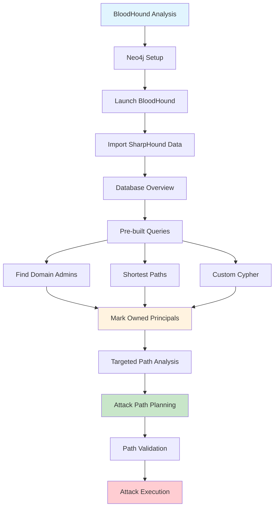

### Strategic Analysis Recommendations

**Progressive Analysis Approach:**
1. **Domain Overview**: Understand overall structure and privilege distribution
2. **High-Value Targets**: Identify Domain Admins and privileged groups
3. **Attack Path Discovery**: Find shortest routes to objectives
4. **Owned Principal Analysis**: Focus on realistic compromise scenarios
5. **Multi-Path Validation**: Verify multiple attack vectors
6. **Risk Assessment**: Evaluate detection likelihood and impact

**Enterprise Environment Considerations:**
- **Scale Challenges**: Thousands of users and computers
- **Complex Relationships**: Nested groups and inheritance
- **Multiple Domains**: Forest-wide trust relationships
- **Service Dependencies**: Cross-service authentication patterns

### BloodHound Best Practices

**Analysis Methodology:**
- **Start Broad**: Use "Find all Domain Admins" for overview
- **Focus Owned**: Mark realistic compromise starting points
- **Validate Paths**: Verify attack feasibility before execution
- **Document Findings**: Record discovered attack paths
- **Regular Updates**: Re-run collection to capture changes

**OpSec Considerations:**
- **Data Collection Noise**: SharpHound generates significant traffic
- **Analysis Security**: Secure BloodHound database access
- **Path Documentation**: Maintain attack methodology records
- **Tool Detection**: Monitor for BloodHound deployment signatures

BloodHound transforms complex Active Directory relationships into actionable attack intelligence through graph-based visualization, enabling rapid identification of privilege escalation paths and lateral movement opportunities that manual enumeration cannot efficiently reveal.

---
