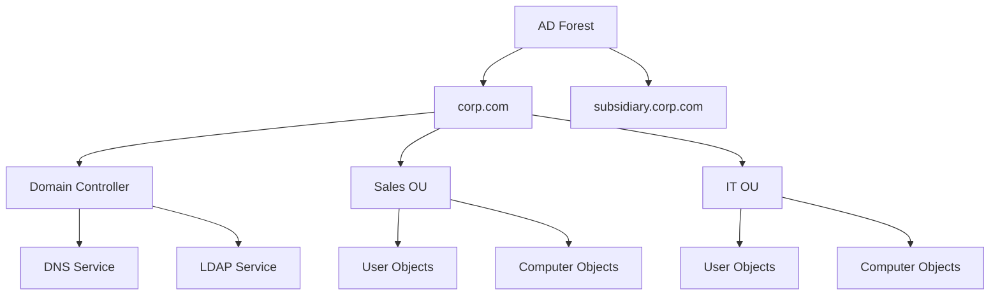
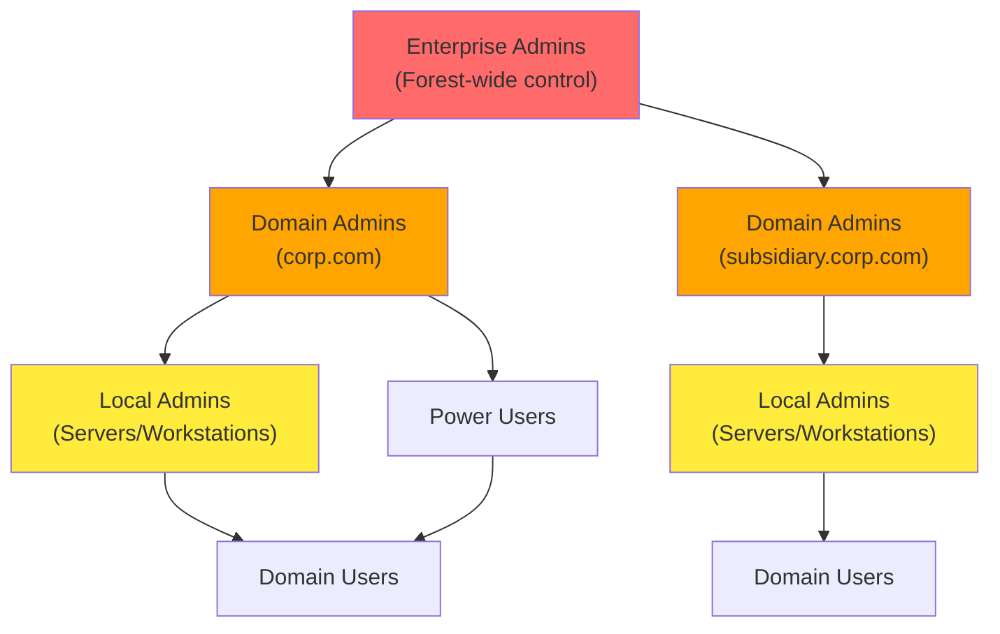
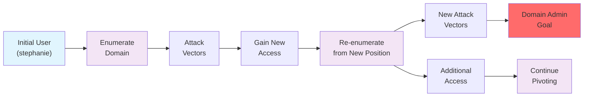
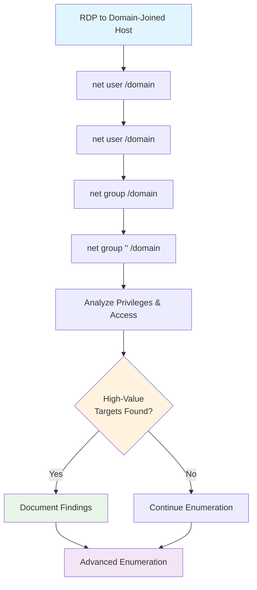
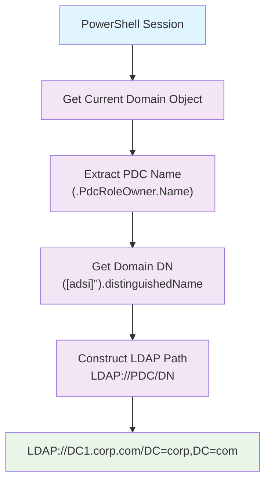
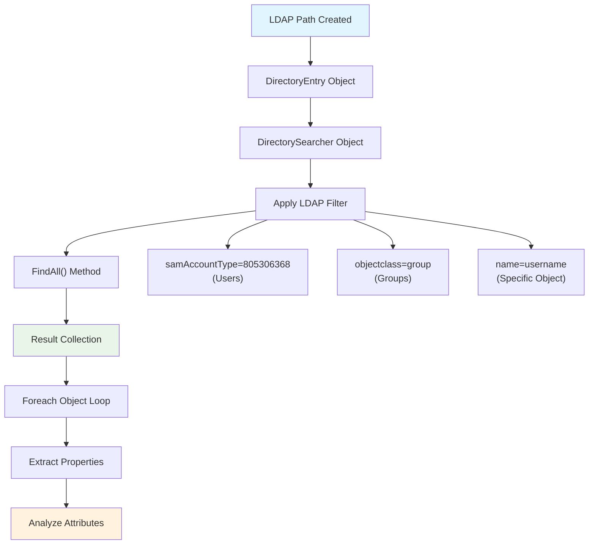
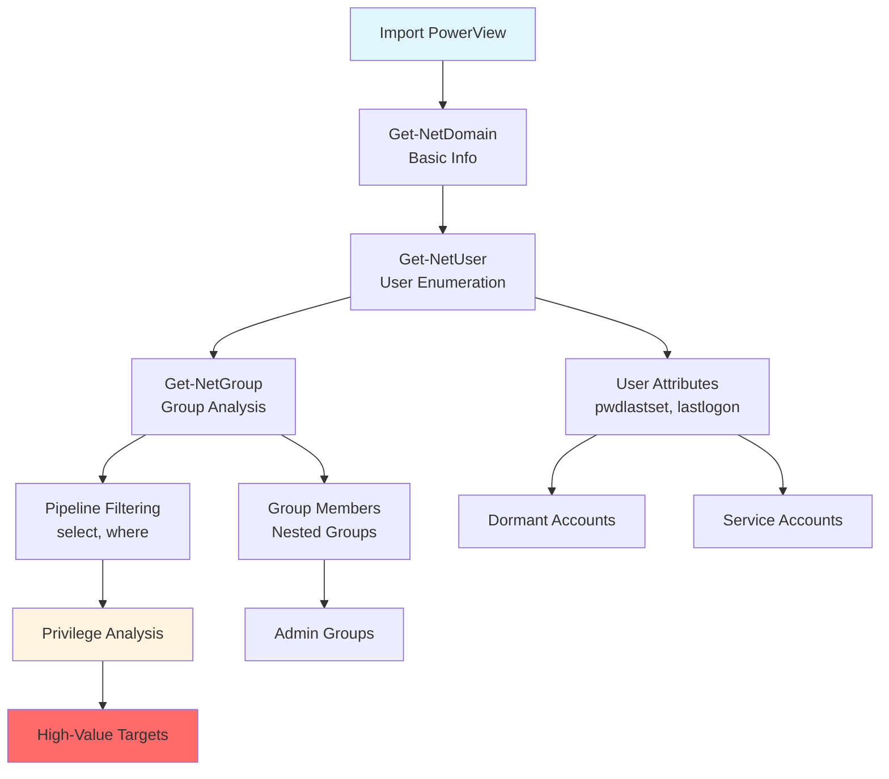

# Active Directory Introduction and Enumeration

Active Directory Domain Services, often referred to as Active Directory (AD), is a service that allows system administrators to update and manage operating systems, applications, users, and data access on a large scale. Active Directory is installed with a standard configuration; however, system administrators often customize it to fit the needs of the organization.

From a penetration tester's perspective, Active Directory is very interesting as it typically contains a wealth of information. If we successfully compromise certain objects within the domain, we may be able to take full control over the organization's infrastructure.

In this Learning Module, we will focus on the enumeration aspect of Active Directory. The information we will gather throughout the Module will have a direct impact on the various attacks we will do in the upcoming Attacking Active Directory Authentication and Lateral Movement in Active Directory Modules.

## Table of Contents

- [Introduction to Active Directory](#introduction-to-active-directory)
- [Active Directory Enumeration Using Manual Tools](#active-directory-enumeration-using-manual-tools)
- [Enumerating Active Directory Using Automated Tools](#enumerating-active-directory-using-automated-tools)

---

## Introduction to Active Directory

Active Directory (AD) is both a service and a management layer that stores critical information about an organization's environment—users, groups, computers, and their associated permissions. Each entity is an **object** with specific **attributes** that define its properties and capabilities within the domain.

### Core Components

**Domain Structure:**
- **Domain**: Fundamental AD unit (e.g., `corp.com`) containing all objects
- **Domain Controller (DC)**: Central hub storing all objects, OUs, and attributes
- **DNS Integration**: Critical dependency—DCs typically host authoritative DNS servers

**Object Organization:**
- **Organizational Units (OUs)**: Containers for organizing objects (similar to file system folders)
- **Computer Objects**: Domain-joined servers and workstations
- **User Objects**: Accounts for domain authentication
- **Group Objects**: Collections of users/computers for unified management

### AD Forest and Domain Structure



### Privilege Hierarchy



### Communication Protocols
- **LDAP**: Primary protocol for AD queries and enumeration
- **Kerberos**: Authentication protocol
- **DNS**: Name resolution and service location
- **SMB/CIFS**: File sharing and remote access

---

## Enumeration Goals and Methodology

### Scenario: corp.com Domain Assessment
- **Initial Access**: User `stephanie` with RDP permissions
- **Privilege Level**: Standard domain user (non-admin)
- **Target**: Full domain enumeration leading to domain administrator privileges
- **Scope**: corp.com domain within PWK labs

### Key Enumeration Targets
1. **High-Value Groups**: Domain Admins, Enterprise Admins, privileged service accounts
2. **Attack Paths**: User permissions, group memberships, ACLs, trusts
3. **Vulnerable Services**: Kerberoastable accounts, ASREPRoast targets
4. **Lateral Movement**: RDP/WinRM access, local admin rights

### Enumeration Strategy: Iterative Pivoting



### Critical Success Factors
- **Perspective Shifts**: Each compromised account provides unique permissions and access
- **Persistent Re-enumeration**: Repeat enumeration with every new account/computer access
- **Individual User Privileges**: Never dismiss seemingly identical accounts—each may have unique permissions
- **Large Organization Complexity**: More users/computers = more opportunities for privilege escalation

This methodology ensures comprehensive coverage and maximizes the chance of finding privilege escalation paths in complex AD environments.

---

## Active Directory Enumeration Using Manual Tools

Manual enumeration forms the foundation of AD reconnaissance, leveraging built-in Windows tools and PowerShell/.NET capabilities. This approach provides deep understanding of the domain structure and builds expertise for more advanced techniques.

### Learning Objectives
- Enumerate Active Directory using legacy Windows applications
- Use PowerShell and .NET to perform additional AD enumeration

---

## Enumeration Using Legacy Windows Tools

### Initial Access Setup
**RDP Connection (Recommended):**
```bash
xfreerdp /u:<username> /d:<domain> /v:<target_ip>
# Example: xfreerdp /u:stephanie /d:corp.com /v:192.168.50.75
```

> **Warning**: Use RDP over PowerShell Remoting to avoid Kerberos Double Hop issues that can break domain enumeration tools.

### User Enumeration with net.exe

**List All Domain Users:**
```cmd
net user /domain
```
*Sample Output:*
```
User accounts for \\DC1.corp.com
-------------------------------------------------------------------------------
Administrator    dave         Guest
iis_service      jeff         jeffadmin  
jen              krbtgt       pete
stephanie
```

**Enumerate Specific User:**
```cmd
net user <username> /domain
# Example: net user jeffadmin /domain
```

**Key Information to Extract:**
- **Account Status**: Active/Inactive, expiration dates
- **Password Policy**: Last set, expiration, change requirements  
- **Group Memberships**: Local and Global groups
- **Login Information**: Last logon, allowed workstations
- **Administrative Indicators**: Look for prefixes/suffixes like "admin", "svc_", etc.

*Critical Finding Example:*
```
User name                    jeffadmin
Local Group Memberships      *Administrators
Global Group memberships     *Domain Users    *Domain Admins
```
→ **High-Value Target**: Domain Admin account identified

### Group Enumeration with net.exe

**List All Domain Groups:**
```cmd
net group /domain
```
*Sample Output:*
```
Group Accounts for \\DC1.corp.com
-------------------------------------------------------------------------------
*Domain Admins           *Enterprise Admins
*Management Department   *Sales Department
*Development Department  *Domain Users
```

**Enumerate Group Members:**
```cmd
net group "<group_name>" /domain
# Example: net group "Domain Admins" /domain
# Example: net group "Sales Department" /domain
```

### Strategic Enumeration Priorities

**1. High-Privilege Groups (Priority 1):**
```cmd
net group "Domain Admins" /domain
net group "Enterprise Admins" /domain  
net group "Schema Admins" /domain
net group "Administrators" /domain
```

**2. Custom Groups (Priority 2):**
```cmd
net group "Management Department" /domain
net group "Development Department" /domain
net group "Sales Department" /domain
```

**3. Service Groups (Priority 3):**
```cmd
net group "Backup Operators" /domain
net group "Server Operators" /domain
net group "Account Operators" /domain
```

### Enumeration Workflow



### Key Takeaways from Legacy Tool Enumeration

**Advantages:**
- **Stealth**: Built-in tools, minimal detection risk
- **Universal**: Available on all Windows systems
- **No Dependencies**: Works without additional tools

**Limitations:**
- **Limited Output**: Basic information only
- **Manual Process**: Requires individual queries
- **No Advanced Filtering**: Cannot perform complex searches

**Information Gained:**
- User account inventory
- Administrative account identification  
- Group structure and memberships
- Custom organizational groups
- Baseline for advanced enumeration

This foundational enumeration provides the groundwork for more sophisticated PowerShell and automated techniques covered in subsequent sections.

---

## Enumeration Using PowerShell and .NET Classes

### Why PowerShell/.NET Over Built-in Cmdlets?
- **Get-ADUser** and similar cmdlets require RSAT (Remote Server Administration Tools)
- RSAT is rarely installed on client machines and requires admin privileges
- PowerShell/.NET approach works with basic user privileges and mimics normal AD operations

### LDAP and Active Directory Communication

**LDAP Protocol Fundamentals:**
- Primary communication protocol for AD queries
- Uses Active Directory Services Interface (ADSI) as LDAP provider
- Requires specific LDAP ADsPath format

**LDAP Path Structure:**
```
LDAP://HostName[:PortNumber][/DistinguishedName]
```

**Components:**
- **HostName**: Computer name, IP, or domain name (we want PDC for most current info)
- **PortNumber**: Optional (auto-selected based on SSL usage)
- **DistinguishedName**: Unique object identifier in LDAP format

### Distinguished Names (DN) Structure

**Format Example:**
```
CN=Stephanie,CN=Users,DC=corp,DC=com
```

**Reading Order (Right to Left):**
- **DC=corp,DC=com**: Domain Components (domain itself)
- **CN=Users**: Common Name of parent container
- **CN=Stephanie**: Common Name of the object

**Key Terms:**
- **CN**: Common Name (object identifier)
- **DC**: Domain Component (domain hierarchy)
- **OU**: Organizational Unit (container for objects)

### Building the LDAP Path Dynamically

#### Step 1: Find the Primary Domain Controller (PDC)
```powershell
[System.DirectoryServices.ActiveDirectory.Domain]::GetCurrentDomain()
```
*Output:*
```
Forest                  : corp.com
PdcRoleOwner           : DC1.corp.com
Name                   : corp.com
```

#### Step 2: Extract PDC Hostname
```powershell
$PDC = [System.DirectoryServices.ActiveDirectory.Domain]::GetCurrentDomain().PdcRoleOwner.Name
Write-Host $PDC
# Output: DC1.corp.com
```

#### Step 3: Get Domain Distinguished Name
```powershell
$DN = ([adsi]'').distinguishedName
Write-Host $DN
# Output: DC=corp,DC=com
```

#### Step 4: Construct Full LDAP Path
```powershell
$LDAP = "LDAP://$PDC/$DN"
Write-Host $LDAP
# Output: LDAP://DC1.corp.com/DC=corp,DC=com
```

### Complete LDAP Path Script

**Full Script (enumeration.ps1):**
```powershell
# Get Primary Domain Controller
$PDC = [System.DirectoryServices.ActiveDirectory.Domain]::GetCurrentDomain().PdcRoleOwner.Name

# Get Domain Distinguished Name
$DN = ([adsi]'').distinguishedName 

# Construct LDAP Path
$LDAP = "LDAP://$PDC/$DN"

# Display Result
$LDAP
```

**Execution:**
```powershell
# Bypass execution policy
powershell -ep bypass

# Run script
.\enumeration.ps1
# Output: LDAP://DC1.corp.com/DC=corp,DC=com
```

### LDAP Path Construction Flow



### Key Advantages of This Approach

**Dynamic Discovery:**
- Automatically finds PDC (most current information)
- Works across different domains without hardcoding
- Proper DN format regardless of domain structure

**Stealth and Compatibility:**
- Uses standard .NET classes (available on all Windows systems)
- No additional tools or admin privileges required
- Mimics normal AD operations

**Reusability:**
- Script works in any AD environment
- Foundation for advanced enumeration techniques
- Easily adaptable for different query types

This LDAP path foundation enables sophisticated AD enumeration using DirectorySearcher and other .NET classes in subsequent techniques.

---

## Adding Search Functionality to PowerShell Script

### .NET Classes for AD Searching

**Core Classes:**
- **DirectoryEntry**: Encapsulates AD service hierarchy objects
- **DirectorySearcher**: Performs LDAP queries against AD
- **Location**: System.DirectoryServices namespace

**DirectoryEntry Properties:**
- Encapsulates LDAP path pointing to hierarchy top
- Can accept credentials (not needed when already authenticated)
- Acts as SearchRoot for DirectorySearcher

**DirectorySearcher Methods:**
- **FindAll()**: Returns collection of all matching entries
- **SearchRoot**: Defines where search begins in AD hierarchy

### Basic Search Implementation

**Initial Search Script:**
```powershell
$PDC = [System.DirectoryServices.ActiveDirectory.Domain]::GetCurrentDomain().PdcRoleOwner.Name
$DN = ([adsi]'').distinguishedName 
$LDAP = "LDAP://$PDC/$DN"

$direntry = New-Object System.DirectoryServices.DirectoryEntry($LDAP)
$dirsearcher = New-Object System.DirectoryServices.DirectorySearcher($direntry)
$dirsearcher.FindAll()
```

*Output (truncated):*
```
Path
----
LDAP://DC1.corp.com/DC=corp,DC=com
LDAP://DC1.corp.com/CN=Users,DC=corp,DC=com
LDAP://DC1.corp.com/CN=Computers,DC=corp,DC=com
LDAP://DC1.corp.com/OU=Domain Controllers,DC=corp,DC=com
...
```

### Filtering Results with samAccountType

**samAccountType Values:**
- **805306368** (0x30000000): Normal user accounts
- **805306369** (0x30000001): Computer accounts  
- **268435456** (0x10000000): Group accounts

**User Enumeration Script:**
```powershell
$PDC = [System.DirectoryServices.ActiveDirectory.Domain]::GetCurrentDomain().PdcRoleOwner.Name
$DN = ([adsi]'').distinguishedName 
$LDAP = "LDAP://$PDC/$DN"

$direntry = New-Object System.DirectoryServices.DirectoryEntry($LDAP)
$dirsearcher = New-Object System.DirectoryServices.DirectorySearcher($direntry)
$dirsearcher.filter="samAccountType=805306368"
$dirsearcher.FindAll()
```

*Sample Output:*
```
Path                                                         Properties
----                                                         ----------
LDAP://DC1.corp.com/CN=Administrator,CN=Users,DC=corp,DC=com {logoncount, codepage, objectcategory...}
LDAP://DC1.corp.com/CN=jeffadmin,CN=Users,DC=corp,DC=com     {logoncount, codepage, objectcategory...}
```

### Extracting Object Properties

**Property Enumeration Script:**
```powershell
$PDC = [System.DirectoryServices.ActiveDirectory.Domain]::GetCurrentDomain().PdcRoleOwner.Name
$DN = ([adsi]'').distinguishedName 
$LDAP = "LDAP://$PDC/$DN"

$direntry = New-Object System.DirectoryServices.DirectoryEntry($LDAP)
$dirsearcher = New-Object System.DirectoryServices.DirectorySearcher($direntry)
$dirsearcher.filter="samAccountType=805306368"
$result = $dirsearcher.FindAll()

Foreach($obj in $result)
{
    Foreach($prop in $obj.Properties)
    {
        $prop
    }
    Write-Host "-------------------------------"
}
```

**Key User Attributes:**
- **memberof**: Group memberships (critical for privilege analysis)
- **samaccountname**: Username
- **distinguishedname**: Full LDAP path
- **useraccountcontrol**: Account status and properties
- **admincount**: Indicates administrative privilege history

### Targeted Filtering Examples

**Search Specific User:**
```powershell
$dirsearcher.filter="name=jeffadmin"
$result = $dirsearcher.FindAll()

Foreach($obj in $result)
{
    Foreach($prop in $obj.Properties)
    {
        $prop.memberof
    }
}
```

*Output:*
```
CN=Domain Admins,CN=Users,DC=corp,DC=com
CN=Administrators,CN=Builtin,DC=corp,DC=com
```

### Flexible LDAP Search Function

**Reusable Function (function.ps1):**
```powershell
function LDAPSearch {
    param (
        [string]$LDAPQuery
    )

    $PDC = [System.DirectoryServices.ActiveDirectory.Domain]::GetCurrentDomain().PdcRoleOwner.Name
    $DistinguishedName = ([adsi]'').distinguishedName

    $DirectoryEntry = New-Object System.DirectoryServices.DirectoryEntry("LDAP://$PDC/$DistinguishedName")
    $DirectorySearcher = New-Object System.DirectoryServices.DirectorySearcher($DirectoryEntry, $LDAPQuery)

    return $DirectorySearcher.FindAll()
}
```

**Usage:**
```powershell
# Import function
Import-Module .\function.ps1

# Search users
LDAPSearch -LDAPQuery "(samAccountType=805306368)"

# Search groups
LDAPSearch -LDAPQuery "(objectclass=group)"

# Complex filter
LDAPSearch -LDAPQuery "(&(objectCategory=group)(cn=Sales Department))"
```

### Advanced Group Enumeration

**Group Member Analysis:**
```powershell
# Get all groups and their members
foreach ($group in $(LDAPSearch -LDAPQuery "(objectCategory=group)")) {
    $group.properties | select {$_.cn}, {$_.member}
}

# Target specific group
$sales = LDAPSearch -LDAPQuery "(&(objectCategory=group)(cn=Sales Department))"
$sales.properties.member
```

*Sample Output:*
```
CN=Development Department,DC=corp,DC=com
CN=pete,CN=Users,DC=corp,DC=com
CN=stephanie,CN=Users,DC=corp,DC=com
```

### Nested Group Discovery

**Why Nested Groups Matter:**
- Groups can be members of other groups
- Users inherit permissions from all parent groups
- `net.exe` only shows direct user memberships
- PowerShell/.NET reveals complete hierarchy

**Nested Group Analysis:**
```powershell
# Sales Department members
$sales = LDAPSearch -LDAPQuery "(&(objectCategory=group)(cn=Sales Department))"
$sales.properties.member

# Development Department members
$dev = LDAPSearch -LDAPQuery "(&(objectCategory=group)(cn=Development Department*))"
$dev.properties.member

# Management Department members  
$mgmt = LDAPSearch -LDAPQuery "(&(objectCategory=group)(cn=Management Department*))"
$mgmt.properties.member
```

### PowerShell vs net.exe Comparison

| Feature | net.exe | PowerShell/.NET |
|---------|---------|-----------------|
| **User Enumeration** | Basic info only | Full attribute access |
| **Group Discovery** | Direct members only | Nested groups revealed |
| **Filtering** | Limited | LDAP filter syntax |
| **Attributes** | Fixed output | All object properties |
| **Automation** | Manual queries | Scriptable functions |
| **Detection** | Very low | Low (native .NET) |

### Search Workflow



### Key Advantages of PowerShell/.NET Approach

**Enhanced Visibility:**
- Complete object attribute access
- Nested group membership discovery
- Administrative privilege indicators
- Service account identification

**Flexibility:**
- Custom LDAP filter syntax
- Scriptable and reusable functions
- Dynamic property selection
- Complex search criteria

**Stealth:**
- Uses built-in .NET classes
- Normal LDAP traffic patterns
- No additional tool requirements
- Minimal detection footprint

This approach provides comprehensive AD enumeration capabilities that far exceed basic Windows tools while maintaining operational security and compatibility across environments.

---

## Enumerating Active Directory Using Automated Tools

Automated tools streamline AD enumeration by providing pre-built functions that leverage the same .NET classes and LDAP techniques we've explored. These tools significantly speed up reconnaissance while providing advanced filtering and analysis capabilities.

---

## AD Enumeration with PowerView

### PowerView Overview
PowerView is a comprehensive PowerShell script containing numerous functions for AD enumeration. It builds upon the same .NET classes (DirectoryEntry, DirectorySearcher) we used in custom scripts, but provides streamlined commands with advanced filtering capabilities.

### Initial Setup

**Import PowerView:**
```powershell
Import-Module .\PowerView.ps1
```

### Core Domain Information

**Get Basic Domain Info:**
```powershell
Get-NetDomain
```

*Sample Output:*
```
Forest                  : corp.com
DomainControllers       : {DC1.corp.com}
PdcRoleOwner           : DC1.corp.com
RidRoleOwner           : DC1.corp.com
InfrastructureRoleOwner : DC1.corp.com
Name                   : corp.com
```

### User Enumeration with PowerView

**All Users (Full Details):**
```powershell
Get-NetUser
```

*Key Attributes Returned:*
- **distinguishedname**: Full LDAP path
- **samaccountname**: Username
- **memberof**: Group memberships
- **admincount**: Administrative privilege indicator
- **lastlogon**: Last authentication time
- **pwdlastset**: Password last changed

**Filtered User Information:**
```powershell
# Basic user list
Get-NetUser | select cn

# User activity analysis
Get-NetUser | select cn,pwdlastset,lastlogon

# Administrative users
Get-NetUser | where {$_.admincount -eq 1} | select cn,memberof
```

*Sample Output:*
```
cn            pwdlastset            lastlogon
--            ----------            ---------
Administrator 8/16/2022 5:27:22 PM  9/14/2022 2:37:15 AM
jeffadmin     9/2/2022 4:26:48 PM   9/14/2022 2:26:37 AM
iis_service   9/7/2022 5:38:43 AM   9/14/2022 2:35:55 AM
```

### Group Enumeration with PowerView

**All Groups:**
```powershell
# Basic group list
Get-NetGroup | select cn

# Specific group details
Get-NetGroup "Sales Department" | select member

# High-privilege groups
Get-NetGroup "Domain Admins","Enterprise Admins","Schema Admins" | select cn,member
```

*Sample Output:*
```
member
------
{CN=Development Department,DC=corp,DC=com, CN=pete,CN=Users,DC=corp,DC=com, CN=stephanie,CN=Users,DC=corp,DC=com}
```

### Advanced PowerView Techniques

**User Attribute Analysis:**
```powershell
# Dormant accounts (old passwords)
Get-NetUser | where {$_.pwdlastset -lt (Get-Date).AddDays(-90)} | select cn,pwdlastset

# Never logged in users
Get-NetUser | where {$_.lastlogon -eq $null -or $_.lastlogon -eq 0} | select cn

# Service accounts
Get-NetUser | where {$_.cn -like "*service*" -or $_.cn -like "*svc*"} | select cn,memberof

# Accounts with passwords that don't expire
Get-NetUser | where {$_.useraccountcontrol -band 65536} | select cn,pwdlastset
```

**Administrative Privilege Discovery:**
```powershell
# Users with adminCount=1 (historical admin access)
Get-NetUser | where {$_.admincount -eq 1} | select cn,memberof,lastlogon

# Domain Admins group members
Get-NetGroupMember "Domain Admins" | select MemberName,MemberSID

# Local administrators on specific computers
Get-NetLocalGroup -ComputerName <target> -GroupName "Administrators"
```

### PowerView vs Custom Scripts Comparison

| Feature | Custom Script | PowerView |
|---------|---------------|-----------|
| **Setup Time** | Build from scratch | Import and use |
| **Functionality** | Basic LDAP queries | 100+ specialized functions |
| **Filtering** | Manual loops | Built-in pipeline support |
| **Error Handling** | Custom implementation | Pre-built robustness |
| **Learning Curve** | High (LDAP/NET knowledge) | Medium (PowerShell cmdlets) |
| **Customization** | Full control | Parameter-based |
| **Detection Risk** | Very Low | Low (common tool) |

### PowerView Enumeration Workflow



### Strategic User Analysis

**Identifying High-Value Targets:**

1. **Administrative Accounts:**
   ```powershell
   Get-NetUser | where {$_.memberof -match "Admin"} | select cn,memberof
   ```

2. **Dormant Accounts (Stale Passwords):**
   ```powershell
   Get-NetUser | where {$_.pwdlastset -lt (Get-Date).AddDays(-90)} | select cn,pwdlastset,lastlogon
   ```

3. **Service Accounts:**
   ```powershell
   Get-NetUser -ServicePrincipalName *
   ```

4. **Accounts with Pre-Authentication Disabled (ASREPRoast):**
   ```powershell
   Get-NetUser -PreauthNotRequired | select cn,serviceprincipalname
   ```

### Key PowerView Commands Reference

**Domain Information:**
- `Get-NetDomain`: Domain details
- `Get-NetDomainController`: Domain controller info
- `Get-NetForest`: Forest information

**User/Group Enumeration:**
- `Get-NetUser`: User objects
- `Get-NetGroup`: Group objects  
- `Get-NetGroupMember`: Group membership
- `Get-NetLocalGroup`: Local group enumeration

**Computer Enumeration:**
- `Get-NetComputer`: Computer objects
- `Get-NetLoggedon`: Logged-on users
- `Get-NetSession`: Active sessions

**Advanced Functions:**
- `Find-LocalAdminAccess`: Find computers where current user has admin
- `Find-DomainShare`: Discover network shares
- `Get-NetGPO`: Group Policy Objects

### Advantages of PowerView

**Efficiency:**
- Pre-built functions eliminate script development time
- Pipeline support for complex filtering
- Comprehensive error handling

**Functionality:**
- Advanced enumeration techniques beyond basic LDAP
- Specialized functions for privilege escalation paths
- Built-in analysis for common attack vectors

**Flexibility:**
- Parameter-based filtering
- Pipeline integration with PowerShell
- Easy output formatting and analysis

PowerView demonstrates how researchers build upon fundamental LDAP/.NET techniques to create powerful, user-friendly enumeration tools while maintaining the stealth benefits of native Windows functionality.

---
